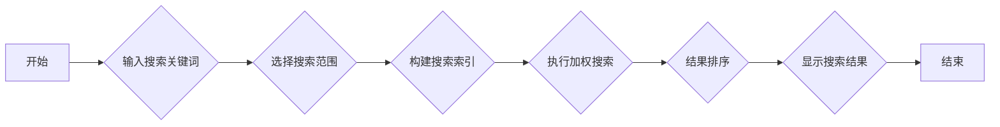

bili 视频：[obsidian插件：自定义加权的内容搜索插件_哔哩哔哩_bilibili](https://www.bilibili.com/video/BV18ajzzQEKG/?vd_source=247ac77d4ae7339ea06d0fec09aa8f70)

github 开源地址：[yuhanbo758/obsidian-yuhanbo-search: obsidian的搜索搜索，主要功能是解决搜索加权的问题，可以自行设置标题、属性、引用等的加权搜索](https://github.com/yuhanbo758/obsidian-yuhanbo-search)

程序小店：[obsidian插件：yuhanbo--search，自定义加权的内容搜索插件 | 三人聚智-余汉波程序小店](https://jy.sanrenjz.com/buy/27)

本文档旨在为具有一定技术背景的读者提供对 Obsidian 自定义加权搜索插件的全面解析。该插件为 Obsidian 笔记软件开发，允许用户根据文件名、目录、标签、标题级别等元素进行加权搜索，从而更精确地控制搜索结果的排序。本文将详细介绍插件的功能、结构、算法、使用方法以及潜在的改进方向。

### 插件功能与特性

1. 多元素加权搜索：该插件支持根据多种元素（文件名、目录、标签、标题级别、正文内容和引用内容）进行加权搜索。
1. 自定义权重：用户可以自定义每个搜索元素的权重，从而精确控制搜索结果的排序，满足个性化需求。
1. 即时搜索：插件支持输入两个字符后自动搜索，结果实时显示，提高搜索效率。
1. 排除文件夹：用户可以设定要排除的文件夹列表，减少搜索范围，提高搜索效率。
1. 快捷键支持：插件支持使用 Ctrl+Shift+F 快速打开搜索界面，方便用户使用。


### 插件结构与组织方式

该插件主要由以下几个文件组成：

* main.js：插件的核心逻辑实现，包括插件的加载、卸载、设置、索引构建和搜索算法等。
* styles.css：插件的样式文件，定义了插件界面的各种样式，包括搜索框、按钮、结果列表等。
* manifest.json：插件的清单文件，包含了插件的元数据信息，如插件 ID、名称、版本、描述、作者等。
* data.json：存储插件配置数据的文件，包括文件名权重、目录权重、标签权重、各级标题权重、正文内容权重、引用权重、排除的文件夹列表和缓存更新间隔等。
* versions.json: 定义插件版本和最低兼容 Obsidian 版本的文件。
* package.json: 定义项目依赖、名称、版本等信息的标准 npm 包文件。


### 核心代码解析

### main.js

main.js 是插件的核心文件，包含了插件的主要逻辑。

```javascript
const { Plugin, PluginSettingTab, App, TFile, Notice, Modal, Setting } = require('obsidian');

const DEFAULT_SETTINGS = {
	fileNameWeight: 10,
	directoryWeight: 9,
	tagWeight: 8,
	heading1Weight: 7,
	heading2Weight: 6,
	heading3Weight: 5,
	heading4Weight: 4,
	contentWeight: 3,
	quoteWeight: 2,
	excludedFolders: '',
	cacheUpdateInterval: 60, // 默认60分钟
}

class YuhanboSearchPlugin extends Plugin {
	async onload() {
        // ...插件加载时执行的代码
    }

	onunload() {
        // ...插件卸载时执行的代码
    }

	async loadSettings() {
        // ...加载插件设置
    }

	async saveSettings() {
        // ...保存插件设置
    }

	async updateSearchIndex() {
        // ...更新搜索索引
    }

	getAllTags(fileCache) {
        // ...获取所有标签
    }

	extractHeadings(file) {
        // ...提取标题信息
    }

	extractQuotes(content) {
        // ...提取引用信息
    }

	search(query, options = {}) {
        // ...执行搜索
    }
}
```

onload 函数：

* 插件加载时执行，用于初始化插件。
* 加载插件设置，添加左侧栏图标，添加状态栏项目，添加命令，添加设置选项卡，注册定期更新索引的计时器，初始化索引。
updateSearchIndex 函数：

* 更新搜索索引，该函数是插件的核心之一。
* 首先，清空现有的搜索索引，然后获取所有 Markdown 文件。
* 遍历所有文件，检查文件是否在排除的文件夹中。
* 如果文件不在排除的文件夹中，则读取文件内容，并提取文件名、目录、标签、标题和引用等信息，然后将这些信息添加到搜索索引中。
search 函数：

* 执行搜索，该函数是插件的另一个核心。
* 首先，将查询字符串转换为小写，并按空格分割成关键词数组。
* 然后，遍历搜索索引中的所有文件，计算每个文件的得分。
* 计算得分时，根据用户设置的权重，对文件名、目录、标签、标题和引用等元素进行加权计算。
* 最后，根据得分对搜索结果进行排序，并返回排序后的结果。
其他函数：

* onunload 函数：插件卸载时执行，用于清理插件。
* loadSettings 函数：加载插件设置。
* saveSettings 函数：保存插件设置。
* getAllTags 函数：获取所有标签。
* extractHeadings 函数：提取标题信息。
* extractQuotes 函数：提取引用信息。
### styles.css

styles.css 文件定义了插件界面的各种样式，包括搜索框、按钮、结果列表等。

```css
/* 样式文件 */

/* 搜索模态框 */
.yuhanbo-search-modal {
    padding: 20px;
    width: 80vw; /* 增大宽度至视口的80% */
    max-width: 1000px; /* 增大最大宽度 */
}

/* 搜索范围标签文字 */
.search-scope-label {
    font-size: 14px;
    font-weight: bold;
    color: var(--text-normal);
    margin-right: 10px;
    margin-bottom: 10px;
    display: inline-block;
}

/* 搜索范围按钮容器 */
.search-scope-buttons {
    display: flex;
    flex-wrap: wrap;
    gap: 5px;
    margin-bottom: 15px;
    width: 100%;
}

/* 搜索范围按钮 */
.search-scope-button {
    background-color: var(--background-secondary);
    border: 1px solid var(--background-modifier-border);
    border-radius: 15px;
    padding: 5px 12px;
    font-size: 14px;
    cursor: pointer;
    transition: all 0.2s ease;
    display: flex;
    align-items: center;
    color: var(--text-normal);
}

/* 选中状态按钮 */
.search-scope-button.active {
    background-color: var(--interactive-accent);
    color: var(--text-on-accent);
    border-color: var(--interactive-accent);
}

/* 按钮悬停效果 */
.search-scope-button:hover {
    background-color: var(--background-modifier-hover);
}

.search-scope-button.active:hover {
    background-color: var(--interactive-accent-hover);
}

/* 搜索容器 */
.search-container {
    display: flex;
    margin-bottom: 20px;
    width: 100%;
}

/* 搜索输入框 */
.search-input {
    flex-grow: 1;
    padding: 10px;
    border: 1px solid var(--background-modifier-border);
    border-radius: 4px;
    font-size: 16px;
    width: 100%; /* 确保输入框占满宽度 */
}

/* 大号搜索框样式 */
.search-input.large {
    height: 45px;
    font-size: 18px;
}

/* 搜索按钮（保留但隐藏，以便兼容性） */
.search-button {
    display: none;
}

/* 原选项容器（保留但修改样式，确保不干扰） */
.options-container {
    display: none;
}

/* 搜索结果 */
.search-results {
    max-height: none; /* 完全移除高度限制 */
    overflow: visible; /* 移除滚动条 */
    width: 100%;
    border-top: 1px solid var(--background-modifier-border);
    padding-top: 15px;
}

/* 结果数量 */
.results-count {
    margin-bottom: 15px;
    font-weight: bold;
    font-size: 16px;
    color: var(--text-accent);
}

/* 没有结果 */
.no-results {
    padding: 20px;
    text-align: center;
    color: var(--text-muted);
    font-size: 16px;
}

/* 结果列表 */
.results-list {
    display: flex;
    flex-direction: column;
    width: 100%;
}

/* 单个结果项 */
.result-item {
    padding: 15px;
    margin-bottom: 15px;
    border: 1px solid var(--background-modifier-border);
    border-radius: 6px;
    background-color: var(--background-primary);
    width: 100%; /* 确保结果项占满宽度 */
}

.result-item:hover {
    background-color: var(--background-secondary);
    box-shadow: 0 2px 8px rgba(0,0,0,0.1);
}

/* 选中的结果项样式 */
.result-item.selected {
    background-color: var(--background-secondary-alt);
    border: 1px solid var(--interactive-accent);
    box-shadow: 0 2px 8px rgba(0,0,0,0.2);
}

/* 结果标题 */
.result-title {
    font-size: 18px;
    font-weight: bold;
    margin-bottom: 5px;
    cursor: pointer;
    color: var(--interactive-accent);
}

.result-title:hover {
    text-decoration: underline;
}

/* 结果路径 */
.result-path {
    font-size: 13px;
    color: var(--text-muted);
    margin-bottom: 12px;
    word-break: break-all; /* 允许单词内换行，避免路径溢出 */
}

/* 匹配容器 */
.matches-container {
    margin-bottom: 12px;
    width: 100%;
}

/* 单个匹配项 */
.match-item {
    margin-bottom: 8px;
    padding: 8px;
    background-color: var(--background-primary-alt);
    border-radius: 4px;
    line-height: 1.4;
    width: 100%;
    word-break: break-word; /* 确保长文本能够正确换行 */
}

/* 匹配类型 */
.match-type {
    font-weight: bold;
    color: var(--text-accent);
    margin-right: 5px;
}

/* 匹配上下文 */
.match-context {
    overflow-wrap: break-word;
    display: inline-block;
    max-width: 100%;
}

/* 更多匹配项 */
.more-matches {
    margin-top: 8px;
    font-style: italic;
    color: var(--text-muted);
    padding-left: 5px;
}

/* 结果得分 */
.result-score {
    font-size: 12px;
    color: var(--text-accent);
    text-align: right;
    margin-top: 8px;
}

/* 设置模态框整体滚动，而不是内容区域滚动 */
.modal {
    max-height: 90vh;
    overflow-y: auto;
}

/* 确保内容不超出模态框 */
.modal-content {
    width: 100%;
    overflow-x: hidden;
}

/* 自动聚焦相关样式 */
.yuhanbo-search-modal-container {
    /* 确保模态框获得焦点 */
    outline: none;
}

/* 确保输入框即使在非活动状态也能视觉突出 */
.yuhanbo-search-input-js {
    outline: 2px solid var(--interactive-accent) !important;
    outline-offset: 2px;
    transition: all 0.2s ease;
}

.yuhanbo-search-input-js:focus {
    outline: 3px solid var(--interactive-accent) !important;
    box-shadow: 0 0 8px var(--interactive-accent);
}

/* 覆盖任何可能干扰自动聚焦的样式 */
#yuhanbo-search-input {
    z-index: 10;
    position: relative;
}
```

该文件包含了大量的 CSS 规则，用于定义插件界面的各种样式。例如，.yuhanbo-search-modal 类定义了搜索模态框的样式，.search-input 类定义了搜索输入框的样式，.result-item 类定义了搜索结果项的样式等。

### manifest.json

manifest.json 文件包含了插件的元数据信息，例如插件 ID、名称、版本、描述、作者等。

```json
{
	"id": "obsidian-yuhanbo-search",
	"name": "yuhanbo-search",
	"version": "1.0.0",
	"minAppVersion": "0.15.0",
	"description": "自定义加权搜索插件，允许用户根据文件名、目录、标签、标题级别等元素进行加权搜索",
	"author": "余汉波",
	"authorUrl": "https://github.com/yuhanbo758",
	"isDesktopOnly": false
}
```

该文件用于告诉 Obsidian 如何加载和显示插件。

### 搜索算法详解

该插件的核心搜索算法位于 main.js 文件的 search 函数中。该算法的主要步骤如下：

1. 关键词提取：将查询字符串转换为小写，并按空格分割成关键词数组。
1. 文件遍历：遍历搜索索引中的所有文件。
1. 得分计算：对于每个文件，根据用户设置的权重，对文件名、目录、标签、标题和引用等元素进行加权计算，得到该文件的得分。
1. 结果排序：根据得分对搜索结果进行排序，并返回排序后的结果。
在得分计算过程中，该算法使用了简单的字符串匹配算法，例如 indexOf 和 includes 函数。对于每个关键词，如果文件中的某个元素包含该关键词，则该文件将获得一定的分数。分数的多少取决于用户设置的权重。

### 潜在限制与改进建议

1. 索引构建效率：当前的索引构建算法在处理大型笔记库时可能效率较低。可以考虑使用更高效的索引结构，例如倒排索引，以提高索引构建速度。
1. 搜索算法优化：当前的搜索算法使用了简单的字符串匹配算法，可以考虑使用更高级的搜索算法，例如模糊搜索、拼写纠错等，以提高搜索准确率。
1. 界面优化：当前的搜索界面可以进一步优化，例如添加搜索历史、搜索建议等功能，以提高用户体验。
1. 异步索引更新：目前索引更新是同步的，可能会阻塞 Obsidian 的主线程。可以考虑使用异步任务来更新索引，以避免阻塞主线程。
1. 高亮显示优化：目前仅仅展示了命中的上下文，缺少关键词高亮显示。可以增加关键词高亮显示，方便用户快速定位。
### 使用的编程语言和库

* 编程语言：JavaScript
* 库：Obsidian API
### Mermaid 流程图



