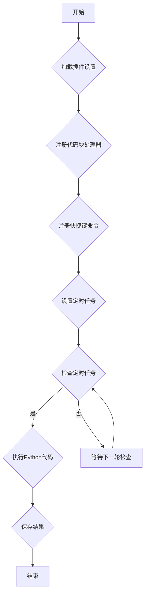

obsidian-yuhanbo-python1.0： [obsidian插件：yuhanbo-python，在笔记中直接运行 Python 代码，提升学习工作效率！ | 余汉波 文档](https://wd.sanrenjz.com/%E4%BB%A3%E7%A0%81%E4%B8%8E%E6%95%88%E7%8E%87/obsidian%E6%8F%92%E4%BB%B6%EF%BC%9Ayuhanbo-python%EF%BC%8C%E5%9C%A8%E7%AC%94%E8%AE%B0%E4%B8%AD%E7%9B%B4%E6%8E%A5%E8%BF%90%E8%A1%8C%20Python%20%E4%BB%A3%E7%A0%81%EF%BC%8C%E6%8F%90%E5%8D%87%E5%AD%A6%E4%B9%A0%E5%B7%A5%E4%BD%9C%E6%95%88%E7%8E%87%EF%BC%81)

程序小店：[obsidian插件：yuhanbo-python2.0，在OB中直接运行python和执行定时任务 | 三人聚智-余汉波程序小店](https://jy.sanrenjz.com/buy/26)

本文档旨在详细解释 Obsidian Python Runner 插件 2.0 的代码，该插件允许用户在 Obsidian 编辑器中运行 Python 代码块，并提供定时任务功能，以便自动化执行特定 MD 文件中的 Python 代码。本文档面向具有一定技术背景但非编程专家的读者，将深入剖析插件的目的、功能、结构、算法、潜在限制以及改进建议。

## 插件目的与功能

Obsidian Python Runner 插件的主要目的是为了方便 Obsidian 用户在笔记中嵌入和执行 Python 代码。它提供以下核心功能：

1. 代码块执行：允许用户在 Markdown 文件中使用 ```python 代码块，插件可以识别并执行这些代码块，并将结果显示在 Obsidian 编辑器中。
1. 定时任务：插件支持设置定时任务，定期执行指定 MD 文件中的 Python 代码，并将结果保存到指定路径。
1. 灵活的配置：用户可以配置 Python 解释器的路径、默认文件名模式等。
1. 用户友好的界面：提供设置面板，方便用户管理定时任务和其他配置。


## 插件结构与组织方式

该插件的代码主要由以下几个文件组成：

* data.json: 存储插件的配置数据，如 Python 解释器路径、定时任务列表等。
* manifest.json: 定义插件的基本信息，如 ID、名称、版本、描述等。
* package.json: 包含项目依赖、脚本命令等信息。
* styles.css: 定义插件的样式，包括代码块、按钮、模态框等的外观。
* main.js: 插件的核心逻辑，包括代码块处理器、定时任务管理、设置界面等。
main.js 文件是插件的核心，下面将详细分析其主要组成部分。

### ExecWindow 类

ExecWindow 类用于创建一个模态窗口，用于显示 Python 代码的执行结果。该类包含以下主要方法：

* constructor(app): 构造函数，初始化模态窗口的各个元素。
* open(): 打开模态窗口，将窗口添加到文档中。
* close(): 关闭模态窗口，从文档中移除窗口。
* onOpen(): 在模态窗口打开时执行，用于动态创建窗口内容，包括标题、执行结果区域、复制按钮、关闭按钮等。
* setContent(content): 设置模态窗口中显示的内容，即 Python 代码的执行结果。
* makeDraggable(modalEl, titleBar): 使模态窗口可以拖动。
### PythonRunnerPlugin 类

PythonRunnerPlugin 类是插件的主类，继承自 Obsidian 的 Plugin 类。该类包含以下主要方法：

* onload(): 插件加载时执行，用于加载设置、添加设置标签、注册 Markdown 代码块处理器、注册快捷键命令等。
* executePythonCode(code): 执行 Python 代码，使用 child_process 模块的 exec 函数调用 Python 解释器执行代码，并返回执行结果。
* loadSettings(): 加载插件设置。
* saveSettings(): 保存插件设置。
* checkAndRunScheduledTasks(): 检查并执行定时任务。
* executeScheduledTask(task): 执行单个定时任务。
* extractPythonCode(content): 从 Markdown 文件内容中提取 Python 代码块。
* saveResult(result, outputPath, outputFileName): 将执行结果保存到指定文件。
* calculateNextRun(schedule, type, weekDay): 计算下次运行时间。
* runPythonInCurrentFile(): 运行当前文件中的 Python 代码。
### PythonRunnerSettingTab 类

PythonRunnerSettingTab 类用于创建插件的设置界面，继承自 Obsidian 的 PluginSettingTab 类。该类包含以下主要方法：

* constructor(app, plugin): 构造函数，初始化设置界面。
* display(): 显示设置界面，包括 Python 路径设置、定时任务列表、添加定时任务按钮等。
* displayTasks(containerEl): 显示定时任务列表。
* showEditTaskModal(task, taskIndex): 显示编辑定时任务模态框。
* showAddTaskModal(): 显示添加定时任务模态框。
* handleSuggestionKeydown(event, suggestions, container, selectedIndex, setIndex, onSelect): 处理建议列表的键盘事件。
* updateSuggestions(container, suggestions, selectedIndex, onClick): 更新建议列表。
* getFolders(): 获取所有文件夹。
* showError(container, message): 显示错误消息。


## 代码分析与算法

以下是代码中一些关键部分的详细分析：

1. executePythonCode(code) 方法
1. checkAndRunScheduledTasks() 方法
1. extractPythonCode(content) 方法
1. calculateNextRun(schedule, type, weekDay) 方法
## 潜在限制与改进建议

1. 安全性问题：执行任意 Python 代码存在安全风险。建议增加代码执行权限限制，例如只允许执行特定的库或函数。
1. 错误处理：当前的错误处理机制较为简单，只显示错误消息。建议增加更详细的错误信息，例如错误类型、行号等。
1. 代码依赖：如果 Python 代码依赖第三方库，需要用户手动安装。建议增加自动安装依赖的功能。
1. 并发执行：当前的定时任务是串行执行的，如果任务执行时间较长，可能会影响其他任务的执行。建议增加并发执行功能。
1. 用户界面：可以进一步优化设置界面，例如增加任务状态显示、任务执行日志等。
1. 模态框拖拽：模态框拖拽的实现可能在某些情况下存在问题，建议使用更稳定的拖拽库。
## 编程语言与库

* JavaScript: 插件的主要编程语言。
* Obsidian API: 用于与 Obsidian 编辑器交互。
* Node.js: 用于执行 Python 代码。
* child_process: 用于调用外部命令（Python 解释器）。
* util: 用于将 child_process.exec 函数转换为 Promise。
* fs: 用于读写文件。
* path: 用于处理文件路径。
* os: 用于获取操作系统信息。
* node-cron: 该库在提供的代码中没有直接使用，但 package.json 中声明了依赖，原本可能用于定时任务的调度，但实际代码使用 setInterval 实现，后续可以考虑使用该库进行更专业的任务调度。
## Mermaid 流程图代码



