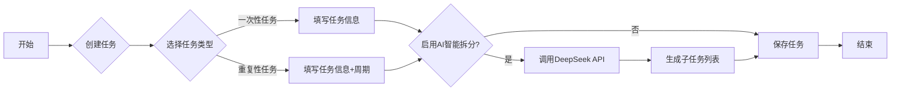

bili 视频：[obsidian插件：yuhanbo-task，智能任务管理与番茄时钟插件_哔哩哔哩_bilibili](https://www.bilibili.com/video/BV16pKfzPEBV/?vd_source=247ac77d4ae7339ea06d0fec09aa8f70)

程序小店：[obsidian插件：yuhanbo-task，智能任务管理与番茄时钟插件 | 三人聚智-余汉波程序小店](https://jy.sanrenjz.com/buy/35)

github 开源：[yuhanbo758/obsidian-yuhanbo-task: Obsidian 智能任务管理与番茄时钟插件，集成 AI 智能拆分的任务管理系统，配备专业番茄时钟，提升工作效率。](https://github.com/yuhanbo758/obsidian-yuhanbo-task)

Obsidian 是一款强大的笔记软件，通过插件扩展其功能，可以实现各种定制化的需求。本文将深入解析一款 Obsidian 任务管理与番茄时钟插件的代码，该插件集成了任务管理、番茄时钟和 AI 智能拆分功能，旨在提高用户的工作效率。

## 插件概述

这款插件主要由以下几个部分组成：

1. 核心功能：番茄时钟、任务管理和 AI 智能拆分。
1. 主要文件：
1. 技术栈：JavaScript、CSS、Obsidian API、DeepSeek API。

## 文件结构与功能

### README.md

README.md 文件是插件的说明文档，其主要内容包括：

* 功能介绍：详细描述了插件的各项功能，例如番茄时钟的设置、任务的分类和 AI 智能拆分的使用。
* 使用方法：指导用户如何安装和使用插件，包括番茄时钟的启动、任务的创建和 AI 智能拆分的步骤。
* 设置项说明：解释了插件的各项设置项，例如 API 设置、任务保存路径设置、番茄时钟设置和提示音设置。
* 命令列表：列出了插件的所有命令，例如“开始番茄时钟”、“添加新任务”等。
* 许可证：声明了插件的许可证类型，这里是 MIT 许可证。
### manifest.json

manifest.json 文件是插件的清单文件，其主要内容包括：

* id：插件的唯一 ID，用于标识插件。
* name：插件的名称，显示在 Obsidian 插件列表中。
* version：插件的版本号。
* minAppVersion：插件所需的最低 Obsidian 版本。
* description：插件的描述，用于简要介绍插件的功能。
* author：插件的作者。
* authorUrl：插件作者的 URL。
* isDesktopOnly：指示插件是否仅在桌面端运行。
### package.json

package.json 文件是 Node.js 包管理文件，其主要内容包括：

* name：插件的名称。
* version：插件的版本号。
* description：插件的描述。
* main：插件的入口文件，这里是 main.js。
* author：插件的作者。
* license：插件的许可证类型。
* keywords：插件的关键词，用于在插件市场中搜索。
### styles.css

styles.css 文件是插件的样式文件，用于定义插件的界面样式。其主要内容包括：

* 全局样式：定义了插件的全局样式，例如字体、颜色和边框。
* 侧边栏工具样式：定义了插件侧边栏按钮的样式。
* 番茄时钟状态栏样式：定义了番茄时钟状态栏的样式。
* 番茄时钟样式：定义了番茄时钟界面的样式。
* 弹窗通用样式：定义了插件弹窗的通用样式。
* 任务列表样式：定义了任务列表的样式。
* 任务表单样式：定义了任务表单的样式。
* 子任务样式：定义了子任务列表的样式。
* 任务进度更新弹窗样式：定义了任务进度更新弹窗的样式。
* 标签页样式：定义了标签页的样式。
* 设置页面样式：定义了插件设置页面的样式。
* 响应式样式：定义了插件的响应式样式，以适应不同屏幕尺寸。
### main.js

main.js 文件是插件的主要逻辑文件，包含插件的核心功能实现。以下是 main.js 文件的主要组成部分：

1. 插件类 YuhanboTaskPlugin：
1. 番茄时钟计时器类 PomodoroTimer：
1. 设置标签页类 YuhanboTaskSettingTab：
1. 任务管理器类 TaskManager：
1. 任务选择弹窗类 TaskSelectionModal：
1. 任务进度更新弹窗类 TaskProgressModal：
1. 任务创建和编辑弹窗类 TaskModal：
1. 任务列表弹窗类 TaskListModal：
## 核心功能实现

### 番茄时钟

番茄时钟功能由 PomodoroTimer 类实现，主要包括以下步骤：

1. 设置计时器状态：根据当前状态（工作、休息、暂停）设置计时器的状态。
1. 设置计时器时长：根据当前状态设置计时器的时长（工作时长、短休息时长、长休息时长）。
1. 启动计时器：使用 setInterval 函数启动计时器，每秒更新状态栏显示。
1. 处理计时器结束：计时器结束时，播放提示音，并根据当前状态执行相应的操作（启动休息、启动工作）。
### 任务管理

任务管理功能由 TaskManager 类实现，主要包括以下步骤：

1. 加载任务：从任务文件夹中加载所有任务，并将任务存储在任务列表中。
1. 添加任务：将新任务添加到任务列表中，并保存到任务文件中。
1. 删除任务：从任务列表中删除任务，并从任务文件中移除。
1. 更新任务：更新任务的进度或状态，并将更新后的任务保存到任务文件中。
### AI 智能拆分

AI 智能拆分功能由 TaskModal 类和 DeepSeek API 实现，主要包括以下步骤：

1. 获取 API Key：从插件设置中获取 DeepSeek API Key。
1. 构建 API 请求：根据任务标题和描述构建 API 请求，请求 DeepSeek API 生成子任务。
1. 解析 API 响应：解析 DeepSeek API 的响应，提取子任务列表。
1. 渲染子任务列表：将子任务列表渲染到任务表单中。
## 算法与数据结构

1. 日期处理：插件使用了 JavaScript 的 Date 对象来处理日期和时间，例如计算任务的截止日期和执行日期。
1. 任务存储：插件使用 JavaScript 的数组来存储任务列表，并使用 JSON 格式将任务数据保存到任务文件中。
1. 字符串处理：插件使用了 JavaScript 的字符串处理函数来解析任务文件，例如 split、match 和 replace 函数。
## 潜在限制与改进建议

1. 依赖外部 API：AI 智能拆分功能依赖 DeepSeek API，如果 API 不可用或网络连接不稳定，则该功能无法正常使用。
1. 任务文件格式：插件使用 Markdown 格式存储任务数据，如果任务文件格式不正确，则可能导致任务加载失败。
1. 提示音设置：插件的提示音设置比较简单，只支持 MP3 和 WAV 格式的音频文件。
## 编程语言与库

1. JavaScript：插件的主要编程语言是 JavaScript，用于实现插件的核心功能。
1. CSS：插件使用 CSS 来定义界面样式，包括全局样式、侧边栏样式、番茄时钟样式和任务列表样式。
1. Obsidian API：插件使用 Obsidian API 来访问 Obsidian 的核心功能，例如加载和保存设置、创建和管理文件、添加命令和状态栏。
1. DeepSeek API：插件使用 DeepSeek API 来实现 AI 智能拆分功能，用于将复杂任务拆分为多个子任务。
1. moment.js：处理日期和时间。
## Mermaid 流程图

