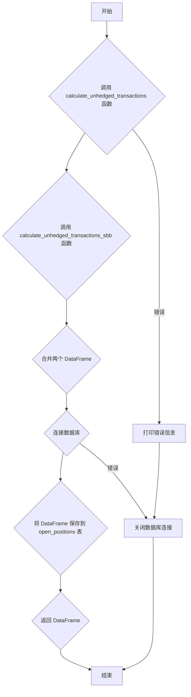

### 用途说明

该函数用于计算当前的持仓信息，并将结果保存到数据库的 open_positions 表中。它结合了两种不同的交易策略（基本技术指标和网格交易）的持仓结果。

### 参数

* db_path (str): 数据库文件的路径。
### 返回值

* pandas.DataFrame: 包含当前所有持仓信息的 DataFrame，如果出现错误则返回 None。
### 工作流程



### 使用方法

以下是如何使用 open_positions 函数的示例：

```python
import pandas as pd
import sqlite3
import yuhanbolh as lh

# ... 其他代码 ...

# 调用函数并获取持仓 DataFrame
positions_df = lh.open_positions('my_database.db')

# 打印持仓信息
if positions_df is not None:
    print(positions_df)
```

### 示例

假设 my_database.db 数据库包含了您的交易记录，调用 open_positions('my_database.db') 函数将会：

1. 调用 calculate_unhedged_transactions 和 calculate_unhedged_transactions_sbb 函数分别计算两种策略的持仓情况。
1. 合并两个结果 DataFrame。
1. 连接到 my_database.db 数据库。
1. 将合并后的 DataFrame 保存到 open_positions 表中，如果表已存在则覆盖。
1. 返回包含所有持仓信息的 DataFrame。
注意: 该函数假设您已经定义了 calculate_unhedged_transactions 和 calculate_unhedged_transactions_sbb 函数，并且数据库中包含了执行这些函数所需的数据。

