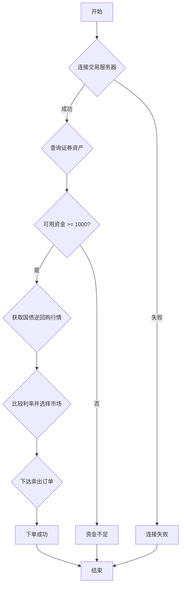

## 用途说明

该函数用于比较沪深两市的一天期国债逆回购利率，选择利率较高的市场进行卖出操作。

## 参数

* xt_trader (object):  XTrader交易接口对象。
* acc (str): 交易账号。
* xtdata (object):  XTrader数据接口对象。
## 用法

该函数首先检查与交易服务器的连接状态。连接成功后，查询指定账户的证券资产信息，并判断可用资金是否充足（大于等于1000元）。

如果资金充足，则获取指定日期的沪深两市一天期国债逆回购利率（代码分别为 '131810.SZ' 和 '204001.SH' ），比较后选择利率较高的市场进行卖出操作。

如果资金不足，则输出提示信息，不进行交易。

## 示例

```python
import yuhanbolh as lh

lh.place_order_based_on_asset(xt_trader, 'your_account', xtdata)
```

## 函数流程图



## 代码

```python
# 比较沪深两市的一天期的买一国债逆回购，选择值大的进行卖出
def place_order_based_on_asset(xt_trader, acc, xtdata):
    # 检查连接结果
    connect_result = xt_trader.connect()
    if connect_result == 0:
        print('连接成功')
        try:
            # 查询证券资产
            asset = xt_trader.query_stock_asset(acc)
            print("证券资产查询保存成功, 可用资金：", asset.cash)

            # 判断可用资金是否足够
            if asset.cash >= 1000:
                # 根据资产计算订单量
                order_volume = int(asset.cash / 1000) * 10

                # 获取市场数据以确定股票代码和价格
                xtdata.subscribe_quote('131810.SZ', period='tick', start_time='', end_time='', count=1, callback=None)
                xtdata.subscribe_quote('204001.SH', period='tick', start_time='', end_time='', count=1, callback=None)
                generate_func = xtdata.get_market_data(field_list=['bidPrice'], stock_list=['131810.SZ','204001.SH'], period='tick', start_time='', end_time='', count=-1, dividend_type='none', fill_data=True)

                # 提取 '131810.SZ' 和 '204001.SH' 的最后一个 bidPrice
                price_131810 = generate_func['131810.SZ']['bidPrice'][-1][0]
                price_204001 = generate_func['204001.SH']['bidPrice'][-1][0]

                # 根据价格选择股票代码和价格
                if price_131810 >= price_204001:
                    stock_code, price = '131810.SZ', price_131810
                else:
                    stock_code, price = '204001.SH', price_204001

                # 下达股票订单
                xt_trader.order_stock(
                    acc, 
                    stock_code, 
                    xtconstant.STOCK_SELL, 
                    order_volume, 
                    xtconstant.FIX_PRICE, 
                    price, 
                    '国债逆回购策略', 
                    ''
                )
                print(f"成功下达订单，股票代码：{stock_code}，价格：{price}，订单量：{order_volume}。")
            else:
                print("可用资金不足，不进行交易")
        except Exception as e:
            print("下达订单时出现错误:", e)
    else:
        print('连接失败')
```

