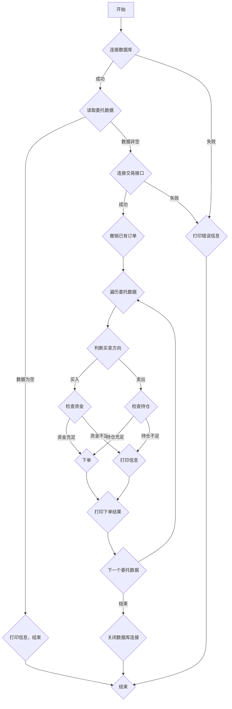

### 用途说明

该函数用于自动化证券委托交易，根据指定的数据库表信息，连接证券交易接口进行下单操作。支持股票买入和卖出，并根据委托价格类型进行限价或市价交易。

### 参数

### 用法

调用 place_orders(db_path, table_name, trade_table_name, xt_trader, acc)，函数将自动执行以下操作:

1. 连接到指定的数据库。
1. 读取 table_name 表中的委托数据。
1. 连接证券交易接口。
1. 撤销之前发送的，针对相同证券代码的订单。
1. 遍历委托数据，根据买入或卖出类型、委托价格类型、可用资金/持仓数量等条件进行下单操作。
1. 打印下单结果信息。
### 示例

```python
# 导入必要的库
import sqlite3
import pandas as pd
import yuhanbolh as lh
from your_module import xtconstant, xt_trader  # 假设 xtconstant 和 xt_trader 来自 your_module


# 设置参数
db_path = 'your_database.db'
table_name = 'order_table'
trade_table_name = 'trade_record_table'
acc = 'your_account'

# 调用函数
lh.place_orders(db_path, table_name, trade_table_name, xt_trader, acc)
```

### 流程图



