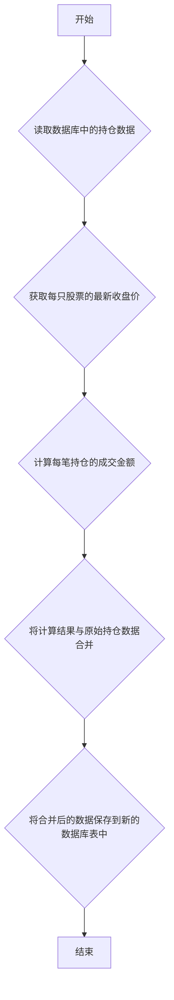

## 用途说明

该函数用于获取指定数据库表中的持仓数据，并结合最新的收盘价计算成交金额等信息。最终将计算结果与原始持仓数据合并，并将合并后的数据保存到新的数据库表中。

## 参数

* table_name (str): 数据库中存储持仓数据的表名。
## 用法

函数调用示例：

```python
import yuhanbolh as lh
merged_data = lh.position_close_process_data("my_position_table")
print(merged_data)
```

其中 my_position_table 是数据库中存储持仓数据的表名。函数返回一个 Pandas DataFrame，其中包含原始持仓数据和计算得到的成交信息。

## 示例

假设数据库中有一个名为 position_data 的表，存储了以下持仓数据：

调用函数 position_close_process_data("position_data") 后，函数会：

1. 从数据库中读取 position_data 表的数据。
1. 获取每只股票的最新收盘价。
1. 计算每笔持仓的成交金额。
1. 将计算结果与原始持仓数据合并。
1. 将合并后的数据保存到名为 position_data_hedge 的新表中。
## 函数工作流程图



## 代码

```python
# 获取持仓和收盘价，从而获得整体的交易日期和现金流，然后保存到数据库到r"D:\wenjian\python\smart\data\guojin_account.db"
def position_close_process_data(table_name):
    db_path = r"D:\wenjian\python\smart\data\guojin_account.db"
    conn = sqlite3.connect(db_path)

    query = f"SELECT * FROM {table_name}"
    data_from_db = pd.read_sql_query(query, conn)

    conn.close()

    data = gf.calculate_unhedged_transactions(db_path, [table_name])

    for index, row in data.iterrows():
        market_data = json_to_dfcf_qmt(row['证券代码'], 5)
        close_price = market_data['close'].iloc[-1]
        data.at[index, '成交时间'] = pd.Timestamp.now().strftime('%Y-%m-%d %H:%M:%S')
        data.at[index, '成交均价'] = close_price
        data.at[index, '成交金额'] = close_price * row['成交数量']
        data.at[index, '买卖'] = -1

    merged_data = pd.concat([data_from_db, data], ignore_index=True)

    # 创建新的数据库连接
    new_db_path = r"D:\wenjian\python\smart\data\guojin_account.db"
    new_conn = sqlite3.connect(new_db_path)

    # 新表名为原表名加"_hedge"
    new_table_name = f"{table_name}_hedge"


    # 将merged_data保存到新的数据库
    merged_data.to_sql(new_table_name, new_conn, if_exists='replace', index=False)
    

    # 关闭新的数据库连接
    new_conn.close()

    return merged_data
```

