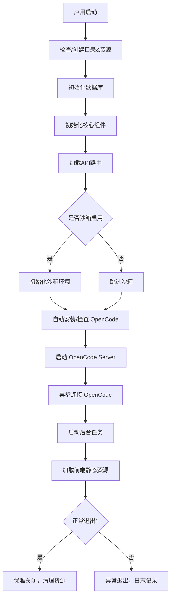

测试

项目为三人聚智的开源项目，可以到 [github：yuhanbo758/codebot](https://github.com/yuhanbo758/codebot) 或 [gitee：yuhanbo758/codebot](https://gitee.com/yuhanbo758/codebot) 拉取项目，或releases 或到[夸克](https://pan.quark.cn/s/32af0c9b87cc)下载，亦可前往程序小店。

程序小店：[程序小店 - 虚拟商品销售平台](https://shop.sanrenjz.com/product/69c1dafed64de6758c5268bd)

bili 视频：[Codebot-基于OpenCode的个人龙虾AI助手_哔哩哔哩_bilibili](https://www.bilibili.com/video/BV1ejXnB2ExS/)

bili 视频：[Codebot-基于OpenCode的个人龙虾AI助手-2_哔哩哔哩_bilibili](https://www.bilibili.com/video/BV1QrDTBNEy4/?vd_source=247ac77d4ae7339ea06d0fec09aa8f70#reply116345983206547)

## 一、项目概述

Codebot 是一款基于 OpenCode 平台打造的个人 AI 助手，具有跨平台、多通信渠道（飞书、邮箱）、丰富技能系统与高效记忆管理能力。项目以 Python3.11+ 为后端主力，配合 Electron 桌面端和 Vue3 前端，为开发者和普通用户提供灵活、智能、高扩展性的效率工具环境。

本项目的主功能包括：

* 与 OpenCode 服务无缝集成，支持多模型切换与自主决策
* 实现对用户信息、习惯、偏好的自动提取与记忆提示
* 完备的定时任务、通知、日志、技能、MCP 集成与管理
* 安全隔离的沙箱执行环境，大幅提升代码生成和运行的灵活性与安全性
* 跨平台兼容（支持 Windows、Linux、macOS，及 Electron 桌面端）
## 二、功能结构与主流程

整体架构采用分层+模块化设计，后端核心为 FastAPI 应用，按 REST API 暴露对话、记忆、定时任务、技能、配置等服务路由，配合 memory（ChromaDB+SQLite）、opencode 客户端、沙箱管理和多前端适配。

主模块逻辑及流程：

* 应用初始化 → 数据/技能/日志/备份目录校验与创建 → 内置技能复制
* 依赖检查与自动安装（OpenCode）
* 连接数据库并初始化表结构
* 各全局核心组件实例化（内存管理、通知、WS 机器人、沙箱等）
* API 路由加载（chat/memory/scheduler/skills/config/mcp/etc.）
* 沙箱环境启动与端口自适应检测
* 异步启动 OpenCode Server 并接管后端与技能调度
* 前端静态资源挂载、SPA 路由回退
* 应用关闭时 graceful shutdown，停止后台任务、断开连接
以 main.py 为核心入口，调动 config、database、core（opencode_ws/memory_manager/scheduler等）、services、skills、api、沙箱子模块共同完成项目启动、生命周期管理及功能扩展。

## 三、关键技术细节与算法实现

### 1. 目录结构自动管理

通过 Path/OS/shutil，确保数据、技能、日志、前端静态文件等关键目录存在，并按需种子复制内置技能（支持 PyInstaller 打包、Electron extraResources、本地源码多种场景）。

### 2. 沙箱隔离环境（sandbox_manager）

所有 AI 生成代码执行均在独立的 sandbox_workspace 下完成，采用 asyncio 子进程调度，并内置超时控制。

* 隔离执行：防止异常/恶意代码危害主系统
* 支持 stdout/stderr/exit_code 管理与实时反馈
### 3. Memory 及知识库管理

集成 SQLite + ChromaDB，支持上下文及长期记忆的持久化、自动提取、归档查看、导入导出、清理整理等多种管理手段。

### 4. 技能与 MCP 工具自动发现与调度

遍历技能目录，按 YAML frontmatter 匹配技能元数据，实现低侵入调度与高可扩展性。

* ol生成技能沉淀
* 各技能支持内链调用
### 5. 网络端口、多实例检测和优雅降级

通过UDP/Socket检测局域网IP和端口占用，有效避免资源冲突和异常退出。Skill API 提供种子数据合并机制避免多实例请求异常。

## 四、核心代码流程图（Mermaid）

## 五、主要依赖与技术栈

* Python 3.11+，FastAPI，asyncio，SQLite，ChromaDB，loguru
* Electron, Node.js (前端打包/桌面)，Vue 3, Pinia
* 依赖自动检测（OpenCode CLI），跨平台兼容
## 六、局限与改进建议

### 局限：

* 依赖 Electron+Python 环境，首次安装环境配置复杂
* 需保证 OpenCode Server 正常运行方可使用绝大部分 AI 驱动功能
* 技能文件的自动沉淀仅依赖本地规则，用户自行管理自定义目录时须注意格式兼容
### 改进建议：

* 增强多模型 AI 后端兼容性（如深度集成 OpenAI API）
* 前端适配移动端用户体验进一步优化
* 技能市场与一键安装功能完善，降低维护门槛
* 增加云端备份及远程协作能力
