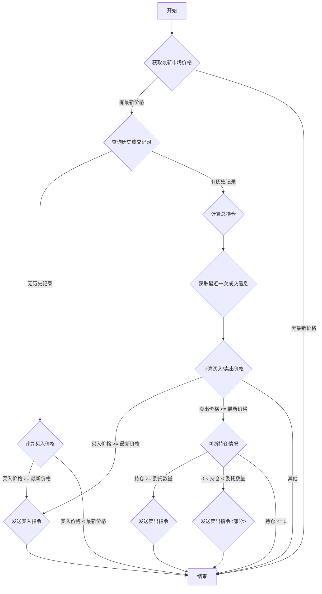

## 用途说明

该函数用于处理基于振幅的网格交易策略。它根据最新的市场价格、预设的振幅百分比和持仓情况，决定是否发送买入或卖出指令。

## 参数

* cursor (database cursor): 数据库游标对象，用于执行SQL查询。
* conn (database connection): 数据库连接对象，用于提交或回滚事务。
* tick (dict): 包含最新市场行情数据的字典，例如 {'lastPrice': 10.0, ...}。
* code (str): 股票代码。
* price (float): 策略计算的委托价格。
* quantity (int): 策略计算的委托数量。
* buy_sell (int): 买卖方向，1表示买入，-1表示卖出。
* strategy (str): 策略名称。
* remark (str): 委托备注信息，包含振幅百分比信息。
* datetime_str (str): 当前时间字符串，格式为"YYYY-MM-DD HH:MM:SS"。
* rowid (int): 数据库记录的rowid。
## 函数逻辑

1. 获取最新市场价格 lastPrice。
1. 从 execute_general_trade 表中查询该策略在该股票上的历史成交记录。
1. 如果没有历史成交记录：
1. 如果有历史成交记录：
1. 如果发生异常，则打印错误信息并回滚数据库事务。
## 流程图



## 代码示例

```python
# 处理振幅网格策略
def process_amplitude_grid(cursor, conn, tick, code, price, quantity, buy_sell, strategy, remark, datetime_str, rowid):
    """
    处理振幅网格策略
    """
    try:
        lastPrice = tick.get('lastPrice')
        if lastPrice is None:
            return
        
        委托备注_value = float(remark)
        委托数量_value = quantity
        
        cursor.execute("""
            SELECT 成交均价, 成交数量, 买卖, 委托备注 FROM execute_general_trade
            WHERE 策略名称=? AND 证券代码=?
            ORDER BY rowid ASC
        """, (strategy, code))
        trade_rows = cursor.fetchall()
        
        if not trade_rows:
            new_buy_price = price - 委托备注_value * price / 100
            if new_buy_price >= lastPrice:
                insert_order(cursor, conn, code, new_buy_price, 委托数量_value, 1, strategy, remark, datetime_str)
        else:
            total_position = sum(row[1] * row[2] for row in trade_rows)
            last_trade = trade_rows[-1]
            last成交均价 = last_trade[0]
            委托备注_value = float(last_trade[3])
            buy_price = last成交均价 - 委托备注_value * last成交均价 / 100
            sell_price = last成交均价 + 委托备注_value * last成交均价 / 100
            
            if buy_price >= lastPrice:
                insert_order(cursor, conn, code, buy_price, 委托数量_value, 1, strategy, remark, datetime_str)
            elif sell_price <= lastPrice:
                if total_position >= 委托数量_value:
                    insert_order(cursor, conn, code, sell_price, 委托数量_value, -1, strategy, remark, datetime_str)
                elif total_position > 0:
                    insert_order(cursor, conn, code, sell_price, total_position, -1, strategy, remark, datetime_str)
                else:
                    pass  # 不做任何操作
    except Exception as e:
        # 捕获所有异常并打印错误信息
        print(f"发生异常: {e}")
        # 回滚事务以确保数据一致性
        conn.rollback()
        return None  # 返回 None 或其他适当的值以表示失败

    # 不删除receive_condition表中的行
```

