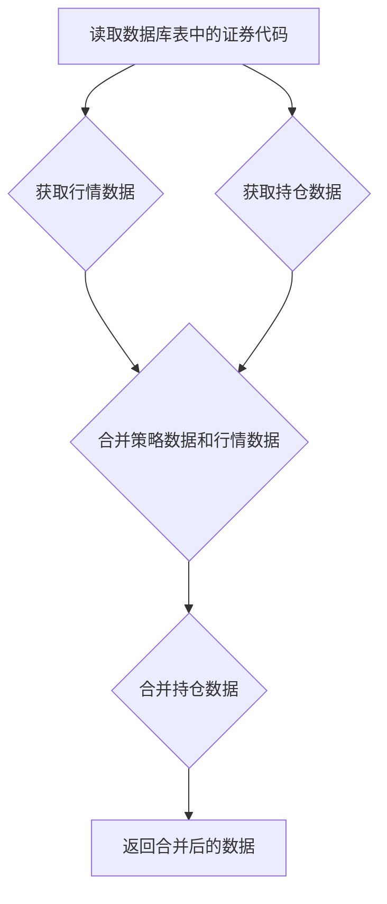

### 用途说明

该函数用于读取指定数据库表中的'证券代码'列，获取对应的实时行情数据和账户持仓量，并将这些数据与原始数据合并，最终返回合并后的DataFrame。

### 参数

* db_path (str): 数据库文件的路径。
* table_name (str): 读取证券代码的数据表名称。
* acc (str):  账户标识符，用于查询持仓信息。
### 返回值

* pandas.DataFrame: 包含以下列的DataFrame：
### 用法

调用 process_and_merge_data(db_path, table_name, acc)，传入数据库路径、数据表名以及账户标识符，函数会返回合并后的数据。

### 示例

```python
import yuhanbolh as lh

merged_data = lh.process_and_merge_data('strategy_data.db', 'selected_stocks', 'your_account_id')
print(merged_data)
```

### 流程图



