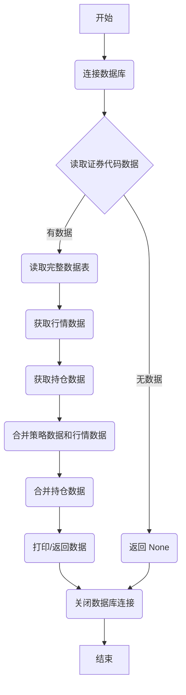

## 用途说明

该函数用于读取指定数据库表中的'证券代码'列，获取对应的行情数据和持仓量，并将所有数据合并到一个 DataFrame 中。

## 参数

* db_path (str): 数据库文件的路径。
* table_name (str): 读取证券代码的数据表名称。
* acc (str): 账户标识符。
## 用法

函数调用示例及返回值说明：

```python
import yuhanbolh as lh

merged_data = lh.process_and_merge_data('path/to/database.db', 'strategy_table', 'account_id')

if merged_data is not None:
  print(merged_data)
```

* merged_data: 包含原始表数据、行情数据和持仓数据的 DataFrame，如果没有任何数据则返回 None。
## 示例

```python
# 调用函数并打印合并后的数据
merged_data = process_and_merge_data('stock_data.db', 'selected_stocks', 'my_account')

if merged_data is not None:
    print(merged_data)
```

## 流程图



## 代码

```python
# 读取指定数据库表中的'证券代码'列，获取对应的行情数据和持仓量，最后打印合并后的数据。
def process_and_merge_data(db_path: str, table_name: str, acc: str):
    """
    读取指定数据库表中的'证券代码'列，获取对应的行情数据和持仓量，
    并将行情数据与原始表数据以及持仓数据合并，最后打印合并后的数据。

    :param db_path: 数据库文件的路径。
    :param table_name: 读取证券代码的数据表名称。
    :param acc: 账户标识符。
    """
    try:
        xt_trader = None
        # 连接到数据库
        conn = sqlite3.connect(db_path)

        # 从数据库读取证券代码
        query = f"SELECT 证券代码 FROM {table_name}"
        strategy_data = pd.read_sql_query(query, conn)

        if strategy_data is None or strategy_data.empty:
            # print('没有可用数据')
            return

        # 重新读取完整的数据表
        complete_strategy_data = pd.read_sql_query(f"SELECT * FROM {table_name}", conn)

        # 获取行情数据
        codes = strategy_data['证券代码'].tolist()
        market_data = get_snapshot(codes)  # 确保这个函数返回一个包含'证券代码'列的DataFrame

        # 获取所有持仓信息
        positions = xt_trader.query_stock_positions(acc)  # 获取所有持仓
        positions_data = pd.DataFrame([{'证券代码': pos.stock_code, '持仓量': pos.volume} for pos in positions])

        # 合并策略数据和行情数据
        merged_data = pd.merge(complete_strategy_data, market_data, on='证券代码', how='left')
        # 再将持仓数据合并到已有的合并数据中
        final_merged_data = pd.merge(merged_data, positions_data, on='证券代码', how='left')

        # 打印合并后的数据
        # print(final_merged_data)
        return final_merged_data

    except Exception as e:
        print(f"An error occurred: {e}")
    finally:
        # 关闭数据库连接
        conn.close()
```

