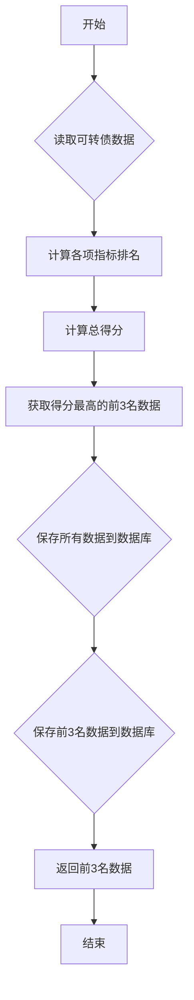

### 用途说明

该函数用于对可转债数据进行加权排名，并将其保存到数据库中。函数会根据指定的权重，对'最新价'，'转股溢价率'，'最新变动后余额'，'转股价值'和'期权价值'进行排名，并计算总得分。最终将所有数据和得分最高的前3名数据分别存储到指定的数据库表中。

### 参数

* data (pandas.DataFrame): 原始的可转债数据，需要包含'最新价'，'转股溢价率'，'最新变动后余额'，'转股价值'和'期权价值'列。
* db_path (str): 数据库文件路径。
* data_table (str): 用于存储所有数据的数据库表名。
* top_3_table (str): 用于存储得分最高的前3名数据的数据库表名。
* price_w (float): '最新价'的权重。
* prem_w (float): '转股溢价率'的权重。
* size_w (float): '最新变动后余额'的权重。
* conv_w (float): '转股价值'的权重。
* opt_w (float): '期权价值'的权重。
### 返回值

* pandas.DataFrame:  得分最高的前3名数据，如果处理过程中出现错误，则返回一个空的DataFrame。
### 用法

以下代码展示了如何调用process_data函数：

```python
import pandas as pd
import yuhanbolh as lh

# 从文件中读取数据
data = pd.read_csv("convertible_bond_data.csv")

# 设置数据库信息和权重
db_path = "convertible_bond.db"
data_table = "all_data"
top_3_table = "top_3"
price_w = 0.2
prem_w = 0.3
size_w = 0.1
conv_w = 0.2
opt_w = 0.2

# 调用函数处理数据
top_3_data = lh.process_data(data, db_path, data_table, top_3_table, price_w, prem_w, size_w, conv_w, opt_w)

# 打印得分最高的前3名数据
print(top_3_data)
```

### 流程图



