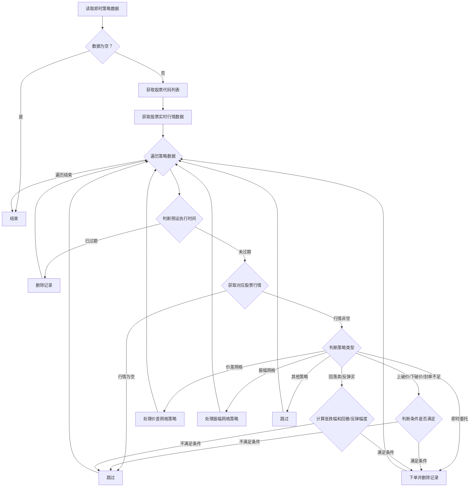

### 用途说明

该函数用于处理数据库中 receive_condition 表中标记为“即时”的交易策略。它会根据不同的策略类型，读取最新的股票行情数据，判断是否满足条件，并执行相应的操作，例如：下单、删除记录等。

### 参数

* rows (list): 从数据库中读取的“即时”交易策略数据，每行数据包含以下字段：
* cursor: 数据库游标对象，用于执行SQL语句。
* conn: 数据库连接对象，用于提交数据库操作。
### 工作流程



### 函数逻辑

1. 检查传入的 rows 是否为空，如果为空则直接返回。
1. 从 rows 中提取所有不重复的股票代码。
1. 调用 xtdata.get_full_tick 函数获取所有股票的实时行情数据。
1. 遍历 rows 中的每一行数据，进行以下处理：
### 代码示例

```python
# 处理监控策略
def process_immediate_rows(rows, cursor, conn):
    """
    处理即时行数据
    """
    if not rows:
        return
    securities = list(set(row[1] for row in rows))  # row[1] 是 '证券代码'
    tick_data = xtdata.get_full_tick(securities)
    current_time = datetime.now()
    for row in rows:
        rowid, code, price, quantity, buy_sell, strategy, remark, datetime_str = row
        # 处理'日期时间'
        if datetime_str:
            row_time = datetime.strptime(datetime_str, "%Y%m%d %H:%M")
            if current_time > row_time:
                cursor.execute("DELETE FROM receive_condition WHERE rowid=?", (rowid,))
                conn.commit()
                # 删除对应的execute_general_trade行
                cursor.execute("DELETE FROM execute_general_trade WHERE 策略名称=? AND 证券代码=?", (strategy, code))
                conn.commit()
                continue
        # 获取tick数据
        tick = tick_data.get(code, {})
        if not tick:
            continue  # 如果没有tick数据，跳过
        lastPrice = tick.get('lastPrice')
        high = tick.get('high')
        low = tick.get('low')
        lastClose = tick.get('lastClose')
        volume = tick.get('volume')
        bidVol1 = tick.get('bidVol')[0]  # 买一量
        askVol1 = tick.get('askVol')[0]  # 卖一量
        if strategy == '即时委托':
            insert_order(cursor, conn, code, price, quantity, buy_sell, strategy, remark, datetime_str)
            cursor.execute("DELETE FROM receive_condition WHERE rowid=?", (rowid,))
            conn.commit()
            # 删除对应的execute_general_trade行
            cursor.execute("DELETE FROM execute_general_trade WHERE 策略名称=? AND 证券代码=?", (strategy, code))
            conn.commit()
        elif strategy == '上破价':
            if lastPrice >= price:
                insert_order(cursor, conn, code, price, quantity, buy_sell, strategy, remark, datetime_str)
                delete_receive_condition_row(cursor, conn, rowid)
                delete_execute_general_trade_row(cursor, conn, strategy, code)
        elif strategy == '下破价':
            if lastPrice <= price:
                insert_order(cursor, conn, code, price, quantity, buy_sell, strategy, remark, datetime_str)
                delete_receive_condition_row(cursor, conn, rowid)
                delete_execute_general_trade_row(cursor, conn, strategy, code)
        elif strategy == '封单不足-注数量':
            action, amount = remark.split(":")
            amount = float(amount)
            if (action == 'buy' and bidVol1 <= amount) or (action == 'sell' and askVol1 <= amount):
                insert_order(cursor, conn, code, price, quantity, buy_sell, strategy, remark, datetime_str)
                delete_receive_condition_row(cursor, conn, rowid)
                delete_execute_general_trade_row(cursor, conn, strategy, code)

        elif strategy == '回落卖-价涨幅-注回撤':
            try:
                if lastClose != 0:
                    price_change_ratio = (high - lastClose) / lastClose
                    retreat_ratio = (high - lastPrice) / high
                    if (price_change_ratio >= price / 100) and (retreat_ratio >= float(remark) / 100):
                        insert_order(cursor, conn, code, 0, quantity, buy_sell, strategy, '最优五档', datetime_str)
                        delete_receive_condition_row(cursor, conn, rowid)
                        delete_execute_general_trade_row(cursor, conn, strategy, code)
            except ZeroDivisionError:
                continue
        elif strategy == '反弹买-价跌幅-注反弹':
            try:
                if lastClose != 0:
                    price_drop_ratio = (lastClose - low) / lastClose
                    rebound_ratio = (lastPrice - low) / low
                    if (price_drop_ratio >= price / 100) and (rebound_ratio >= float(remark) / 100):
                        insert_order(cursor, conn, code, 0, quantity, buy_sell, strategy, '最优五档', datetime_str)
                        delete_receive_condition_row(cursor, conn, rowid)
                        delete_execute_general_trade_row(cursor, conn, strategy, code)
            except ZeroDivisionError:
                continue
        elif strategy.startswith('价差网格-注价差'):
            process_price_grid(cursor, conn, tick, code, price, quantity, buy_sell, strategy, remark, datetime_str, rowid)
        elif strategy.startswith('振幅网格-注振幅'):
            process_amplitude_grid(cursor, conn, tick, code, price, quantity, buy_sell, strategy, remark, datetime_str, rowid)
        else:
            pass  # 其他策略
```

