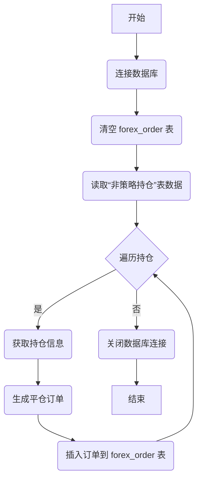

## 用途说明

该函数用于平仓“非策略持仓”表中的所有持仓。它会读取“非策略持仓”表中的数据，为每个持仓生成平仓订单，并将订单插入到 forex_order 表中。该函数每月运行一次。

## 参数

* db_path (str): 数据库文件的路径。
## 用法

每月调用一次 process_non_strategy_positions(db_path)， 传入数据库文件路径作为参数，即可平仓所有非策略持仓。

## 示例

```python
import yuhanbolh as lh
lh.process_non_strategy_positions("/path/to/your/database.db")
```

## 流程图



## 代码

```python
# 将“非策略持仓”表中的数据插入到forex_order表中，进行平仓持仓，每月运行一次。参数：数据库路径
def process_non_strategy_positions(db_path):
    # 连接到数据库
    conn = sqlite3.connect(db_path)
    
    # 清空forex_order表
    cursor = conn.cursor()
    cursor.execute("DELETE FROM forex_order")
    conn.commit()
    
    # 读取“非策略持仓”表中的数据
    df_non_strategy_positions = pd.read_sql_query("SELECT * FROM `非策略持仓`", conn)
    
    # 遍历“非策略持仓”表中的每一行数据，并插入到forex_order表中
    for index, position in df_non_strategy_positions.iterrows():
        # 从数据表中提取相应的值
        magic = position['magic']
        symbol = position['symbol']
        volume = position['volume']
        symbol_info = mt5.symbol_info(symbol)
        if symbol_info is None:  # 确保symbol信息存在
            continue
        deviation = symbol_info.point * 10

        type = 0 if position['type'] == 1 else 1
        comment = position['comment']
        ticket = position['ticket']
        
        close_position_fn(conn, magic, symbol, volume, deviation, type, comment, ticket)
    
    # 关闭数据库连接
    conn.close()
```

