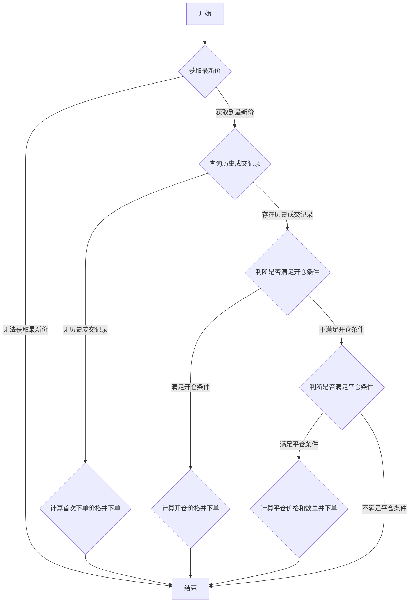

### 用途说明

该函数用于处理股票交易中的价差网格策略，根据实时价格、持仓情况和策略参数，决定是否下单以及下单的价格和数量。

### 参数

* cursor (database cursor): 数据库游标对象，用于执行SQL语句。
* conn (database connection): 数据库连接对象，用于提交数据库操作。
* tick (dict): 实时行情数据，包含最新价等信息。
* code (str): 股票代码。
* price (float): 委托价格。
* quantity (int): 委托数量。
* buy_sell (int): 买卖方向，1代表买入，-1代表卖出。
* strategy (str): 策略名称。
* remark (str): 委托备注，存储价差。
* datetime_str (str): 当前时间字符串。
* rowid (int): 数据行号。
### 流程图



### 函数逻辑

1. 获取股票实时行情数据中的最新价。
1. 查询该策略在该股票上的历史成交记录。
1. 如果没有历史成交记录：
1. 如果存在历史成交记录：
### 示例代码

```python
# 处理价差网格策略
def process_price_grid(cursor, conn, tick, code, price, quantity, buy_sell, strategy, remark, datetime_str, rowid):
    """
    处理价差网格策略
    """
    lastPrice = tick.get('lastPrice')
    if lastPrice is None:
        return
    委托备注_value = float(remark)
    委托数量_value = quantity
    # 查询execute_general_trade
    cursor.execute("""
        SELECT 成交均价, 成交数量, 买卖, 委托备注 FROM execute_general_trade
        WHERE 策略名称=? AND 证券代码=?
        ORDER BY rowid ASC
    """, (strategy, code))
    trade_rows = cursor.fetchall()
    if not trade_rows:
        if (price - 委托备注_value) >= lastPrice:
            new_price = price - 委托备注_value
            insert_order(cursor, conn, code, new_price, 委托数量_value, 1, strategy, remark, datetime_str)
    else:
        total_position = sum(row[1] * row[2] for row in trade_rows)
        last_trade = trade_rows[-1]
        last成交均价 = last_trade[0]
        委托备注_value = float(last_trade[3])
        if (last成交均价 - 委托备注_value) >= lastPrice:
            new_price = last成交均价 - 委托备注_value
            insert_order(cursor, conn, code, new_price, 委托数量_value, 1, strategy, remark, datetime_str)
        elif (last成交均价 + 委托备注_value) <= lastPrice:
            new_price = last成交均价 + 委托备注_value
            if total_position >= 委托数量_value:
                insert_order(cursor, conn, code, new_price, 委托数量_value, -1, strategy, remark, datetime_str)
            elif total_position > 0:
                insert_order(cursor, conn, code, new_price, total_position, -1, strategy, remark, datetime_str)
            else:
                pass  # 不做任何操作
    # 不删除receive_condition表中的行

```

