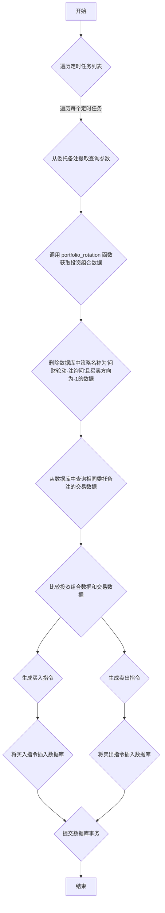

## 用途说明

该函数用于处理定时任务，根据委托备注信息调用 portfolio_rotation 函数获取投资组合数据，并与数据库中已执行的交易数据进行比较，生成新的买入和卖出指令。

## 参数

* scheduled_tasks (list): 包含定时任务信息的列表，每个元素是一个元组，包含以下信息：
* cursor (cursor object): 数据库游标对象，用于执行SQL语句
* conn (connection object): 数据库连接对象，用于提交或回滚事务
## 用法

该函数通常由定时任务调度器调用，传入需要处理的定时任务列表、数据库游标对象和数据库连接对象。

## 示例

```python
import yuhanbolh as lh
# 假设 scheduled_tasks 包含以下数据：
scheduled_tasks = [
    (1, '000001.SZ', 10.0, 100, 1, '问财轮动-注询问', '{"query": "筛选条件"}', '2023-10-26 10:00:00'),
]
# 调用 process_scheduled_tasks 函数处理定时任务
process_scheduled_tasks(scheduled_tasks, cursor, conn)
```

## 流程图



```python
# 根据委托备注获取数据
def process_scheduled_tasks(scheduled_tasks, cursor, conn):
    """
    处理定时任务
    """
    try:
        for row in scheduled_tasks:
            rowid, code, price, quantity, buy_sell, strategy, remark, datetime_str = row
            # 从'委托备注'获取查询参数
            query = remark
            # 调用portfolio_rotation(query)
            A_data = portfolio_rotation(query, quantity, strategy)
            # 假设A_data有列['证券代码', '委托数量', '策略名称', '委托备注']
            if A_data.empty:
                continue
            # 删除'execute_general_trade'中'策略名称' == '问财轮动-注询问'且'买卖' == -1的行
            cursor.execute("""
                DELETE FROM execute_general_trade
                WHERE 策略名称='问财轮动-注询问' AND 买卖=-1
            """)
            conn.commit()
            # 从'execute_general_trade'获取相同'委托备注'的数据组
            cursor.execute("""
                SELECT 证券代码, 成交数量, 策略名称, 委托备注
                FROM execute_general_trade
                WHERE 委托备注=?
            """, (remark,))
            B_rows = cursor.fetchall()
            B_data = set(row[0] for row in B_rows)
            A_securities = set(A_data['证券代码'])
            securities_to_buy = A_securities - B_data
            securities_to_sell = B_data - A_securities
            for buy_code in securities_to_buy:
                row_data = A_data[A_data['证券代码'] == buy_code].iloc[0]
                insert_order(cursor, conn, buy_code, 0, quantity, 1, strategy, remark, datetime.now().strftime('%Y%m%d %H:%M'))
            for sell_code in securities_to_sell:
                cursor.execute("""
                    SELECT 成交数量
                    FROM execute_general_trade
                    WHERE 策略名称=? AND 证券代码=? AND 委托备注=?
                """, (strategy, sell_code, remark))
                execute_rows = cursor.fetchall()
                total_quantity = sum(row[0] for row in execute_rows)
                insert_order(cursor, conn, sell_code, 0, total_quantity, -1, strategy, remark, datetime.now().strftime('%Y%m%d %H:%M'))
                cursor.execute("""
                    DELETE FROM execute_general_trade
                    WHERE 策略名称=? AND 证券代码=? AND 委托备注=?
                """, (strategy, sell_code, remark))
                conn.commit()
    except Exception as e:
        # 捕获所有异常并打印错误信息
        print(f"发生异常: {e}")
        # 回滚事务以确保数据一致性
        conn.rollback()
        return None  # 返回 None 或其他适当的值以表示失败
```

