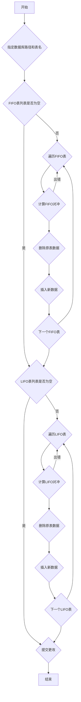

## 用途说明

批量处理多个数据表中的策略持仓数据，支持先进先出(FIFO)和后进先出(LIFO)两种对冲方式，并将处理后的数据更新回原始数据表。

## 参数

* db_path (str): 数据库文件的路径。
* fifo_table_names (list, optional): 采用先进先出(FIFO)对冲策略的数据表名列表。默认为空列表。
* lifo_table_names (list, optional): 采用后进先出(LIFO)对冲策略的数据表名列表。默认为空列表。
## 用法

函数调用示例及返回值说明。

## 示例

```python
process_strategy_positions_original_table(
    db_path=r"D:\wenjian\python\smart\data\guojin_account.db",
    fifo_table_names=['execute_fund_basics_technical_trade', 'execute_calmar_ratio_trade', 'execute_sortino_ratio_trade', 'execute_low_premium_trade', 'execute_min_drawdown_trade', 'execute_triple_mean_trade'],
    lifo_table_names=['execute_fund_grid_trade']
)
```

## 函数工作流程图



## 函数代码

```python
import sqlite3
import pandas as pd
import global_functions as gf

# 批量对冲多个数据表单一策略（比如将不同策略的成交写入不同数据表的数据），策略持仓处理函数，保存到原表，参数是数据库路径和表名列表。调用例子：process_strategy_positions_original_table(db_path, ['execute_fund_grid_trade'], ['execute_fund_basics_technical_trade'])
def process_strategy_positions_original_table(db_path, fifo_table_names=None, lifo_table_names=None):
    """
    处理策略持仓数据
    
    参数:
    db_path: 数据库路径
    fifo_table_names: 先进先出表名列表，默认为空
    lifo_table_names: 后进先出表名列表，默认为空
    
    返回:
    处理后的DataFrame
    """
    conn = None  # 初始化conn变量
    
    try:
        # 设置默认值
        if fifo_table_names is None:
            fifo_table_names = []
        if lifo_table_names is None:
            lifo_table_names = []
            
        # 创建数据库连接
        conn = sqlite3.connect(db_path)
        
        cursor = conn.cursor()
        
        # 分别处理每个FIFO表
        for table_name in fifo_table_names:
            try:
                # 对单个表进行FIFO对冲计算
                df_table = gf.calculate_unhedged_transactions(db_path, [table_name])
                print(f"FIFO表 {table_name} 处理完成，共处理 {len(df_table)} 条记录")
                
                # 删除原表数据
                cursor.execute(f"DELETE FROM {table_name}")
                
                # 将处理后的数据重新插入到原表中
                if not df_table.empty:
                    df_table.to_sql(table_name, conn, if_exists='append', index=False)
                    
            except sqlite3.OperationalError as e:
                print(f"处理FIFO表 {table_name} 时出错: {e}")
                continue
                
        # 分别处理每个LIFO表
        for table_name in lifo_table_names:
            try:
                # 对单个表进行LIFO对冲计算
                df_table = gf.calculate_unhedged_transactions_sbb(db_path, [table_name])
                print(f"LIFO表 {table_name} 处理完成，共处理 {len(df_table)} 条记录")
                
                # 删除原表数据
                cursor.execute(f"DELETE FROM {table_name}")
                
                # 将处理后的数据重新插入到原表中
                if not df_table.empty:
                    df_table.to_sql(table_name, conn, if_exists='append', index=False)
                    
            except sqlite3.OperationalError as e:
                print(f"处理LIFO表 {table_name} 时出错: {e}")
                continue
                
        conn.commit()
        
        # 返回处理结果的汇总信息
        total_tables = len(fifo_table_names) + len(lifo_table_names)
        print(f"所有表处理完成，共处理 {total_tables} 个表")
        return pd.DataFrame({'message': [f'处理完成，共处理 {total_tables} 个表']})
        
    except Exception as e:
        print(f"An error occurred: {e}")
        return pd.DataFrame()  # 返回空DataFrame
        
    finally:
        if conn is not None:  # 只有当conn被创建时才关闭
            conn.close()


if __name__ == '__main__':
    # 测试多表策略对冲
    process_strategy_positions_original_table(r"D:\wenjian\python\smart\data\guojin_account.db", ['execute_fund_basics_technical_trade', 'execute_calmar_ratio_trade', 'execute_sortino_ratio_trade', 'execute_low_premium_trade', 'execute_min_drawdown_trade', 'execute_triple_mean_trade'], ['execute_fund_grid_trade'])
```

