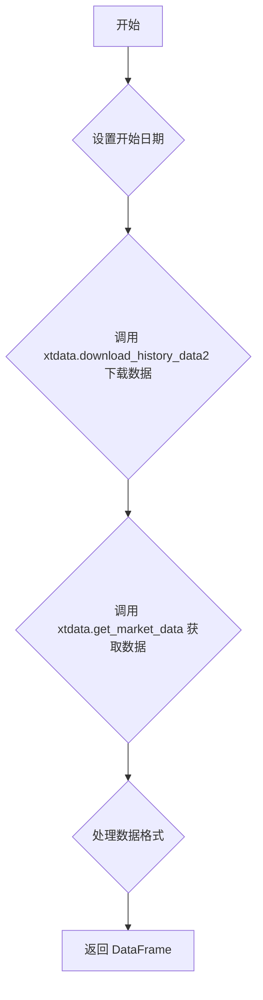

### 用途说明

该函数用于下载指定股票代码的国金证券 QMT 行情数据，并将其整理为 Pandas DataFrame 格式，方便后续分析使用。

### 参数

* stock_code (str): 股票代码，例如 '600000.SH'。
* days (int, optional): 下载过去多少天的数据，默认为 7*365，即 7 年。
### 返回值

* data_transposed (pandas.DataFrame): 包含历史行情数据的 DataFrame，包含以下列：
### 用法

调用 qmt_data_source_download(stock_code, days) 下载指定股票代码的历史行情数据。

### 示例

```python
import datetime
import xtdata
import pandas as pd
import yuhanbolh as lh

# 下载过去 5 年的股票数据
stock_data = lh.qmt_data_source_download('600000.SH', days=5*365) 

# 打印前 5 行数据
print(stock_data.head())
```

### 函数工作流程图



## 代码

```python
# 获取国金qmt行情数据的补充数据
def on_progress(data):
    '''补充历史数据回调函数'''
    print(data) 

# 通过qmt获取证券的7年K线历史数据，包含数据下载补充
def qmt_data_source_download(stock_code, days=7*365):

    # 计算7年前的日期
    start_time = (datetime.datetime.now() - datetime.timedelta(days=days)).strftime("%Y%m%d")
    xtdata.download_history_data2([stock_code], period='1d', start_time=start_time, callback=on_progress)

    field_list = ['time', 'open', 'close', 'high', 'low', 'volume', 'amount', 'settelementPrice', 'openInterest', 'preClose', 'suspendFlag']
    
    # 从新的数据源获取数据
    data = xtdata.get_market_data(field_list, [stock_code], period='1d', start_time=start_time, count=-1, dividend_type='front', fill_data=True)
    
    # 转置每个字段并连接在一起
    data_transposed = pd.concat([data[field].T for field in field_list], axis=1)
    data_transposed.columns = field_list
    data_transposed.reset_index(drop=True, inplace=True) # 重置索引
    
    # 将时间戳转换为日期字符串
    data_transposed['time'] = pd.to_datetime(data_transposed['time'], unit='ms') + pd.Timedelta(hours=8) # 加上时区偏移
    data_transposed['time'] = data_transposed['time'].dt.strftime('%Y-%m-%d')
    
    return data_transposed
```

