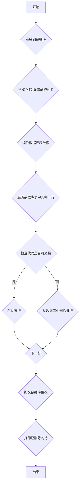

## 用途说明

该函数用于清理成分股数据库中无法在 MetaTrader 5 (MT5) 平台交易的产品代码。它连接到指定的 SQLite 数据库，读取指定表中的数据，并将 "mt5代码" 列中的每个代码与 MT5 平台上可交易的品种列表进行比较。如果代码不在可交易品种列表中，则从数据库中删除该行数据。

## 参数

* db_path (str): SQLite 数据库文件的路径。
* table_name (str): 需要清理数据的表的名称。
## 用法

函数将尝试连接到指定的 SQLite 数据库，并从指定的表中读取数据。它将使用 mt5.symbols_get() 函数获取 MT5 平台上所有可交易品种的列表。

对于数据库表中的每一行，函数将检查 "mt5代码" 列中的值是否在可交易品种列表中。如果代码不在列表中，则该行数据将被删除。

最后，函数将提交对数据库的更改并打印已删除的行。

## 示例

```python
import yuhanbolh as lh
lh.remove_unavailable_products_mt5('path/to/your/database.db', '成分股')
```

## 流程图



## 代码

```python
# 从成分股中清除不能在mt5交易的产品，参数分别是需要清除的数据库路径和表名
def remove_unavailable_products_mt5(db_path, table_name):
    try:
        # 获取所有交易品种的名称
        symbols = mt5.symbols_get()
        if symbols is None:
            raise Exception("无法获取交易品种，可能是MetaTrader 5未初始化")

        symbol_names = {symbol.name for symbol in symbols}

        # 连接到SQLite数据库
        conn = sqlite3.connect(db_path)
        cursor = conn.cursor()

        # 读取指定表中的所有列数据
        cursor.execute(f"SELECT * FROM {table_name}")
        rows = cursor.fetchall()

        # 获取表的列名
        column_names = [description[0] for description in cursor.description]

        # 遍历数据库中的代码，与交易品种对比
        deleted_rows = []
        for row in rows:
            mt5_code = row[column_names.index('mt5代码')]
            if mt5_code not in symbol_names:
                # 如果代码不在交易品种中，删除该行数据
                cursor.execute(f"DELETE FROM {table_name} WHERE mt5代码 = ?", (mt5_code,))
                deleted_rows.append(row)

        # 提交更改
        conn.commit()

        # 打印被删除的行
        print("以下行已被删除：")
        for deleted_row in deleted_rows:
            print(dict(zip(column_names, deleted_row)))

    except sqlite3.Error as e:
        print(f"数据库操作出错: {e}")
    except Exception as e:
        print(f"发生错误: {e}")
    finally:
        # 确保关闭数据库连接
        if conn:
            conn.close()
```

