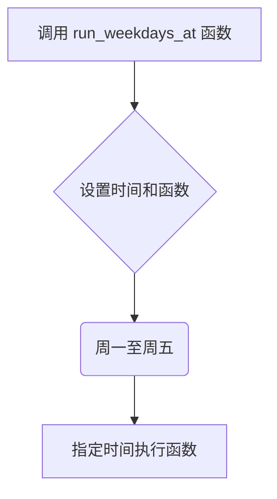

### 用途说明

该函数用于在每周的工作日（周一至周五）的指定时间执行指定的 Python 函数。

### 参数

* time_str (str): 字符串格式的时间，例如 "10:30", "14:00"。
* function (function): 需要在指定时间执行的 Python 函数对象。
### 用法

调用 run_weekdays_at(time_str, function) ，传入时间字符串和需要执行的函数对象，即可设置在每个工作日的指定时间执行该函数。

### 示例

```python
import schedule
import time

def my_function():
    print("This function runs every weekday at 10:30 AM.")

# 设置在每个工作日的 10:30 AM 执行 my_function 函数
run_weekdays_at("10:30", my_function)

while True:
    schedule.run_pending()
    time.sleep(1)
```

### 流程图



## 代码

```python
def run_weekdays_at(time_str, function):
    schedule.every().monday.at(time_str).do(function)
    schedule.every().tuesday.at(time_str).do(function)
    schedule.every().wednesday.at(time_str).do(function)
    schedule.every().thursday.at(time_str).do(function)
    schedule.every().friday.at(time_str).do(function)
```

