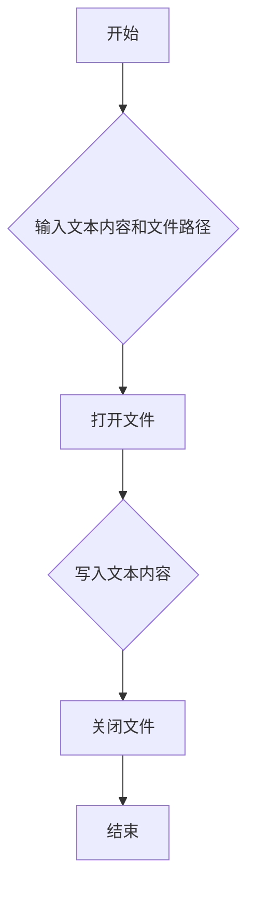

## 用途说明

将生成的文本保存为.md格式的文件。

## 参数

* generated_text (str): 要保存的文本内容。
* file_path (str): 要保存的文件路径，包含文件名和.md后缀。
## 用法

调用 save_as_md(generated_text, file_path) 将文本保存到指定路径。如果文件已存在，则会被覆盖。

## 示例

```python
generated_text = "# 标题\n这是一段示例文本。"
file_path = "example.md"
save_as_md(generated_text, file_path)
```

## 流程图



## 代码

```python
def save_as_md(generated_text, file_path):
    """
    将生成的文本保存为.md文件。

    :param generated_text: 生成的文本。
    :param file_path: 要保存的文件路径。
    """
    # 使用'w'模式打开文件，如果文件已存在则会被覆盖
    with open(file_path, 'w', encoding='utf-8') as file:
        file.write(generated_text)
```

