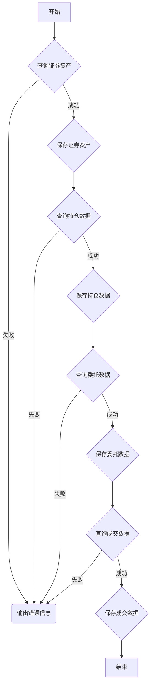

### 用途说明

该函数用于保存当日的证券资产、委托、成交和持仓数据到指定的数据库。

### 参数

* xt_trader (object): 交易对象，用于执行查询操作。
* acc (object): 账户信息，用于指定查询的账户。
* db_path (str): 数据库路径，用于指定数据保存的位置。
### 用法

调用 save_daily_data(xt_trader, acc, db_path) 函数，传入交易对象、账户信息和数据库路径，即可保存当日的证券数据。

### 示例

```python
import yuhanbolh as lh

lh.save_daily_data(trader, account, "stock_data.db")
```

### 流程图



```python
# 保存证券资产、委托、成交和持仓数据到数据库
def save_daily_data(xt_trader, acc, db_path):
    """
    保存当日的持仓、委托和成交数据到数据库
    :param xt_trader: 交易对象
    :param acc: 账户信息
    :param db_path: 数据库路径
    """
    try:
        # 查询证券资产
        asset = xt_trader.query_stock_asset(acc)
        if asset:
            save_stock_asset(asset, db_path)
            print("证券资产查询保存成功,可用资金：", asset.cash)
    except Exception as e:
        print("保存证券资产时出现错误:", e)

    try:
        # 查询当日所有的持仓
        positions = xt_trader.query_stock_positions(acc)
        if len(positions) != 0:
            save_positions(positions, db_path)
            print(f"持仓保存成功, 持仓数据： {len(positions)}")
    except Exception as e:
        print("保存持仓数据时出现错误:", e)

    try:
        # 查询当日所有的委托
        orders = xt_trader.query_stock_orders(acc)
        if len(orders) != 0:
            save_daily_orders(orders, db_path)
            print(f"当日委托保存成功, 委托数据： {len(orders)}")
    except Exception as e:
        print("保存委托数据时出现错误:", e)

    try:
        # 查询当日所有的成交
        trades = xt_trader.query_stock_trades(acc)
        if len(trades) != 0:
            save_daily_trades(trades, db_path)
            print(f"当日成交保存成功, 成交数据： {len(trades)}")
    except Exception as e:
        print("保存成交数据时出现错误:", e)
```

