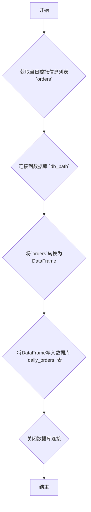

### 用途说明

该函数用于将当日的委托信息保存到SQLite数据库的daily_orders表中。

### 参数

* orders (list): 包含当日所有委托信息的列表。列表中的每个元素应为一个包含以下属性的自定义订单对象：
* db_path (str): SQLite数据库文件的路径。
### 用法

调用 save_daily_orders(orders, db_path) 函数，将 orders 列表中的委托信息保存到指定路径的SQLite数据库中。如果数据库中已存在 daily_orders 表，则会替换原有数据；如果不存在，则会创建新表。

### 示例

```python
import yuhanbolh as lh

# 假设 orders 是一个包含所有订单信息的列表
lh.save_daily_orders(orders, 'order_data.db')
```

### 流程图



## 代码

```python
# 查询当日委托并保存到数据库daily_orders
def save_daily_orders(orders, db_path):
    try:
        # 连接到SQLite数据库
        conn = sqlite3.connect(db_path)

        # 创建DataFrame
        data = {
            '账户类型': [order.account_type for order in orders],
            '资金账号': [order.account_id for order in orders],
            '证券代码': [order.stock_code for order in orders],
            '委托类型': [order.order_type for order in orders],
            '订单编号': [order.order_id for order in orders],
            '报单时间': [convert_time(order.order_time) for order in orders],
            '委托价格': [order.price for order in orders],
            '委托数量': [order.order_volume for order in orders],
            '报价类型': [order.price_type for order in orders],
            '委托状态': [order.order_status for order in orders],
            '柜台合同编号': [order.order_sysid for order in orders],
            '策略名称': [order.strategy_name for order in orders],
            '委托备注': [order.order_remark for order in orders]
        }
        
        df = pd.DataFrame(data)
        
        # 将DataFrame写入数据库，替换现有数据
        df.to_sql('daily_orders', conn, if_exists='replace', index=False)
        conn.close()
    except Exception as e:
        print("An error occurred:", e)

    # 假设 orders 是一个包含所有订单信息的列表
    # save_daily_orders(orders, db_path)
```

