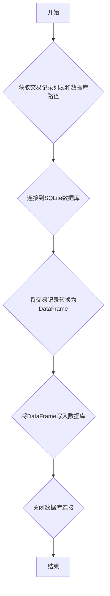

## 用途说明

该函数用于将当日的交易记录保存到指定的SQLite数据库中。

## 参数

* trades (list): 包含当日所有交易信息的列表，列表中的每个元素都是一个包含交易属性的对象，如 trade.account_type, trade.account_id 等。
* db_path (str): SQLite数据库文件的路径。
## 用法

调用 save_daily_trades(trades, db_path) 函数，传入包含当日交易信息的列表和数据库文件路径，即可将交易记录保存到数据库中。

## 示例

```python
import yuhanbolh as lh
# 假设 trades 是一个包含所有交易信息的列表
lh.save_daily_trades(trades, 'trades.db')
```

## 工作流程图



## 代码

```python
# 查询当日成交并保存到数据库daily_trades
def save_daily_trades(trades, db_path):
    try:
        # 连接到SQLite数据库
        conn = sqlite3.connect(db_path)
        

        # 创建DataFrame
        data = {
            '账户类型': [trade.account_type for trade in trades],
            '资金账号': [trade.account_id for trade in trades],
            '证券代码': [trade.stock_code for trade in trades],
            '委托类型': [trade.order_type for trade in trades],
            '成交编号': [trade.traded_id for trade in trades],
            '成交时间': [convert_time(trade.traded_time) for trade in trades],
            '成交均价': [trade.traded_price for trade in trades],
            '成交数量': [trade.traded_volume for trade in trades],
            '成交金额': [trade.traded_amount for trade in trades],
            '订单编号': [trade.order_id for trade in trades],
            '柜台合同编号': [trade.order_sysid for trade in trades],
            '策略名称': [trade.strategy_name for trade in trades],
            '委托备注': [trade.order_remark for trade in trades]
        }
        
        df = pd.DataFrame(data)
        
        # 将DataFrame写入数据库，替换现有数据
        df.to_sql('daily_trades', conn, if_exists='replace', index=False)
        conn.close()
    except Exception as e:
        print("An error occurred:", e)

    # 假设 trades 是一个包含所有交易信息的列表
    # save_daily_trades(trades, db_path)
```

