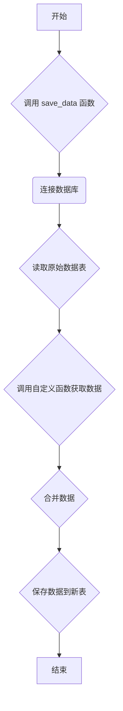

## 用途说明

该函数用于获取数据并将数据与原始数据表合并，然后将合并后的数据保存到新的数据表中。

## 参数

* function (callable): 获取数据的自定义函数。
* db_path (str): 数据库文件的路径。
* original_table_name (str): 原始数据表的名称。
* new_table_name (str): 用于保存合并后数据的新表名称。
## 用法

该函数接收一个自定义函数以及数据库和数据表的信息，通过调用自定义函数获取数据，并将数据与原始数据表合并，最终将合并后的数据保存到新的数据表中。

## 示例

```python
import yuhanbolh as lh
# 定义获取数据的自定义函数
def get_new_data(db_path, original_table_name):
    # 此处编写获取数据的逻辑，例如从API获取数据
    # ...
    # 返回获取到的数据，数据类型为 pandas.DataFrame
    return new_data_df

# 调用 save_data 函数
lh.save_data(get_new_data, "data.db", "original_table", "new_table")
```

## 工作流程图



## 代码

```python
# 将数据保存为sql
def save_data(function, db_path, original_table_name, new_table_name):
    """
    执行 function 以获取数据，并将该数据与 original_table_name 表的内容合并，
    然后将合并后的数据保存到 new_table_name 表中。

    参数:
    function: callable
        获取数据的自定义函数。
    db_path: str
        数据库文件的路径。
    original_table_name: str
        原始数据表的名称。
    new_table_name: str
        用于保存合并后数据的新表名称。
    """
    # 创建数据库连接
    conn = sqlite3.connect(db_path)
    
    try:
        # 获取原始表中的数据
        original_data = pd.read_sql_query(f"SELECT * FROM `{original_table_name}`", conn)
        
        # 调用自定义函数获取新的数据
        new_data = function(db_path, original_table_name)
        
        # 如果新数据不为空，合并原始数据和新数据
        if not new_data.empty:
            merged_data = pd.merge(original_data, new_data, on='价值代码', how='left')
        else:
            merged_data = original_data
        
        # 将合并后的数据保存到新的表中
        merged_data.to_sql(new_table_name, conn, if_exists='replace', index=False)
    except Exception as e:
        print(f"发生错误: {e}")
    finally:
        # 关闭数据库连接
        conn.close()
```

