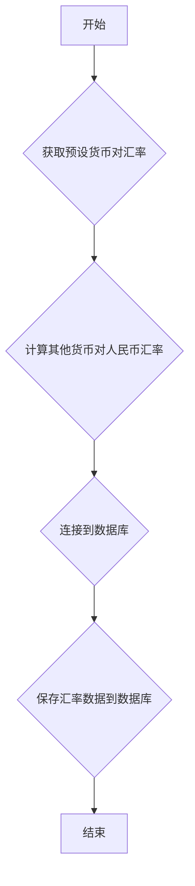

## 用途说明

该函数用于获取指定货币对的实时汇率，并将计算后的汇率数据保存到指定的 SQLite 数据库中。

## 参数

* db_path (str): 数据库文件的路径。
* table_name (str): 数据库中用于存储汇率数据的表名。
## 用法

调用 save_exchange_rates_to_db(db_path, table_name)  函数，将会执行以下操作：

1. 获取预设的货币对汇率数据，包含：USDJPY, EURGBP, EURAUD, GBPAUD, GBPUSD, EURUSD, USDCNH。
1. 计算其他货币对人民币（CNH）的汇率，包含：JPYCNH, GBPCNH, AUDCNH, EURCNH。
1. 将所有货币对和对应的汇率数据保存到指定的数据库和表中。
## 示例

```python
import yuhanbolh as lh
lh.save_exchange_rates_to_db('financial_data.db', 'exchange_rates')
```

该代码将会把汇率数据保存到 financial_data.db 数据库中的 exchange_rates 表中。

## 函数流程图



## 代码

```python
# 获取保存汇率数据到数据库，常用
def save_exchange_rates_to_db(db_path, table_name):
    """
    获取所需的所有汇率，计算兑换到CNH的汇率，并将结果保存到数据库中。

    参数:
    db_path: str
        数据库文件的路径。
    table_name: str
        数据库中的表名，用于存储汇率数据。
    """
    # 从 API 或模拟函数中获取所有需要的汇率
    rate_identifiers = ["119.USDJPY", "119.EURGBP", "119.EURAUD", "119.GBPAUD", "119.GBPUSD", "119.EURUSD", "133.USDCNH"]
    rates = {secid.split('.')[1]: get_exchange_rate(secid) for secid in rate_identifiers}

    # 计算其他货币对人民币的汇率
    rates["JPYCNH"] = (1 / rates["USDJPY"]) * rates["USDCNH"]
    rates["GBPCNH"] = (1 / rates["EURGBP"]) * rates["EURUSD"] * rates["USDCNH"]
    rates["AUDCNH"] = (1 / rates["EURAUD"]) * rates["EURUSD"] * rates["USDCNH"]
    rates["EURCNH"] = rates["EURUSD"] * rates["USDCNH"]

    # 将汇率数据转换为 DataFrame
    df_rates = pd.DataFrame(list(rates.items()), columns=["货币对", "汇率"])

    # 连接到 SQLite 数据库，并将汇率数据保存到指定的表中
    conn = sqlite3.connect(db_path)
    df_rates.to_sql(table_name, conn, if_exists='replace', index=False)
    conn.close()

    # 输出一条信息，确认数据已被保存
    print("汇率数据已经成功保存到数据库表：" + table_name)
```

