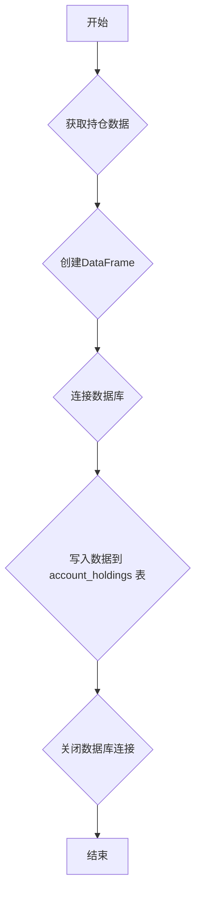

### 用途说明

该函数用于获取持仓数据并将数据保存至指定的SQLite数据库文件中。

### 参数

* positions (list): 包含多个持仓对象的列表。每个持仓对象应包含以下属性：
* db_path (str): SQLite数据库文件的路径。
### 用法

调用 save_positions(positions, db_path) 函数，将持仓数据保存至指定的数据库文件。函数执行过程中，会将持仓数据转换为 Pandas DataFrame，并将 DataFrame 写入数据库的 account_holdings 表中。如果表已存在，则会替换现有数据。

### 示例

```python
import yuhanbolh as lh
# 示例持仓数据
positions = [
    Position("股票账户", "123456", "000001", 1000, 1000, 10.0, 11000),
    Position("基金账户", "789012", "510300", 500, 500, 5.0, 2500)
]
# 数据库文件路径
db_path = "investment.db"
# 保存持仓数据
lh.save_positions(positions, db_path)
```

### 流程图



## 代码

```python
# 获取持仓数据并保存到数据库account_holdings
def save_positions(positions, db_path):
    try:
        # 连接到SQLite数据库
        conn = sqlite3.connect(db_path)

        # 创建DataFrame
        data = {
            '账户类型': [position.account_type for position in positions],
            '资金账号': [position.account_id for position in positions],
            '证券代码': [position.stock_code for position in positions],
            '持仓数量': [position.volume for position in positions],
            '可用数量': [position.can_use_volume for position in positions],
            '平均建仓成本': [position.open_price for position in positions],
            '市值': [position.market_value for position in positions]
        }
        df = pd.DataFrame(data)

        # 将DataFrame写入数据库，替换现有数据
        df.to_sql('account_holdings', conn, if_exists='replace', index=False)
        conn.close()
    except Exception as e:
        print("An error occurred:", e)
```

