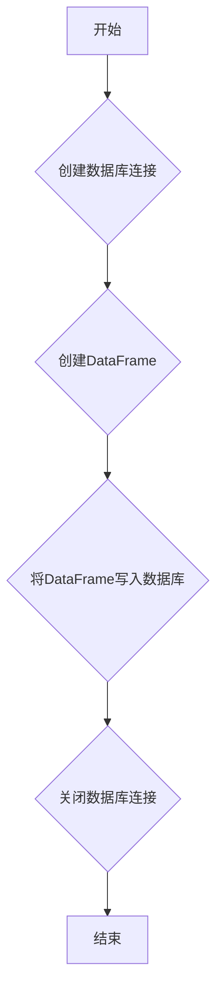

## 用途说明

该函数用于查询证券资产信息，并将数据保存到名为 manage_assets 的 SQLite 数据库表中。它接收一个包含资产信息的 asset 对象和数据库文件路径作为参数，并将资产信息格式化后存储到数据库。

## 参数

* asset (object): 包含证券资产信息的自定义对象，应包含以下属性：
* db_path (str): SQLite 数据库文件的路径。
## 用法

调用 save_stock_asset(asset, db_path) 函数，传入包含证券资产信息的 asset 对象和数据库文件路径。函数将连接到指定的数据库，并将 asset 对象中的数据保存到 manage_assets 表中。如果表已经存在，则会替换现有数据。

## 示例

```python
import sqlite3
import pandas as pd
import yuhanbolh as lh

# 定义 Asset 类
class Asset:
    def __init__(self, account_type, account_id, cash, frozen_cash, market_value, total_asset):
        self.account_type = account_type
        self.account_id = account_id
        self.cash = cash
        self.frozen_cash = frozen_cash
        self.market_value = market_value
        self.total_asset = total_asset

# 创建 Asset 对象示例
asset = Asset("股票账户", "1234567890", 10000.00, 5000.00, 20000.00, 30000.00)

# 设置数据库文件路径
db_path = "my_database.db"

# 调用函数保存资产信息
lh.save_stock_asset(asset, db_path)
```

## 流程图



## 代码

```python
# 证券资产查询并保存到数据库manage_assets
def save_stock_asset(asset, db_path):
    try:
        # 连接到SQLite数据库
        conn = sqlite3.connect(db_path)

        # 创建DataFrame
        data = {
            '账户类型': [asset.account_type],
            '资金账号': [asset.account_id],
            '现金': [asset.cash],
            '冻结现金': [asset.frozen_cash],
            '市值': [asset.market_value],
            '总资产': [asset.total_asset]
        }
        df = pd.DataFrame(data)

        # 将DataFrame写入数据库，替换现有数据
        df.to_sql('manage_assets', conn, if_exists='replace', index=False)
        conn.close()

        # 打印资金变动推送
        # print("资金变动推送")
        # print(asset.account_type, asset.account_id, asset.cash, asset.frozen_cash, asset.market_value, asset.total_asset)
    except Exception as e:
        print("An error occurred:", e)
```

