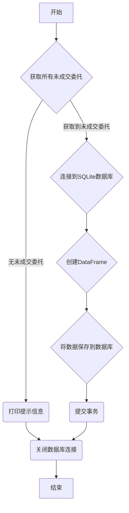

### 用途说明

该函数用于获取 MetaTrader 5 交易平台中所有未成交的委托订单，并将订单数据保存到 SQLite 数据库中。如果数据库中已存在指定的表，则函数会更新表数据；如果表不存在，则会创建新表。

### 参数

* db_path (str): SQLite 数据库文件的路径。
* table_name (str): 数据库中用于存储未成交委托数据的表名。
### 用法

调用 save_unsettled_orders_to_db(db_path, table_name) 函数，将 db_path 设置为数据库文件路径，table_name 设置为目标表名。

### 示例

```python
import yuhanbolh as lh
# 设置数据库路径和表名
db_path = "trading_data.db"
table_name = "unsettled_orders"

# 调用函数保存未成交委托数据
lh.save_unsettled_orders_to_db(db_path, table_name)
```

### 流程图



## 代码

```python
# 将未成交的委托保存到数据库中
def save_unsettled_orders_to_db(db_path, table_name):
    try:
        # 获取所有未成交的订单
        orders = mt5.orders_get()

        # 连接到SQLite数据库
        conn = sqlite3.connect(db_path)
        
        if orders is None or len(orders) == 0:
            print("No unsettled orders")
            # 使用 SQL 删除命令来清空表中的数据，但保留列结构
            conn.execute(f"DELETE FROM {table_name}")
            print(f"表 '{table_name}' 的数据已被清除。")
        else:
            # 创建 DataFrame
            df = pd.DataFrame(list(orders), columns=orders[0]._asdict().keys())

            # 将数据存储到 SQL 数据库
            df.to_sql(table_name, conn, if_exists='replace', index=False)
            print(f"数据成功保存到表'{table_name}' 在数据库 '{db_path}'.")

        # 提交事务并关闭连接
        conn.commit()

    except Exception as e:
        print("发生错误:", e)

    finally:
        # 确保在任何情况下都关闭数据库连接
        conn.close()
```

