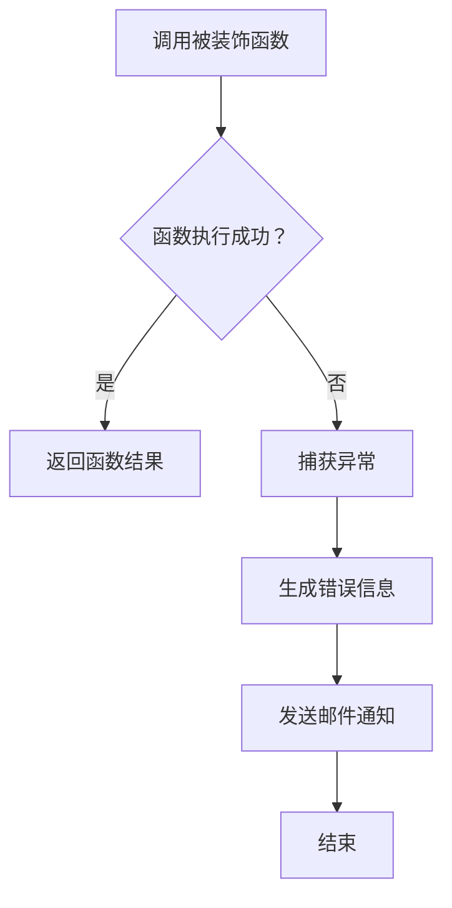

## 用途说明

se_send_email_on_error 是一个 Python 装饰器函数，用于包装其他函数。它会在被装饰函数发生异常时捕获异常，并通过 se.send_other_email 函数发送邮件通知。

## 参数

* func (function):  要装饰的目标函数。
## 用法

se_send_email_on_error 装饰器可以通过 @ 符号应用于其他函数。当被装饰的函数被调用时，装饰器会将其包装在一个 try-except 块中。

* 如果目标函数成功执行，装饰器会返回函数的返回值。
* 如果目标函数抛出异常，装饰器会捕获异常，生成包含函数名和错误信息的邮件内容，并调用 se.send_other_email 函数发送邮件通知。
## 示例

```python
import yuhanbolh as lh

@se_send_email_on_error
def my_function(a, b):
    """
    一个简单的除法函数。
    """
    return a / b

result = my_function(10, 0)
```

在上面的例子中，my_function 被 se_send_email_on_error 装饰。当 my_function 被调用时，由于除数为 0，会抛出一个 ZeroDivisionError 异常。装饰器会捕获这个异常，并发送一封包含错误信息的邮件。

## 工作流程图



```python
# 定义装饰器函数，用于处理任务函数中的异常
def se_send_email_on_error(func):
    def wrapper(*args, **kwargs):
        try:
            return func(*args, **kwargs)
        except Exception as e:
            error_message = f"在运行 {func.__name__} 函数时发生错误：{str(e)}"
            se.send_other_email(error_message)
    return wrapper
```

