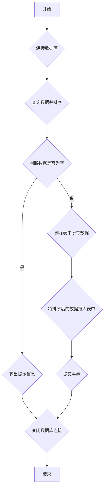

## 用途说明

该函数用于对指定的SQLite数据库表进行排序和更新操作。排序规则为先按照 "买卖" 列升序排序（先卖后买），然后按照 "操作" 列降序排序（先评分高后评分低）。

## 参数

* table_name (str): 指定要排序和更新的SQLite数据库表的名称。
## 用法

调用 sort_and_update_table(table_name) 函数，传入目标数据表的名称即可对数据表进行排序和更新。

## 示例

```python
import yuhanbolh as lh

lh.sort_and_update_table("委托数据表")
```

## 流程图



## 代码

```python
# 对委托数据表进行排序并更新，先卖后买，先评分（操作）高后评分低
def sort_and_update_table(table_name):
    conn = None
    try:
        # 连接到SQLite数据库
        conn = sqlite3.connect("D:/wenjian/python/smart/data/guojin_account.db")
        cursor = conn.cursor()

        # 按照买卖和操作列排序查询数据
        cursor.execute(f"SELECT * FROM {table_name} ORDER BY 买卖 ASC, 操作 DESC")
        sorted_rows = cursor.fetchall()

        # 如果查询结果为空，则不进行后续操作
        if not sorted_rows:
            print("没有数据进行排序和更新。")
            return

        # 如果查询结果不为空，则删除所有现有数据
        cursor.execute(f"DELETE FROM {table_name}")

        # 为排序后的数据准备插入语句
        columns_count = len(sorted_rows[0])
        placeholders = ', '.join('?' * columns_count)
        insert_query = f"INSERT INTO {table_name} VALUES ({placeholders})"

        # 将排序后的数据重新插入到表中
        cursor.executemany(insert_query, sorted_rows)

        # 提交事务
        conn.commit()

    except sqlite3.Error as error:
        print("SQLite数据库错误:", error)

    finally:
        # 确保关闭数据库连接
        if conn:
            conn.close()
```

