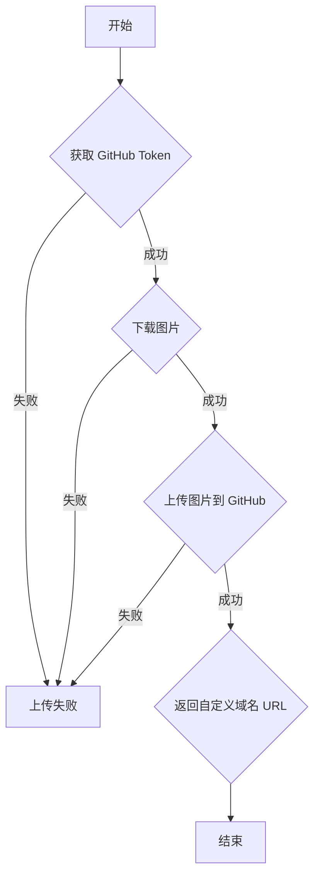

## 用途说明

该函数 upload_bing_image_to_github 用于将图片从指定的 URL 上传到 GitHub 仓库，并将图片命名为“日期+.png”格式，并返回图片的自定义域名 URL。

## 参数

* repo (str): GitHub 仓库名称，格式为 '用户名/仓库名'。
* image_url (str): 图片的 URL。
* commit_message (str, optional): 提交时的说明信息，默认为 'Upload image'。
## 用法

调用 upload_bing_image_to_github(repo, image_url, commit_message) 上传图片并获取自定义域名 URL。

## 示例

```python
image_url = "https://example.com/image.jpg"
repo = "your_username/your_repository"
image_url = upload_bing_image_to_github(repo, image_url, "Upload daily image")

if image_url:
    print(f"图片已上传至: {image_url}")
else:
    print("图片上传失败。")
```

## 流程图



## 代码

```python
def upload_bing_image_to_github(repo, image_url, commit_message="Upload image"):
    """
    将图片从URL上传到 GitHub 仓库，并将其命名为“日期+.png”。
    
    :param repo: GitHub 仓库名称，格式为 '用户名/仓库名'。
    :param image_url: 图片的URL。
    :param commit_message: 提交时的说明信息。
    :return: 上传图片的 URL，带有自定义域名。
    """
    try:
        # 获取 GitHub 令牌，确保你的令牌是正确的
        token = check_account("password", "github_token")

        # 从 URL 读取图片数据
        response = requests.get(image_url)
        if response.status_code == 200:
            image_data = response.content
        else:
            raise Exception(f"图片下载失败，状态码: {response.status_code}")

        # 将图片数据编码为 base64 格式
        image_base64 = base64.b64encode(image_data).decode('utf-8')

        # 生成图片文件名，以“日期+.png”格式命名
        current_date = datetime.now().strftime("%Y%m%d")
        image_name = f"{current_date}.png"
        path = image_name

        # GitHub API 创建或更新文件的 URL
        url = f"https://api.github.com/repos/{repo}/contents/{path}"

        # 准备请求头
        headers = {
            "Authorization": f"token {token}",
            "Accept": "application/vnd.github.v3+json"
        }

        # 检查文件是否存在
        response = requests.get(url, headers=headers)
        counter = 1

        while response.status_code == 200:
            # 文件已存在，增加计数器并修改文件名
            new_name = f"{current_date}_{counter}.png"
            path = f"{new_name}"
            url = f"https://api.github.com/repos/{repo}/contents/{path}"
            response = requests.get(url, headers=headers)
            counter += 1

        # 准备请求数据
        data = {
            "message": commit_message,
            "content": image_base64,
        }

        # 发送请求以上传图片
        response = requests.put(url, headers=headers, json=data)

        if response.status_code in [201, 200]:
            # 返回图片的自定义域名 URL
            custom_domain = "image.sanrenjz.com"
            # 根据是否存在文件返回正确的名称
            final_image_name = new_name if counter > 1 else image_name
            return f"https://{custom_domain}/{final_image_name}"
        else:
            # 处理可能的错误
            raise Exception(f"上传图片时出错: {response.json()}")
    
    except Exception as e:
        # 捕获并处理所有异常
        print(f"图片上传失败: {e}")
        return None
```

