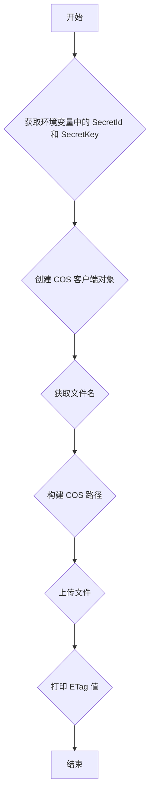

## 用途说明

本函数用于将本地文件上传到指定的腾讯云对象存储（COS）桶和文件夹中。

## 参数

* bucket (str): 要上传到的桶名称。
* file_name (str): 本地文件的完整路径。
* region (str, optional): 桶所在的区域，默认为 'ap-guangzhou'。
* cos_folder (str, optional): COS 中的目标文件夹，默认为 'temporary/'。
## 用法

调用 upload_to_cos(bucket, file_name, region, cos_folder) 函数即可上传文件，函数会返回上传文件的 ETag 值。

## 示例

```python
upload_to_cos(
    bucket='my-bucket',
    file_name='/path/to/my/file.txt',
    region='ap-guangzhou',
    cos_folder='uploads/'
)
```

## 流程图



## 代码

```python
# 上传文件到腾讯云COS
def upload_to_cos(bucket, file_name, region='ap-guangzhou', cos_folder='temporary/'):
    """
    上传文件到腾讯云COS指定桶和文件夹中。

    :param bucket: 要上传到的桶名称。
    :param file_name: 本地文件的完整路径。
    :param region: 桶所在的区域，默认为'ap-guangzhou'。
    :param cos_folder: COS中的目标文件夹，默认为'temporary/'。
    """
    # 配置日志
    logging.basicConfig(level=logging.INFO, stream=sys.stdout)

    # 从环境变量中获取secret_id和secret_key
    secret_id = check_account("username", "TENCENT_CLOUD_COS")  # 确保已经设置了环境变量COS_SECRET_ID
    secret_key = check_account("password", "TENCENT_CLOUD_COS")  # 确保已经设置了环境变量COS_SECRET_KEY
    token = None  # 使用临时密钥需要传入Token，默认为空,可不填
    scheme = 'https'  # 指定使用 http/https 协议来访问COS，默认为https, 可不填

    # 获取客户端对象
    config = CosConfig(Region=region, SecretId=secret_id, SecretKey=secret_key, Token=token, Scheme=scheme)
    client = CosS3Client(config)

    # 从本地文件路径中提取文件名
    base_file_name = os.path.basename(file_name)

    # 上传到COS的路径，包括文件夹和文件名
    cos_path = cos_folder + base_file_name

    # 上传文件
    response = client.upload_file(
        Bucket=bucket,
        LocalFilePath=file_name,
        Key=cos_path,
        PartSize=10,
        MAXThread=10
    )
    print(response['ETag'])
```

