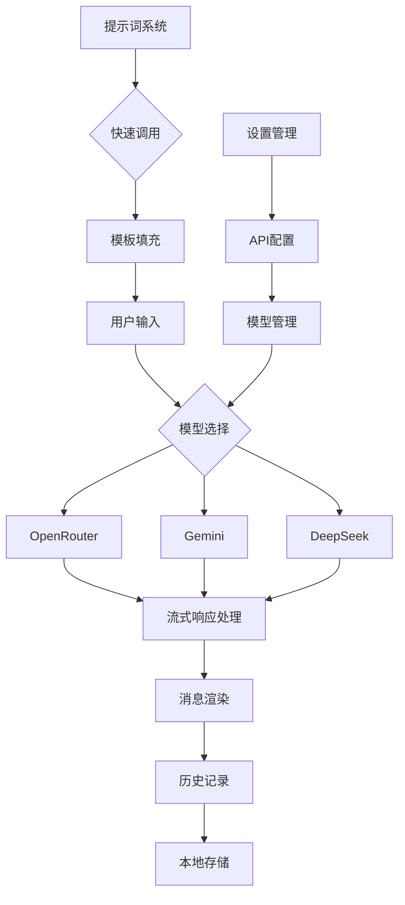

[utools插件：一个基于多模型融合的智能AI助手 | 三人聚智-余汉波程序小店](https://jy.sanrenjz.com/buy/22)

## 1. 引言

在人工智能快速发展的今天，AI 对话助手已经成为提升工作效率的重要工具。本文将详细解析一个基于多模型融合的 AI 对话系统的设计与实现，该系统集成了 Google Gemini、OpenAI GPT-4 和 DeepSeek 等顶级 AI 模型，为用户提供强大而灵活的对话能力。

## 2. 系统架构概述

### 2.1 技术栈选择

* 前端：HTML5、CSS3、原生 JavaScript
* 后端：Node.js (Electron)
* 数据存储：本地文件系统
* API 集成：OpenRouter API、Gemini API、DeepSeek API
* 开发框架：uTools 插件框架
### 2.2 核心功能模块

1. 用户界面模块
1. 多模型管理系统
1. 对话历史管理
1. 提示词系统
1. 流式响应处理
1. 数据持久化


## 3. 详细设计与实现

### 3.1 用户界面设计

系统采用现代化的单页面应用设计，主要包含以下组件：

* 顶部导航栏：新对话、历史记录、模型选择、设置等功能
* 对话区域：支持富文本显示，包括代码高亮
* 输入区域：支持快捷键操作和提示词快速调用
* 设置面板：API 密钥配置、模型管理等
关键代码实现：

```javascript
// 动态调整输入框高度
function autoResizeTextarea(textarea) {
    const minHeight = 72;   // 3行
    const maxHeight = 360;  // 15行
    textarea.style.height = 'auto';
    const newHeight = Math.max(minHeight, 
                    Math.min(textarea.scrollHeight, maxHeight));
    textarea.style.height = newHeight + 'px';
}
```

### 3.2 多模型集成系统

系统支持多个 AI 模型的无缝集成，主要通过统一的 API 调用接口实现：

```javascript
async callAPI(message, modelConfig, conversationHistory) {
    switch(modelConfig.provider) {
        case 'openrouter':
            // OpenRouter API 调用实现
        case 'gemini':
            // Gemini API 调用实现
        case 'deepseek':
            // DeepSeek API 调用实现
    }
}
```

### 3.3 流式响应处理

为提供更好的用户体验，系统实现了流式响应处理：

```javascript
return new ReadableStream({
    async start(controller) {
        const reader = response.body.getReader();
        const decoder = new TextDecoder();
        while (true) {
            const {done, value} = await reader.read();
            if (done) break;
            const chunk = decoder.decode(value);
            // 处理数据块
        }
    }
});
```

### 3.4 提示词系统

系统实现了强大的提示词管理功能，支持：

* 提示词文件管理
* 快速搜索和调用
* Markdown 格式支持
* 动态预览
### 3.5 数据持久化

采用本地文件系统进行数据持久化，确保数据安全性：

* 对话历史保存为 Markdown 文件
* 设置信息使用 uTools 数据库存储
* 提示词库支持自定义路径


## 4. 系统流程图



## 5. 性能优化与改进建议

### 5.1 当前性能优化措施

1. 使用流式响应提升体验
1. 实现输入框高度动态调整
1. 采用防抖处理搜索操作
1. 本地化存储减少网络请求
### 5.2 潜在改进方向

1. 引入消息队列管理并发请求
1. 实现消息的离线缓存
1. 添加语音输入支持
1. 优化大规模历史记录的加载性能
1. 增加更多自定义设置选项
### 6. 安全性考虑

1. API 密钥安全存储
1. 本地数据加密
1. 网络请求安全性
1. 用户数据隐私保护
## 7. 结论

该系统通过多模型融合、流式处理、提示词系统等创新设计，实现了一个功能强大、易用性高的 AI 对话助手。系统的模块化设计和良好的扩展性为未来的功能增强提供了坚实基础。

### 8. 参考资料

1. OpenRouter API 文档
1. Gemini API 文档
1. DeepSeek API 文档
1. uTools 插件开发文档
## 技术规格

* 编程语言：JavaScript (ES6+)
* 运行环境：uTools 平台
* 依赖库：Electron、Node.js 标准库
* 开发工具：Visual Studio Code
* 版本控制：Git
