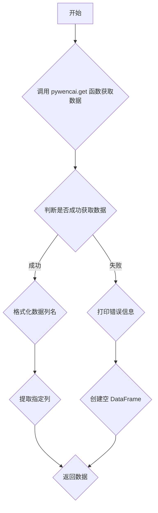

### 用途说明

该函数用于根据指定的问财可转债策略，爬取相关数据并进行格式化处理。

### 参数

* query (str): 问财可转债策略查询语句。例如："双低转债"，"破净可转债" 等。
### 返回值

* pandas.DataFrame: 包含指定列名的可转债数据，若发生错误则返回空 DataFrame。列名包括：
### 用法

调用 wencai_conditional_query(query) 函数，传入问财可转债策略查询语句，即可获取格式化后的数据。

### 示例

```python
import pywencai
import pandas as pd
import numpy as np
import yuhanbolh as lh

# 查询"双低转债"数据
data = lh.wencai_conditional_query("双低转债")

# 打印前5行数据
print(data.head())
```

### 函数工作流程图



