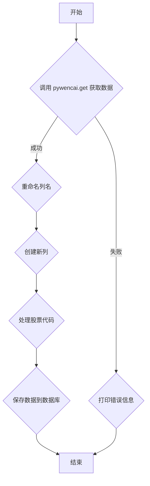

### 用途说明

该函数用于从问财网获取纳斯达克100指数成分股数据，并将数据保存到SQLite数据库中。由于纳斯达克100指数成分股每年年底会有变化，建议每年1月1日运行一次该函数以更新数据。

### 参数

* query (str): 问财网查询语句，用于筛选纳斯达克100指数成分股数据。
### 返回值

* pandas.DataFrame: 包含纳斯达克100指数成分股数据的DataFrame，如果获取数据失败则返回空DataFrame。
### 用法

调用 wencai_conditional_query(query) 并传入问财网查询语句，即可获取并保存纳斯达克100指数成分股数据到SQLite数据库。

### 示例

```python
import yuhanbolh as lh
# 设置问财网查询语句
query = "纳斯达克100指数成分股"

# 调用函数获取并保存数据
nasdaq_100_data = lh.wencai_conditional_query_nz100(query)

# 打印获取到的数据
print(nasdaq_100_data)
```

### 函数工作流程图



## 代码

```python
# 从问财网获取纳斯达克100指数成分股数据，参数查询语句，每年的1月1日运行一次，因为纳斯达克100指数成分股每年年底会有变化
def wencai_conditional_query_nz100(query):
    try:
        data = pywencai.get(query=query, query_type='usstock', loop=True)
        
        # 指定需要查找和重命名的列名
        col_names_to_change = ["股票代码", "股票简称", "指数"]
        for name in col_names_to_change:
            col_name = [col for col in data.columns if name in col]
            if col_name:
                # 重命名列名
                data.rename(columns={col_name[0]: name}, inplace=True)
            else:
                # 若未找到，则创建一个新的列，所有值都为空
                data[name] = np.nan

        # 删除 '股票代码' 中的 '.0' 并保存为 '价值代码'
        data['价值代码'] = data['股票代码'].str.replace('.O', '', regex=False)

        # 将 '股票代码' 中的 '.O' 替换为 '.NYSE' 并保存为 'mt5代码'
        data['mt5代码'] = data['股票代码'].str.replace('.O', '.NAS', regex=False)
        
        # 只保留指定的列
        data = data[col_names_to_change + ['价值代码', 'mt5代码']]
        
        # 数据库文件路径
        db_path = "D:/wenjian/python/smart/data/mt5.db"
        
        # 连接到SQLite数据库
        conn = sqlite3.connect(db_path)
        
        # 将DataFrame保存到SQLite数据库中，表名为“nasdaq_100”
        data.to_sql('nasdaq_100', conn, if_exists='replace', index=False)
        
        # 提交事务
        conn.commit()
        
        # 关闭连接
        conn.close()
        
        return data
    except Exception as e:
        print(f"获取纳斯达克100指数成分股数据时出错: {e}")
        return pd.DataFrame()
```

