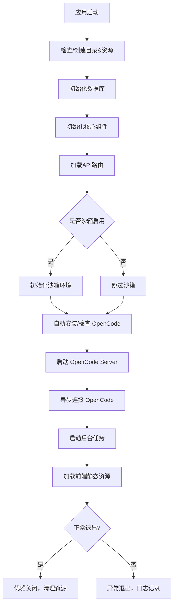

项目为三人聚智的开源项目，可以到 [github：yuhanbo758/codebot](https://github.com/yuhanbo758/codebot) 或 [gitee：yuhanbo758/codebot](https://gitee.com/yuhanbo758/codebot) 拉取项目，或releases 或到[夸克](https://pan.quark.cn/s/32af0c9b87cc)下载，亦可前往程序小店。

程序小店：[程序小店 - 虚拟商品销售平台](https://shop.sanrenjz.com/product/69c1dafed64de6758c5268bd)

bili 视频 1：[Codebot-基于OpenCode的个人龙虾AI助手_哔哩哔哩_bilibili](https://www.bilibili.com/video/BV1ejXnB2ExS/)

bili 视频 2：[Codebot-基于OpenCode的个人龙虾AI助手-2_哔哩哔哩_bilibili](https://www.bilibili.com/video/BV1QrDTBNEy4/?vd_source=247ac77d4ae7339ea06d0fec09aa8f70#reply116345983206547)

bili 视频 3：[Codebot-基于OpenCode的个人龙虾AI助手3_哔哩哔哩_bilibili](https://www.bilibili.com/video/BV1iDSRB6EN1/?vd_source=247ac77d4ae7339ea06d0fec09aa8f70)

## 一、项目概述

Codebot 是一款基于 OpenCode 平台打造的个人 AI 助手，具有跨平台、多通信渠道（飞书、邮箱）、丰富技能系统与高效记忆管理能力。项目以 Python3.11+ 为后端主力，配合 Electron 桌面端和 Vue3 前端，为开发者和普通用户提供灵活、智能、高扩展性的效率工具环境。

本项目的主功能包括：

* 与 OpenCode 服务无缝集成，支持多模型切换与自主决策
* 实现对用户信息、习惯、偏好的自动提取与记忆提示
* 完备的定时任务、通知、日志、技能、MCP 集成与管理
* 安全隔离的沙箱执行环境，大幅提升代码生成和运行的灵活性与安全性
* 跨平台兼容（支持 Windows、Linux、macOS，及 Electron 桌面端）
## 二、功能结构与主流程

整体架构采用分层+模块化设计，后端核心为 FastAPI 应用，按 REST API 暴露对话、记忆、定时任务、技能、配置等服务路由，配合 memory（ChromaDB+SQLite）、opencode 客户端、沙箱管理和多前端适配。

### 2.1 主模块启动流程

主模块逻辑及流程：

* 应用初始化 → 数据/技能/日志/备份目录校验与创建 → 内置技能复制
* 依赖检查与自动安装（OpenCode）
* 连接数据库并初始化表结构
* 各全局核心组件实例化（内存管理、通知、WS 机器人、沙箱等）
* API 路由加载（chat/memory/scheduler/skills/config/mcp/etc.）
* 沙箱环境启动与端口自适应检测
* 异步启动 OpenCode Server 并接管后端与技能调度
* 前端静态资源挂载、SPA 路由回退
* 应用关闭时 graceful shutdown，停止后台任务、断开连接
以 main.py 为核心入口，调动 config、database、core（opencode_ws/memory_manager/scheduler等）、services、skills、api、沙箱子模块共同完成项目启动、生命周期管理及功能扩展。

### 2.2 Codebot 作为第三方的工作方式

OpenCode 是主聊天入口，负责模型选择、推理、工具决策与最终回答。Codebot 通过 /api/mcp/codebot/sse 暴露第三方 MCP，向 OpenCode 提供记忆、任务、技能、会话等工具。Codebot 会把"第三方 MCP"页面中启用的远程 MCP 工具代理成 codebot_mcp__... 形式的工具名，再暴露给 OpenCode。Codebot 会把 skills/ 目录中的技能同步到 OpenCode 技能目录，使其作为第三方技能被直接调用。

聊天请求发往 OpenCode 时只附带必要的用户记忆上下文，不再由 Codebot 预判技能或代替 OpenCode 做二次工具编排。backend/core/tool_dispatcher.py 已收敛为桥接辅助模块，仅负责技能发现与 MCP 协议适配，不再承担聊天主链路上的工具调度。

## 三、核心功能详解

### 3.1 OpenCode 会话系统

* 对话管理: 创建和管理多个对话，支持重命名、置顶、归档、删除
* OpenCode 主控: 所有消息统一交给 OpenCode 处理，Codebot 只负责提供第三方能力和结果展示
* 历史查看: 进入"聊天"自动打开最近对话，支持多对话并行处理
* 分组聊天: 支持将多个对话合并为群组模式
* 对话分享: 生成分享链接（share_id），可供他人只读查看
* 意图分类: 消息自动分类为"定时任务/保存记忆/普通对话"，避免误判
* Agent 模式: 支持 plan（结构化规划）和 build（直接执行）两种模式
* 文件附件: 支持文件附件上传；多模态模型支持图片分析
* 流式响应: 流式展示 OpenCode 步骤事件（如 step-start / step-finish）与回复增量
* 会话复用: 同一对话默认复用 OpenCode 会话，减少上下文丢失，提升连续追问一致性
* 后台执行: 切换到"技能/设置"等页面时，任务继续在后台执行，返回聊天页自动恢复状态并回放工具调用事件
### 3.2 记忆系统

* 上下文记忆: 自动保存对话历史
* 长期记忆: 保存用户习惯、偏好、事实信息（用于之后对话检索问答）
* 自动提取: 每次对话后，后台自动进行规则+AI双通道提取，识别重要信息并保存，无需依赖"记住"关键词
* 记忆类别: habit（习惯）、preference（偏好）、profile（个人信息）、note（笔记）、contact（联系人）、address（地址）
* 记忆提示: 聊天输入时自动检索相关记忆并在输入框上方显示提示气泡，AI 回复时也会注明"根据我的记忆"
* 记忆搜索: 语义搜索相关记忆
* 记忆归档: 自动或手动归档旧记忆，支持按类别过滤查看
* 备份恢复: 导出记忆为 ZIP 文件（保存至 data/backups/），或上传备份文件恢复
* 记忆整理: 每日在配置时间点（默认 03:00）自动用 AI 对活跃记忆进行优化（合并重复、补全描述、标准化格式、修正矛盾），也可手动触发
* 聊天整理联动: 自动整理时会扫描新增聊天记录，从聊天中补充记忆，并尝试沉淀相关定时任务与可复用技能
### 3.3 定时任务系统

* Cron 表达式: 完整的 Cron 语法支持
* 智能时间解析: 自动从用户消息中区分"时间部分"和"任务内容"。例如"5分钟后，写首春天的诗保存到D盘"会解析为：调度时间=5分钟后，任务=写首春天的诗保存到D盘
* 意图识别: 本地规则优先分流"定时任务/记忆/普通对话"，避免"保存到D盘"这类任务被误判为记忆
* 生日提醒特例: 对"记住我的生日，10月20日，我生日时提醒我"这类复合句，会同时保存生日记忆并创建每年生日提醒任务
* AI 辅助: 自然语言生成 Cron 表达式（OpenCode 不可用时降级为本地规则解析）
* 通知渠道: 飞书/邮箱/应用内通知
* 执行日志: 详细的任务执行记录
* 提醒任务: 带 __REMINDER__ 标志的纯提醒任务不依赖 OpenCode 也能按计划触发通知；AI 类任务（生成内容/写文件等）需要 OpenCode 在线执行
* 像聊天一样执行: 定时任务到达执行时间时，系统会像聊天一样通过 OpenCode CLI 处理任务内容，充分利用 AI 的代码生成与文件写入能力
* 一次性任务: 未强调重复性的任务（如"5分钟后"、"明天"）自动标记为一次性，执行完成后不再重复触发
### 3.4 技能系统

* 内置技能: web_search（网页搜索）、web_fetch（抓取网页）、news（新闻获取）、file_reader（文件读取）、pdf（PDF 处理）、docx（Word 文档）、pptx（PowerPoint）、xlsx（Excel）、ai-company（AI 专家团队决策）、expert-agents（14位专家人设）、code-review（代码审查）、writing-plans（写作计划）、subagent-driven-development（子代理驱动开发）、arxiv-research（论文研究）、blogwatcher（博客监控）、obsidian-notes（Obsidian 笔记）、self-improving（自我改进）、systematic-debugging（系统化调试）、test-driven-development（测试驱动开发）
* 技能定义: Markdown 文件（SKILL.md）带 YAML front-matter（name、description），自动匹配用户提示
* 自动调度: tool_dispatcher.py 通过关键词 + 语义匹配，将 SKILL.md 内容注入到对应请求的提示词中
* 低干扰注入: 仅在高相关度下启用技能上下文，降低无关技能误触发
* 自动沉淀技能: 对高复用的已完成任务，自动生成可复用技能元数据，便于后续任务快速命中
* OpenCode 本地技能: 自动读取 ~/.agents/skills，可在技能页卸载
* 自定义目录技能: 支持配置多个外部文件夹路径，自动扫描其中包含 SKILL.md 的子目录并加载为只读技能
### 3.5 MCP 服务器管理

* 支持 stdio 和 SSE 两种传输模式的 MCP 服务器配置
* SSE 模式的 MCP 工具由 tool_dispatcher.py 自动调用：当用户提示词匹配到工具描述时，后端自动发起工具调用并将结果注入上下文
* 完整 CRUD 管理界面（/mcp 页面）及 REST API（/api/mcp）
* 魔搭 ModelScope MCP 集成：Codebot 统一代理外部 MCP 服务器，OpenCode 只需要连接 codebot 这一个第三方 MCP
### 3.6 沙箱执行环境

* 工作目录隔离执行环境，AI 生成的代码在独立 data/sandbox_workspace/ 目录中运行
* 无需安装额外软件：移除 QEMU/Docker 依赖，开箱即用
* 基于 asyncio.create_subprocess_shell 执行命令，支持超时控制
* 完整输出捕获：stdout、stderr、exit_code
* 执行模式：local（工作目录隔离）
* 可配置执行超时（秒，默认 300）
### 3.7 通知系统

* 应用内通知: 默认启用，在右上角查看
* 系统桌面通知: 推送至操作系统通知中心（Windows/macOS/Linux）
* 飞书通知: 配置 Webhook URL，支持长连接订阅模式（无需公网 IP）
* 邮箱通知: 配置 SMTP 服务器，支持一键发送测试邮件验证配置
### 4.1 目录结构自动管理

通过 Path/OS/shutil，确保数据、技能、日志、前端静态文件等关键目录存在，并按需种子复制内置技能（支持 PyInstaller 打包、Electron extraResources、本地源码多种场景）。

### 4.2 沙箱隔离环境（sandbox_manager）

所有 AI 生成代码执行均在独立的 sandbox_workspace 下完成，采用 asyncio 子进程调度，并内置超时控制。

* 隔离执行：防止异常/恶意代码危害主系统
* 支持 stdout/stderr/exit_code 管理与实时反馈
### 4.3 Memory 及知识库管理

集成 SQLite + ChromaDB，支持上下文及长期记忆的持久化、自动提取、归档查看、导入导出、清理整理等多种管理手段。

### 4.4 技能与 MCP 工具自动发现与调度

遍历技能目录，按 YAML frontmatter 匹配技能元数据，实现低侵入调度与高可扩展性。

* ol生成技能沉淀
* 各技能支持内链调用
### 4.5 网络端口、多实例检测和优雅降级

通过UDP/Socket检测局域网IP和端口占用，有效避免资源冲突和异常退出。Skill API 提供种子数据合并机制避免多实例请求异常。

## 五、核心代码流程图（Mermaid）

## 六、主要依赖与技术栈

* Python 3.11+，FastAPI，asyncio，SQLite，ChromaDB，loguru
* Electron, Node.js (前端打包/桌面)，Vue 3, Pinia
* 依赖自动检测（OpenCode CLI），跨平台兼容
## 七、局限与改进建议

### 局限：

* 依赖 Electron+Python 环境，首次安装环境配置复杂
* 需保证 OpenCode Server 正常运行方可使用绝大部分 AI 驱动功能
* 技能文件的自动沉淀仅依赖本地规则，用户自行管理自定义目录时须注意格式兼容
### 改进建议：

* 增强多模型 AI 后端兼容性（如深度集成 OpenAI API）
* 前端适配移动端用户体验进一步优化
* 技能市场与一键安装功能完善，降低维护门槛
* 增加云端备份及远程协作能力
