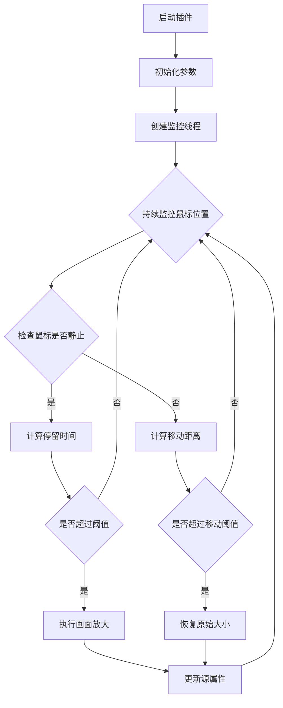

本文将深入解析一个为OBS Studio开发的智能画面缩放插件。这个插件通过Python语言实现，能够根据鼠标位置自动调整画面缩放效果，为直播观众带来更好的观看体验。

注意：OBS 的插件是基于 python 运行的，若你不熟悉或不会安装相应的库，请不要拍，不提供技术支持。

github 开源：[yuhanbo758/obs_display_frame: OBS Python script for intelligent display zoom based on mouse position.](https://github.com/yuhanbo758/obs_display_frame)

gitee 开源：[yuhanbo758/obs_display_frame: OBS Python script for intelligent display zoom based on mouse position.](https://github.com/yuhanbo758/obs_display_frame)

[OBS录播直播画面智能缩放大师脚本 | 三人聚智-余汉波程序小店](https://jy.sanrenjz.com/buy/6)

视频：[OBS口播录播直播利器：智能画面缩放插件_哔哩哔哩_bilibili](https://www.bilibili.com/video/BV18yXXYMEFm/?vd_source=247ac77d4ae7339ea06d0fec09aa8f70)

### 使用的技术栈

1. 核心技术：
* Python 3.6+
* OBS Studio Python API (obspython)
* PyAutoGUI库
* 多线程编程
1. 主要依赖：可以打开 cmd 使用 pip 进行安装，比如 pip obspython
* obspython：OBS Studio的Python接口
* pyautogui：用于获取鼠标位置
* threading：实现后台监控
* time：处理时间相关操作


## Python环境安装教程

由于本插件基于Python运行，在开始使用前需要正确安装和配置Python环境。以下是详细的安装步骤：

### Windows系统安装Python

### 方法一：官网安装（推荐）

1. 下载Python安装包
* 访问Python官网：[https://www.python.org/downloads/](https://www.python.org/downloads/)
* 选择Python 3.6或更高版本（推荐3.8或3.9）
* 下载Windows installer (64-bit)
1. 安装Python
* 双击下载的安装包
* 重要：勾选"Add Python to PATH"选项
* 选择"Install Now"或自定义安装路径
* 等待安装完成
1. 验证安装
* 打开命令提示符（Win+R，输入cmd，回车）
* 输入命令：python --version
* 应显示Python版本号，如：Python 3.9.13
* 输入命令：pip --version
* 应显示pip版本信息
### 方法二：通过Microsoft Store安装

1. 打开Microsoft Store
1. 搜索"Python"
1. 选择Python 3.9或3.10
1. 点击"获取"按钮进行安装
### OBS Studio Python环境配置

OBS Studio需要配置Python路径才能运行脚本：

1. 打开OBS Studio
1. 进入Python脚本设置
* 菜单栏：工具 → 脚本
* 或使用快捷键设置（如果有配置）
1. 配置Python路径
* 在脚本窗口中，点击"Python设置"标签
* Python安装路径示例：
* 默认安装：C:\Users\你的用户名\AppData\Local\Programs\Python\Python39
* 或：C:\Python39
* 点击"浏览"选择Python安装目录
* 确保路径指向包含python.exe的文件夹
1. 验证配置
* 在脚本窗口的"脚本"标签页
* 点击"+"号加载示例脚本
* 如果没有报错，说明配置成功
### 安装依赖库

配置好Python环境后，需要安装插件所需的依赖库：

1. 打开命令提示符
* Win+R，输入cmd，回车
1. 安装pyautogui库
```bash
pip install pyautogui
```

1. 验证安装
```bash
python -c "import pyautogui; print(pyautogui.__version__)"
```

1. 常见安装问题
* 如果pip命令不可用，尝试：python -m pip install pyautogui
* 如果权限不足，使用管理员权限运行cmd
* 如果网络问题，使用国内镜像源：
```bash
pip install pyautogui -i https://pypi.tuna.tsinghua.edu.cn/simple
```

### 注意事项

1. 版本兼容性
* OBS Studio 27.0及以上版本支持Python 3.8+
* 旧版OBS可能需要Python 3.6
* 建议使用Python 3.8或3.9版本，兼容性最佳
1. 路径问题
* 避免在Python安装路径中使用中文或空格
* 推荐安装路径：C:\Python39或D:\Python39
1. 多Python版本管理
* 如果系统安装了多个Python版本，使用py启动器：
```bash
py -3.9 -m pip install pyautogui
```

* 或使用虚拟环境管理工具（如conda）
1. 重启OBS
* 安装完依赖库后，重启OBS Studio确保生效
### 环境检查清单

在运行插件前，请确认以下事项：

完成以上步骤后，即可在OBS中加载和使用智能画面缩放插件。

## 代码结构与实现原理

### 核心参数设计

```python
scene_name = "场景"        # OBS场景名称
source_name = "显示器采集"  # 源名称
max_zoom = 2.0            # 最大缩放比例
min_zoom = 1.0           # 最小缩放比例
zoom_speed = 0.1         # 缩放变化速度
hold_time = 1.0          # 鼠标停留触发时间
move_threshold = 100.0   # 快速移动距离阈值
move_range = 50.0        # 放大区域移动范围
```

这些参数构成了插件的核心配置，可通过OBS界面动态调整，实现灵活的自定义配置。

### 工作流程图



### 核心功能实现

### 1. 初始化与配置管理

插件通过script_description()和script_properties()函数实现配置界面的创建：

```python
def script_properties():
    props = obs.obs_properties_create()
    # 添加各种配置项
    obs.obs_properties_add_text(props, "scene_name", "场景名称", obs.OBS_TEXT_DEFAULT)
    obs.obs_properties_add_text(props, "source_name", "源名称", obs.OBS_TEXT_DEFAULT)
    # ... 其他配置项
    return props
```

### 2. 鼠标位置监控系统

插件使用独立线程持续监控鼠标位置，避免影响OBS主程序性能：

```python
def update_properties():
    while running:
        mouse_x, mouse_y = get_mouse_position()
        current_time = time.time()
        # 处理鼠标位置变化
        # ...
```

### 3. 智能缩放算法

缩放算法包含以下关键要素：

* 鼠标停留检测
* 平滑过渡处理
* 边界检查
* 防抖动处理
```python
def calculate_distance(pos1, pos2):
    """计算两点之间的距离"""
    dx = pos2[0] - pos1[0]
    dy = pos2[1] - pos1[1]
    return (dx**2 + dy**2)**0.5
```

### 4. 画面更新机制

通过OBS API实现画面的动态更新：

```python
# 设置缩放
scale_vec = obs.vec2()
scale_vec.x = current_zoom
scale_vec.y = current_zoom
obs.obs_sceneitem_set_scale(scene_item, scale_vec)

# 设置位置
pos_vec = obs.vec2()
pos_vec.x = -offset_x * current_zoom
pos_vec.y = -offset_y * current_zoom
obs.obs_sceneitem_set_pos(scene_item, pos_vec)
```

## 性能优化与注意事项

### 1. 性能优化措施

1. 使用线程池管理监控线程
1. 实现缓存机制减少API调用
1. 优化计算逻辑，减少不必要的运算
### 2. 潜在问题与解决方案

1. 资源占用问题
* 问题：频繁的鼠标位置检测可能导致CPU使用率升高
* 解决：实现动态检测频率调整
1. 画面抖动问题
* 问题：快速移动时可能出现画面抖动
* 解决：添加平滑过渡和防抖动算法
1. 边界处理问题
* 问题：在画面边缘可能出现黑边
* 解决：实现智能边界检测和处理
## 改进建议

### 1. 功能扩展

1. 添加自定义热键支持
1. 实现多显示器支持
1. 添加预设配置管理
### 2. 性能优化

1. 使用C++重写核心算法
1. 实现GPU加速支持
1. 优化内存使用
### 3. 用户体验

1. 添加可视化配置界面
1. 实现配置文件导入/导出
1. 添加实时预览功能
## 总结

本插件通过巧妙的算法设计和多线程处理，实现了流畅的智能画面缩放效果。虽然还有一些优化空间，但已经能够很好地满足大多数直播场景的需求。通过合理的参数配置和优化措施，可以在提供良好用户体验的同时，保持较低的系统资源占用。

## 参考资料

1. OBS Studio Python API文档
1. PyAutoGUI官方文档
1. Python多线程编程指南
1. 计算机图形学基础 - 图像缩放算法
