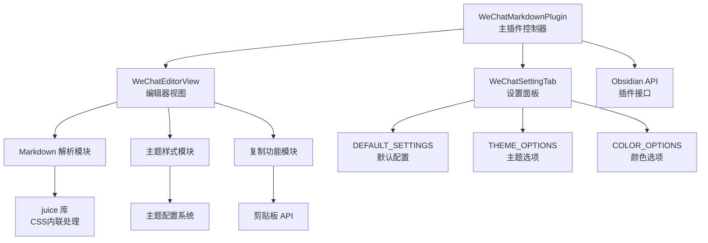
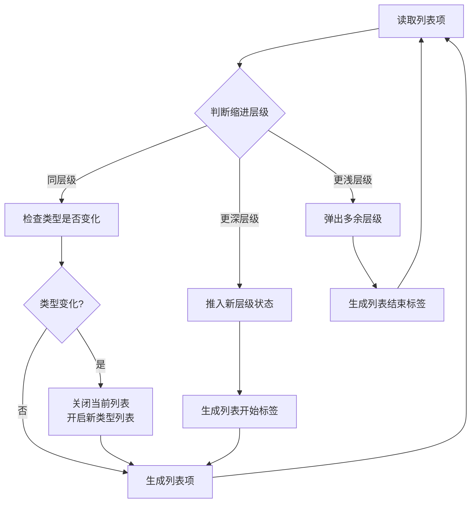
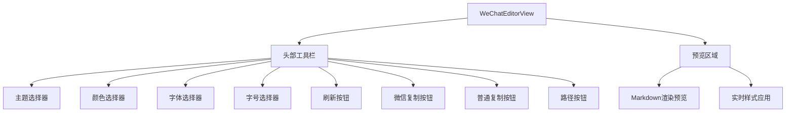

随着知识管理工具 Obsidian 的广泛应用，越来越多的用户希望将个人笔记内容分享到微信公众号等社交平台。然而，Markdown 格式与微信公众号编辑器之间存在显著的兼容性差异：微信公众号不支持原生 Markdown 语法，且对 CSS 样式有特殊限制。Obsidian 微信公众号 Markdown 编辑器插件正是为解决这一问题而生，它实现了从 Obsidian Markdown 到微信公众号格式的无缝转换。

本文将深入剖析该插件的代码架构、核心模块、技术实现细节，帮助开发者理解其设计思路和实现原理。

## 整体架构设计

### 核心类结构

插件采用经典的 MVC 架构模式，主要包含三个核心类：

1. WeChatMarkdownPlugin：主插件类，作为控制器负责插件生命周期管理、命令注册、视图协调
1. WeChatEditorView：视图类，提供用户界面和交互逻辑
1. WeChatSettingTab：设置面板类，管理用户配置
### 模块依赖关系



## 主插件类：WeChatMarkdownPlugin

### 初始化流程

onload() 方法是插件的入口点，执行以下关键初始化操作：

```javascript
async onload() {
    await this.loadSettings();
    
    // 注册自定义视图类型
    this.registerView(
        WECHAT_VIEW_TYPE,
        (leaf) => new WeChatEditorView(leaf, this)
    );
    
    // 添加功能区图标入口
    this.addRibbonIcon('edit', '微信Markdown编辑器', () => {
        this.activateView();
    });
    
    // 注册命令
    this.addCommand({
        id: 'open-wechat-editor',
        name: '打开微信Markdown编辑器',
        callback: () => { this.activateView(); }
    });
    
    // 注册设置面板
    this.addSettingTab(new WeChatSettingTab(this.app, this));
}
```

### 视图激活机制

activateView() 方法实现了智能的视图管理：

```javascript
async activateView() {
    const { workspace } = this.app;
    const leaves = workspace.getLeavesOfType(WECHAT_VIEW_TYPE);
    
    if (leaves.length > 0) {
        leaf = leaves[0];  // 已存在则激活
    } else {
        leaf = workspace.getRightLeaf(false);  // 不存在则创建
        await leaf.setViewState({ type: WECHAT_VIEW_TYPE, active: true });
    }
    
    workspace.revealLeaf(leaf);
}
```

这种设计确保了单例模式，避免重复创建视图窗口。

## Markdown 解析与转换引擎

### Frontmatter 处理

插件首先移除 Obsidian 特有的 YAML frontmatter（笔记属性）：

```javascript
if (html.trim().startsWith('---')) {
    const lines = html.split('\n');
    let frontmatterEndIndex = -1;
    
    for (let i = 1; i < lines.length; i++) {
        if (lines[i].trim() === '---') {
            frontmatterEndIndex = i;
            break;
        }
    }
    
    if (frontmatterEndIndex > 0) {
        html = lines.slice(frontmatterEndIndex + 1).join('\n').trim();
    }
}
```

### 代码块处理策略

代码块采用占位符替换策略，避免在后续处理中被意外修改：

```javascript
html = html.replace(/```([\w]*)?\n([\s\S]*?)```/g, (match, lang, code) => {
    const index = codeBlocks.length;
    
    // Mermaid 图表特殊处理
    if (lang && lang.toLowerCase() === 'mermaid') {
        const mermaidId = `mermaid-${Date.now()}-${Math.random().toString(36).substr(2, 9)}`;
        codeBlocks.push(`<div class="mermaid-container"><pre class="mermaid" id="${mermaidId}">${this.escapeHtml(code.trim())}</pre></div>`);
        return `__CODE_BLOCK_${index}__`;
    }
    
    const langClass = lang ? ` class="language-${lang}"` : '';
    codeBlocks.push(`<pre><code${langClass}>${this.escapeHtml(code.trim())}</code></pre>`);
    return `__CODE_BLOCK_${index}__`;
});
```

### 标题渲染实现

标题采用从高到低的匹配顺序，确保正确捕获各级标题：

```javascript
html = html.replace(/^###### (.*$)/gim, '<h6>$1</h6>');
html = html.replace(/^##### (.*$)/gim, '<h5>$1</h5>');
html = html.replace(/^#### (.*$)/gim, '<h4>$1</h4>');
html = html.replace(/^### (.*$)/gim, '<h3>$1</h3>');
html = html.replace(/^## (.*$)/gim, '<h2>$1</h2>');
html = html.replace(/^# (.*$)/gim, '<h1>$1</h1>');
```

## 嵌套列表解析系统

### 核心挑战

Markdown 列表的嵌套层级处理是最复杂的部分，主要难点包括：

* Tab 和空格混合缩进的处理
* 有序/无序列表的类型切换
* 列表项续行（多行内容）的合并
* 序号层级的一致性维护
### 栈式解析算法

插件采用栈结构管理列表层级状态：



### 序号标准化

normalizeListItems() 方法确保有序列表序号的正确性：

```javascript
normalizeListItems(listItems) {
    const normalized = [];
    const levelCounters = {};  // 各层级计数器
    
    for (const item of listItems) {
        const level = Math.floor(item.indent / 4);
        const normalizedItem = { ...item };
        
        // 清理更深层级计数器
        Object.keys(levelCounters).forEach(key => {
            if (parseInt(key) > level) {
                delete levelCounters[key];
            }
        });
        
        if (item.type === 'ol') {
            if (levelCounters[level] === undefined) {
                levelCounters[level] = item.number || 1;
            } else {
                levelCounters[level]++;
            }
            normalizedItem.number = levelCounters[level];
        }
        
        normalized.push(normalizedItem);
    }
    
    return normalized;
}
```


## 主题样式系统

### 配置架构

主题系统由三层配置组成：

```javascript
const THEME_OPTIONS = {
    'default': '经典',
    'grace': '优雅', 
    'simple': '简洁'
};

const COLOR_OPTIONS = {
    '#0F4C81': '经典蓝',
    '#009874': '翡翠绿',
    '#FA5151': '活力橘',
    // ... 共10种颜色
};

const DEFAULT_SETTINGS = {
    theme: 'default',
    primaryColor: '#0F4C81',
    fontFamily: '-apple-system-font,...',
    fontSize: '16px',
    // ...
};
```

### CSS 变量机制

主题使用 CSS 变量实现动态样式切换：

```javascript
getThemeStyles() {
    const themeConfigs = {
        'default': {
            base: {
                '--md-primary-color': primaryColor,
                '--blockquote-background': '#f7f7f7',
                'line-height': '1.75',
            },
            h1: {
                'display': 'table',
                'border-bottom': '2px solid var(--md-primary-color)',
            },
            // ...
        },
        // grace, simple 主题配置...
    };
    
    return themeConfigs[theme] || themeConfigs['default'];
}
```

### CSS 内联处理

微信公众号不支持外部 CSS，需要将样式内联到 HTML 元素：

```javascript
applyWeChatTheme(htmlContent) {
    // 使用 juice 库将 CSS 内联化
    const baseStyles = `<style>.wechat-content { ... }</style>`;
    return `${baseStyles}<div class="wechat-content">${htmlContent}</div>`;
}
```

## 编辑器视图实现

### 界面结构

视图界面包含以下核心组件：



### 文件同步机制

视图监听工作区事件实现自动同步：

```javascript
this.registerEvent(
    this.app.workspace.on('active-leaf-change', () => {
        this.updateFromActiveFile();
    })
);

this.registerEvent(
    this.app.workspace.on('editor-change', (editor) => {
        if (this.plugin.settings.autoSync) {
            this.updatePreview(editor.getValue());
        }
    })
);
```

### 复制功能实现

三种复制模式的核心差异：

```javascript
// 微信格式：CSS 内联的富文本
async copyWeChatFormat() {
    const themedHtml = this.plugin.applyWeChatTheme(this.currentContent);
    await this.copyHtmlToClipboard(themedHtml);
}

// 普通格式：标准 HTML
async copyNormalFormat() {
    const htmlContent = await this.plugin.convertMarkdownToWeChatFormat(this.currentContent);
    await this.copyHtmlToClipboard(htmlContent);
}

// 纯文本：无格式文本
async copyPlainText() {
    const plainText = this.currentContent.replace(/<[^>]*>/g, '');
    await navigator.clipboard.writeText(plainText);
}
```

## 设置面板设计

### 配置项结构

设置面板提供完整的自定义选项：

```javascript
class WeChatSettingTab extends PluginSettingTab {
    display() {
        // 主题选择
        new Setting(containerEl)
            .setName('主题')
            .setDesc('选择显示主题')
            .addDropdown(dropdown => dropdown
                .addOption('default', '经典')
                .addOption('grace', '优雅')
                .addOption('simple', '简洁')
                .setValue(this.plugin.settings.theme)
                .onChange(async (value) => {
                    this.plugin.settings.theme = value;
                    await this.plugin.saveSettings();
                }));
        
        // 其他设置项...
    }
}
```

## 技术依赖分析

### 核心依赖库

| 依赖 | 版本 | 用途 |
| --- | --- | --- |
| obsidian | latest | Obsidian 插件 API |
| juice | ^11.1.1 | CSS 内联化处理 |
| marked | ^4.3.0 | Markdown 解析（备用） |
| mermaid | ^10.9.1 | 流程图渲染 |
| highlight.js | ^11.8.0 | 代码语法高亮 |### 构建工具

使用 ESBuild 进行高效打包：

```javascript
// esbuild.config.mjs
esbuild.build({
    entryPoints: ['src.js'],
    bundle: true,
    external: ['obsidian'],
    format: 'cjs',
    platform: 'browser',
    target: 'es2018',
    outfile: 'main.js',
});
```

## 潜在限制与改进建议

### 当前限制

1. 图片处理局限：相对路径图片处理依赖文件系统 API，网络图片无法自动优化
1. Mermaid 渲染：流程图依赖客户端渲染，某些微信公众号环境可能不支持
1. 表格样式：微信编辑器对表格样式支持有限，复杂表格可能显示异常
1. 性能考虑：大文档转换可能存在延迟，未实现增量渲染
### 改进建议

1. 引入图片上传服务：集成图床 API，自动上传本地图片获取 CDN 链接
1. 缓存机制：缓存已转换的内容，避免重复处理
1. 模板系统：支持用户自定义主题模板，扩展个性化选项
1. AI 辅助：集成 AI 接口，提供内容优化、格式建议等功能
## 总结

Obsidian 微信公众号 Markdown 编辑器插件通过精巧的架构设计，实现了 Markdown 到微信公众号格式的无缝转换。其核心亮点包括：

* 栈式列表解析算法：精准处理复杂的嵌套列表结构
* 主题样式系统：CSS 变量驱动的多主题动态切换
* CSS 内联处理：使用 juice 库解决微信样式限制
* 模块化设计：清晰的 MVC 分层，便于维护和扩展
该插件为 Obsidian 用户提供了高效的微信公众号内容创作工具，将知识管理与内容发布无缝衔接，显著提升了创作者的工作效率。

