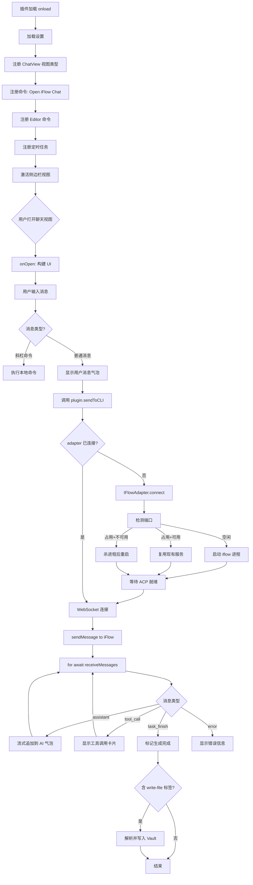

obsidian-yuhanbo-iflow 是一款功能丰富的 Obsidian 插件，旨在将 iFlow CLI（一个基于 WebSocket 的 AI 代理框架）无缝集成到 Obsidian 知识管理环境中。本文将从代码架构、核心模块、关键算法和设计模式四个维度，深入分析这款插件的实现细节，帮助开发者理解其技术选型与工程实践。

插件版本为 1.1.1，基于 TypeScript 编写，通过 esbuild 打包，最低要求 Obsidian 0.15.0，目前仅支持桌面端（isDesktopOnly: true）。

github 开源地址：[yuhanbo758/obsidian-yuhanbo-iflow: Integrate iFlow CLI into Obsidian](https://github.com/yuhanbo758/obsidian-yuhanbo-iflow)

gitee 开源地址：[obsidian-yuhanbo-iflow: Integrate iFlow CLI into Obsidian](https://gitee.com/yuhanbo758/obsidian-yuhanbo-iflow)

bili 视频：[obsidian插件-yuhanbo-iflow，将iFlow CLI集成到Obsidian_哔哩哔哩_bilibili](https://www.bilibili.com/video/BV1rRDvBFE33/?vd_source=247ac77d4ae7339ea06d0fec09aa8f70)

[程序小店 - obsidian插件-yuhanbo-iflow](https://shop.sanrenjz.com/product/69d44995cc92ff8fa15356a8)

---

## 一、整体架构

### 1.1 项目结构

```plain text
obsidian-yuhanbo-iflow/
├── main.ts               # 主入口，包含所有核心逻辑（约 4000+ 行）
├── src/
│   ├── iflow-utils.js    # 工具函数集合（文本处理、格式化等）
│   ├── skills-paths.js   # 技能路径解析与管理
│   └── weighted-search.js# BM25 加权搜索实现
├── manifest.json         # 插件元数据
├── package.json          # 构建依赖
└── esbuild.config.mjs    # 构建配置
```

### 1.2 分层设计

插件采用清晰的三层架构：

1. 适配器层（Adapter Layer）：ICLIAdapter 接口 + IFlowAdapter 实现，隔离具体 CLI 后端
1. 视图层（View Layer）：IFlowChatView 继承 ItemView，负责 UI 渲染与用户交互
1. 插件核心层（Plugin Core）：IFlowPlugin 继承 Plugin，负责生命周期管理、设置存储、命令注册
这种设计使得未来替换 AI 后端（如接入其他 CLI 工具）只需新增一个适配器实现，无需修改视图层代码。

---

## 二、核心接口与适配器模式

### 2.1 CLIMessage 统一消息类型

```typescript
interface CLIMessage {
    type: 'assistant' | 'tool_call' | 'task_finish' | 'error';
    text?: string;
    toolName?: string;
    toolArgs?: any;
    toolId?: string;
    toolStatus?: string;
    toolOutput?: string;
    message?: string;
}
```

这个接口将来自不同后端的消息统一抽象为四种类型：

* assistant：AI 文本输出块（流式）
* tool_call：工具调用事件（含工具名、参数、输出）
* task_finish：任务结束信号
* error：错误信息
### 2.2 ICLIAdapter 接口

```typescript
interface ICLIAdapter {
    connect(cwd?: string): Promise<void>;
    disconnect(): Promise<void>;
    isConnected(): boolean;
    sendMessage(prompt: string): Promise<void>;
    receiveMessages(): AsyncIterable<CLIMessage>;
    getBackendName(): string;
}
```

接口的关键设计是 receiveMessages() 返回 AsyncIterable<CLIMessage>，这使得消息消费方可以用 for await...of 语法以异步迭代方式处理流式响应，代码极为简洁。

### 2.3 IFlowAdapter 实现细节

IFlowAdapter 是目前唯一的适配器实现，封装了 @iflow-ai/iflow-cli-sdk 的 IFlowClient。

连接流程（含端口管理）：

```typescript
async connect(cwd?: string): Promise<void> {
    // 1. 路径注入：将 iflow 所在目录加入 PATH
    // 2. 检测端口是否已被占用
    // 3a. 端口已用 + ACP 服务可用 → 直接复用
    // 3b. 端口已用 + 服务不可用  → 杀死占用进程，重新启动
    // 3c. 端口空闲              → 直接启动进程
    // 4. 等待 ACP 服务就绪（HTTP 层面验证）
    // 5. 创建 IFlowClient 并建立 WebSocket 连接（最多重试 3 次）
}
```

端口检测使用 TCP Socket 探测而非 HTTP 请求，避免了不必要的协议开销：

```typescript
function checkPort(port: number): Promise<boolean> {
    return new Promise((resolve) => {
        const socket = new net.Socket();
        socket.setTimeout(2000);
        socket.on('connect', () => { socket.destroy(); resolve(true); });
        socket.on('timeout', () => { socket.destroy(); resolve(false); });
        socket.on('error', () => { socket.destroy(); resolve(false); });
        socket.connect(port, 'localhost');
    });
}
```

---

## 三、聊天视图（IFlowChatView）

### 3.1 视图生命周期

IFlowChatView 继承自 Obsidian 的 ItemView，通过 onOpen() 构建整个 UI 树：

```plain text
IFlowChatView
├── iflow-chat-container (column flex)
│   ├── iflow-messages (scrollable)
│   │   └── iflow-message (user/ai)
│   │       ├── iflow-copy-btn
│   │       └── iflow-message-content
│   └── iflow-input-area
│       ├── textarea.iflow-input
│       └── iflow-toolbar
│           ├── 压缩 / 新建 / 结束 / 保存 按钮
│           └── 发送按钮
```

### 3.2 消息渲染机制

用户消息使用 setText() 以纯文本渲染（防止 XSS），AI 消息使用 Obsidian 原生的 MarkdownRenderer.render() 渲染为完整的 Markdown HTML：

```typescript
if (role === 'ai') {
    MarkdownRenderer.render(this.plugin.app, text, contentEl, '', this);
    this.attachInternalLinkHandler(contentEl);
} else {
    contentEl.setText(text);
}
```

内部链接点击事件通过事件委托统一处理，调用 app.workspace.openLinkText() 触发 Obsidian 原生导航。

### 3.3 流式输出处理

AI 响应以流式块方式到达，视图通过追加 DOM 文本节点实现实时更新：

```typescript
// 流式追加：更新 copyBtn 的 data-content 并重新渲染 Markdown
contentEl.empty();
MarkdownRenderer.render(this.plugin.app, fullText, contentEl, '', this);
copyBtn.dataset.content = fullText;
```

停止生成通过调用 IFlowAdapter.stopGeneration() → client.interrupt() 实现，并设置 stopRequested 标志位使消费循环提前退出。

### 3.4 斜杠命令系统

输入框监听 input 事件，检测到首字符为 / 时弹出 SlashCommandSuggestModal：

```typescript
const isSlashCommand = fullText.startsWith('/') && cursorPosition === fullText.length;
if (isFirstChar && fullText === '/' && isSlashCommand) {
    this.openSlashCommandModal(fullText.slice(1));
}
```

支持的命令：

| 命令 | 功能 |
| --- | --- |
| /new | 清空对话 |
| /save | 保存对话到 Markdown 文件 |
| /compress | 压缩对话历史 |
| /skills | 列出可用技能 |
| /stop | 停止生成 |### 3.5 文件写入标签解析

AI 响应中可包含特殊标签，插件自动解析并写入 Obsidian Vault：

```typescript
const tagRegex = /<iflow-write-file\s+path="([^"]+)"\s*>([\s\S]*?)<\/iflow-write-file>/gi;
```

解析时进行严格的路径安全校验，拒绝绝对路径和包含 .. 的路径，防止路径遍历攻击：

```typescript
if (/^[a-zA-Z]:[\\/]/.test(rawPath) || rawPath.startsWith('/') || rawPath.includes(':')) {
    continue; // 跳过绝对路径
}
if (normalizedRel.split('/').includes('..')) continue; // 拒绝路径遍历
```

---


## 四、BM25 加权全文搜索

### 4.1 BM25 算法原理

BM25（Best Match 25）是 TF-IDF 的改进版本，公式如下：

$\text{score}(D, Q) = \sum_{i=1}^{n} \text{IDF}(q_i) \cdot \frac{f(q_i, D) \cdot (k_1 + 1)}{f(q_i, D) + k_1 \cdot (1 - b + b \cdot \frac{|D|}{\text{avgdl}})}$

其中：

* k1（默认 1.2）：词频饱和参数，越大对高频词惩罚越小
* b（默认 0.75）：文档长度归一化参数，越大对长文档惩罚越重
* |D|：文档长度，avgdl：语料库平均文档长度
### 4.2 中文 n-gram 分词

对于中文文本，weighted-search.js 使用 n-gram 滑动窗口切词（通常 bigram/trigram），无需外部词典：

```javascript
// 示例：bigram 分词
// "知识管理" → ["知识", "识管", "管理"]
```

这种方式虽然会产生部分无意义 n-gram，但对检索精度影响有限，且实现简单无依赖。

### 4.3 自定义关键词权重

用户可配置关键词权重，格式为 关键词=权重，解析逻辑：

```typescript
function parseKeywordWeightsText(input: string): Record<string, number> {
    for (const rawLine of text.split(/\r?\n/)) {
        const m = line.match(/^\s*(.+?)\s*(?:=|:|\s)\s*([0-9.]+)\s*$/);
        if (!m) continue;
        out[m[1].trim()] = Number(m[2]);
    }
    return out;
}
```

支持 =、:、空格三种分隔符，以 # 开头的行视为注释。

---

## 五、技能路径系统

### 5.1 路径解析（skills-paths.js）

技能路径支持三种格式：

1. Windows 绝对路径：C:\Users\...\skills
1. Unix 绝对路径：/home/.../skills
1. Vault 相对路径：AI/skills（相对于 Vault 根目录）
resolveSkillsPathsAbs() 将所有路径转为绝对路径，并注入到 IFLOW_SKILLS_PATHS 环境变量传递给子进程：

```typescript
const env = { ...process.env } as any;
if (this.skillPathsAbs.length > 0) {
    env.IFLOW_SKILLS_PATHS = this.skillPathsAbs.join(path.delimiter);
}
```

### 5.2 项目技能初始化

ensureProjectSkills() 确保每个工作目录下存在技能软链接或复制，使 iFlow CLI 能够发现项目特定技能。

---

## 六、定时任务系统

### 6.1 任务数据结构

```typescript
interface IFlowScheduledTask {
    id: string;
    name: string;
    sourcePath: string;   // 提示词文件（Vault 路径）
    targetPath: string;   // 输出文件夹（Vault 路径）
    scheduleType: 'once' | 'daily';
    schedule: string;     // 每日时间，如 "09:00"
    dateTime: string;     // 单次执行时间（ISO 格式）
    sendEmail: boolean;
}
```

### 6.2 调度实现

插件在 onload() 时注册所有任务的定时器（setInterval + setTimeout），并在 onunload() 时清除，避免内存泄漏。任务触发时读取 sourcePath 文件内容作为提示词发送给 AI，将结果写入 targetPath 文件夹。

---

## 七、插件设置面板

设置通过 IFlowSettingTab（继承 PluginSettingTab）实现，使用 Obsidian 原生的 Setting API 构建表单，支持以下配置项：

| 配置 | 类型 | 说明 |
| --- | --- | --- |
| iFlowUrl | 文本 | WebSocket 连接地址 |
| iFlowPath | 文本 | CLI 可执行文件目录 |
| autoStartProcess | 开关 | 自动启动后台进程 |
| templatePaths | 文本域 | 模板文件夹（多路径） |
| skillsPaths | 文本域 | 技能文件夹（多路径） |
| chatSavePath | 文本 | 对话保存目录 |
| searchTopN | 数字 | 搜索返回条数 |
| searchBm25K1/B | 数字 | BM25 参数 |
| searchKeywordWeights | 文本域 | 关键词权重配置 |
| 邮件配置 | 多项 | SMTP 参数 |---

## 八、代码流程图



---

## 九、潜在限制与改进建议

### 9.1 当前限制

1. 单适配器架构：目前仅支持 iFlow CLI 后端，扩展性受限于 ICLIAdapter 接口的设计完整性
1. main.ts 文件过大：4000+ 行的单文件包含所有逻辑，建议按模块拆分（视图、适配器、设置面板、工具函数）
1. 搜索索引重建开销：每次插件加载时需重建 BM25 索引，对大型 Vault 可能有性能影响
1. 定时任务持久化：任务状态仅存储在设置中，重启 Obsidian 后执行记录丢失
1. 流式响应内存：流式追加时通过 contentEl.empty() + 重渲染实现，频繁调用可能导致 DOM 抖动
### 9.2 改进建议

1. 代码分割：将 IFlowChatView、IFlowAdapter、IFlowSettingTab 分别提取到独立文件
1. 索引缓存：将 BM25 索引序列化缓存到 data.json，仅在文件变化时增量更新
1. 虚拟滚动：对长对话历史引入虚拟列表，避免 DOM 节点过多
1. 多适配器支持：扩展 ICLIAdapter 支持 OpenAI API / Ollama 等更多后端
1. 错误重试策略：在网络抖动场景下，WebSocket 断线后自动重连而非依赖用户手动重连
---

## 十、使用的编程语言与关键库

| 技术 | 版本 | 用途 |
| --- | --- | --- |
| TypeScript | 4.7.4 | 主语言，提供类型安全 |
| Obsidian API | ^1.5.7 | 插件框架、UI 组件、Vault 操作 |
| @iflow-ai/iflow-cli-sdk | ^0.1.0 | WebSocket AI 通信 |
| esbuild | 0.17.19 | TypeScript → JS 打包 |
| Node.js net/tls | 内置 | TCP 端口探测 |
| Node.js child_process | 内置 | 启动 iflow 子进程 |
| Node.js fs | 内置 | 文件系统操作 |---

## 总结

obsidian-yuhanbo-iflow 通过适配器模式解耦 AI 后端，以 AsyncIterable 处理流式响应，结合 Obsidian 原生 API 实现了深度集成的 AI 助手体验。其 BM25 加权搜索、技能系统和定时任务构成了完整的知识工作自动化链路。

代码整体设计思路清晰，类型使用规范，对跨平台兼容（Windows 路径、命令查找）和健壮性（端口冲突、连接重试、路径安全校验）都有充分考量，是学习 Obsidian 插件开发和 WebSocket 流式通信的优质参考实现。

