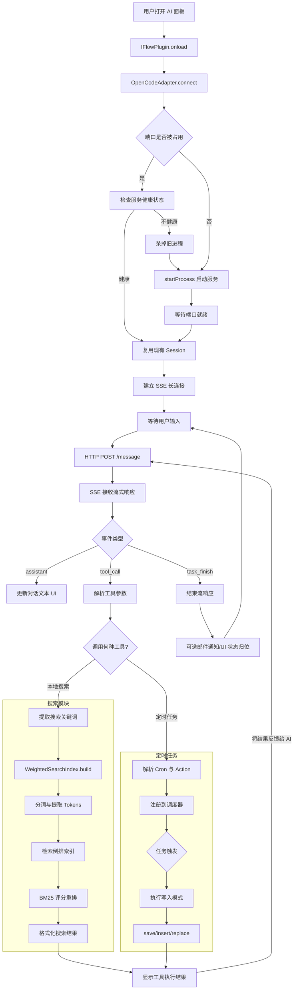

OpenCode AI助手是一款将 OpenCode CLI 深度集成到 Obsidian 的插件，实现了 AI 辅助写作、知识库问答、全文 BM25 搜索、定时任务自动化等功能。本文将深入剖析其代码架构、核心模块与实现原理，帮助开发者理解插件的设计思路和技术细节。

该插件采用 TypeScript 开发，基于 Obsidian Plugin API 构建，通过 HTTP REST API 与 SSE（Server-Sent Events）与 OpenCode CLI 后端通信，实现了流式对话、工具调用状态同步、会话管理等高级功能。同时，插件内置了完整的 BM25 搜索引擎，支持中文和英文关键词检索，为知识库问答提供了精准的本地搜索能力。

## 核心架构

### 插件主类 IFlowPlugin

IFlowPlugin 类是插件的核心入口，继承自 Obsidian 的 Plugin 基类。它负责：

1. 生命周期管理：onload() 初始化所有组件，onunload() 清理资源
1. 设置管理：通过 PluginSettingTab 提供可视化配置界面
1. 视图注册：注册 IFlowChatView 侧边栏视图，提供 AI 对话界面
1. 命令注册：注册"打开 AI 面板"、"管理定时任务"、"搜索笔记"等命令
1. 适配器管理：创建和管理 OpenCodeAdapter 实例，与 CLI 后端通信
### 设置系统

插件支持丰富的配置选项，通过 IFlowPluginSettings 接口定义：

| 设置类别 | 关键配置项 |
| --- | --- |
| CLI 后端 | cliBackend、opencodePath、opencodeUrl、autoStartProcess |
| 模板与 Skills | templatePaths、skillsPaths、lskillPaths |
| 搜索参数 | searchTopN、searchBm25K1、searchBm25B、searchKeywordWeights |
| 邮件通知 | emailEnabled、emailHost、emailPort、emailUser |
| 定时任务 | scheduledTasks 数组 |设置通过 Obsidian 的 loadData() 和 saveData() API 持久化存储。

## OpenCode 适配器

### HTTP + SSE 双通道通信

OpenCodeAdapter 类实现了与 OpenCode CLI 后端的双通道通信：

1. HTTP REST API：用于创建 session、发送消息、查询状态
1. SSE 事件流：用于接收流式响应，实时更新对话内容
连接流程：

```plain text
connect(cwd)
  → disconnect() 清理旧连接
  → startProcess() 启动 opencode serve
  → waitForPort() 等待端口就绪
  → checkHealth() 健康检查
  → httpRequest("POST", "/session") 创建会话
  → connectSSEAndWait() 建立 SSE 连接
```

### 会话管理

每个对话窗口对应一个独立的 session。session 创建时指定工作目录（cwd），确保文件操作限定在当前 Obsidian 仓库内。

```typescript
const sessionPath = cwd ? `/session?directory=${encodeURIComponent(cwd)}` : "/session";
const sessionData = await this.httpRequest("POST", sessionPath, sessionPayload);
this.sessionId = sessionData.id;
```

### 流式消息处理

SSE 连接接收的事件类型包括：

| 事件类型 | 说明 |
| --- | --- |
| assistant | AI 文本回复，增量更新 |
| tool_call | 工具调用开始，显示工具名和参数 |
| tool_result | 工具执行结果 |
| task_finish | 任务完成标记 |通过 pendingMessages 队列和 AsyncIterable 接口，实现非阻塞的消息流式推送。

### idle 防抖机制

为避免 Agent 工具调用间隙误触发 task_finish，插件实现了 idle 防抖：

```typescript
if (this.idleDebounceTimer) {
    clearTimeout(this.idleDebounceTimer);
}
this.idleDebounceTimer = setTimeout(() => {
    this.pushMessage({ type: 'task_finish' });
}, 500);
```

只有在连续 500ms 无新事件时，才发送任务完成信号。

## BM25 搜索引擎

### 索引构建

WeightedSearchIndex 类实现了 BM25 算法的变种，支持中英文混合检索：

```typescript
build(docs: Doc[])
  → 提取 alphanumeric tokens（英文）
  → 提取 CJK sequences（中文）
  → 构建 2-gram / 3-gram 倒排索引
  → 计算平均文档长度 avgDocLen
```

中文处理采用 n-gram 分词，避免词表依赖：

```typescript
for (let i = 0; i <= seq.length - 2; i++) {
    addPosting(this.gram2, seq.slice(i, i + 2), id, 1);
}
for (let i = 0; i <= seq.length - 3; i++) {
    addPosting(this.gram3, seq.slice(i, i + 3), id, 1);
}
```


### 搜索算法

BM25 评分公式：

$$
\text{score}(D, Q) = \sum_{i=1}^{n} \text{IDF}(q_i) \cdot \frac{f(q_i, D) \cdot (k_1 + 1)}{f(q_i, D) + k_1 \cdot (1 - b + b \cdot \frac{|D|}{\text{avgdl}})}
$$
关键参数：

* k1：词频饱和系数（默认 1.2）
* b：文档长度归一化系数（默认 0.75）
用户可通过 searchKeywordWeights 自定义关键词权重，提升重要词汇的检索优先级。

### 搜索结果处理

search() 方法返回结构化结果：

```typescript
{
    keywords: string[],
    results: SearchResult[],
    highlightPositions: Record<docId, Highlights>
}
```

每个结果包含：

* docId、path、title：文档定位信息
* snippet：智能截取的上下文摘要
* score：BM25 评分
* matches：匹配词的统计信息
## Skills 路径解析

### 路径规范化

skills-paths.js 提供路径规范化函数：

```typescript
normalizeSettingPath(value: string)
  → trim()
  → replace(/\//g, "/")
  → replace(/\/+$/g, "")
  → 处理 "./" 前缀
```

### 绝对路径识别

Windows 绝对路径判断：

```typescript
isLikelyWindowsAbsolutePath(value: string) {
    return /^[a-zA-Z]:[\\/]/.test(value);
}
```

### Skills 目录同步

ensureProjectSkills() 自动将 Skills 目录链接/复制到项目工作目录：

```typescript
ensureProjectSkills(projectRootAbs, skillsPathsAbs, projectFolderName)
  → 创建 destRoot/skills 目录
  → 检查源目录是否有 skill.toml
  → symlink 或 cp 复制
```

## 定时任务系统

### 任务数据结构

```typescript
interface IFlowScheduledTask {
    id: string;
    name: string;
    sourcePath: string;      // 提示词模板文件路径
    targetPath: string;      // 输出文件夹（save 模式）
    writeMode: 'save' | 'insert' | 'replace';
    scheduleType: 'once' | 'daily';
    schedule: string;        // cron 表达式
    sendEmail: boolean;
}
```

### 三种写入模式

| 模式 | 行为 |
| --- | --- |
| save | AI 结果写入 targetPath 指定文件夹的新文件 |
| insert | 解析 sourcePath 中的 [[WikiLink]]，结果追加到被引用文件末尾 |
| replace | 解析 WikiLink，结果覆盖被引用文件 |WikiLink 解析示例：

```markdown
翻译[[测试3]]，将文件中的中文翻译成英文。
```

插件读取 测试3.md 内容，嵌入提示词，发送给 AI，然后将翻译结果写入 测试3.md（insert 或 replace）。

## 邮件通知系统

### SMTP 配置

```typescript
interface EmailSettings {
    emailEnabled: boolean;
    emailHost: string;     // 默认 smtp.qq.com
    emailPort: number;     // 默认 465（SSL）
    emailSecure: boolean;
    emailUser: string;
    emailPass: string;
    emailFrom: string;
    emailTo: string;
}
```

### 发送流程

任务完成后，调用 Node.js 内置 tls 模块发送邮件：

```typescript
const socket = tls.connect({
    host: settings.emailHost,
    port: settings.emailPort
}, () => {
    // SMTP 协议握手
    // AUTH LOGIN 认证
    // MAIL FROM / RCPT TO / DATA 发送
});
```

## 流程图



### 主要改进点说明：

1. 服务自愈闭环：
* 当检查到“不健康”时，增加“杀掉进程”并指向“启动服务”的逻辑，确保流程能走通。
* 启动成功后统一进入 Session 创建阶段。
1. 工具调用集成 (Tool Call Integration)：
* 将原本孤立的“搜索模块”和“定时任务”通过 tool_call 事件连接。
* 核心逻辑改进：工具执行完（R 节点）后，流程指向了 M (HTTP POST /message)。这是符合 AI Agent 逻辑的：AI 调用工具 -> 得到结果 -> 带着结果再次请求 AI -> AI 总结回复。
1. 增加等待状态：
* 增加了 L[等待用户输入]，使得流程在任务完成后能回到待命状态，形成交互闭环。
1. 搜索模块内部细节优化：
* 将搜索逻辑从“用户触发”改为“提取关键词”，因为在 AI 场景下，搜索通常是由 AI 根据用户意图发起的。
1. 定时任务执行逻辑：
* 明确了从解析到注册再到触发的异步过程。
这样修改后的流程图更符合一个基于 SSE 的 AI 插件/Agent 的真实运行机制。

