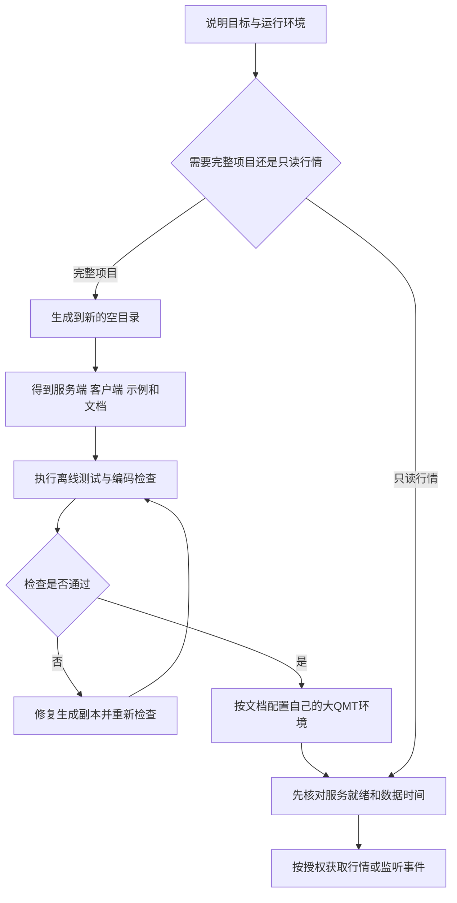

想用外部 Python 处理大QMT的行情和事件，最先遇到的问题通常不是策略，而是怎么把服务端、客户端、账户配置和回调接起来。只复制一个请求函数容易起步，等到需要检查就绪状态、处理断线或核对成交，又得重新补齐周边代码。

bigqmt-bridge-data 提供了一套可以独立生成的桥接项目。你向 AI 说明目标，它就能基于模板生成服务端、客户端、示例、中文文档和测试。后续按需求改生成出来的项目，无需把个人数据库或已有策略复制进 Skill。

这篇教程使用普通 Skill 的 1.0.1 版本。2026年9月7日核对时，发布页已展示该版本及 ZIP 下载入口；下载或安装遇到登录提示，请先登录自己的 SkillHub 账号。Skill 本身不设置付费调用门槛，所用 AI 工具及交易软件的服务条件另行遵循各自规则。

该 skill 在 workbuddy 可找到，github 开源。

## 它适合解决哪些问题

如果你准备开发大QMT的外部行情客户端，或者需要一套覆盖账户查询、指定价格和数量报单、委托与成交回推的桥接代码，这个 Skill 可以作为开发起点。它也保留了只读行情工具，已有桥接服务的用户可以按需获取数据并导出 CSV。

几个入口的作用不同：完整客户端支持账户、订单和事件接口，只读工具只允许 GET 请求。新项目账户开关和真实报单开关默认关闭，不会因为你让 AI“生成项目”就开始查询真实账户或发单。

它不是选股策略，不自带条件单、撤单、算法单或交易网页，也不保证收益。生成服务端面向大QMT内置 Python 环境，不能直接当作小QMT的 xtquant 程序使用。

## 从需求到可检查项目，完整流程是什么



生成阶段只复制源码和文档，不联网、不启动大QMT、不配置真实账号、不产生订单。真正使用桥接服务时，才需要部署者在自己的环境完成设置。默认端口是本机 1693，服务是否就绪需要检查实际返回，不能只看 HTTP 是否能访问。

需要交易功能时，还要逐层区分参数预演、报单调用、柜台委托状态、成交回调和账本落地。收到心跳或空事件流，不能证明发生了成交。


## 第一步：从发布页获取 Skill

打开[大QMT完整桥接开发的发布页](https://skillhub.cn/team-skills/bigqmt-bridge-data)，核对名称为“大QMT完整桥接开发”、Slug 为 bigqmt-bridge-data，再选择页面提供的安装方式。

方式一：把页面安装提示词交给支持安装 Skill 的 AI。 当前页面给出的提示词如下，后续若平台更新命令，以页面最新内容为准：

```vb.net
请先检查是否已安装 SkillHub 商店，若未安装，请根据 https://skillhub.cn/install/skillhub.md 安装SkillHub商店，但是只安装CLI，然后安装 @org-3k753sri/bigqmt-bridge-data 技能。若已安装，则直接安装 @org-3k753sri/bigqmt-bridge-data 技能。
```

方式二：点击“下载 Zip 包安装”。 下载后使用你的 AI 工具支持的本地 Skill 安装方式。需要保留整个 bigqmt-bridge-data 文件夹，包括 SKILL.md、scripts、assets 和 references 等内容，不能只复制入口文件。

本教程的工作区验收使用 WorkBuddy：把完整技能目录放入项目的 .codebuddy/skills/bigqmt-bridge-data/，然后打开该项目并让 AI 调用它。不同工具的 Skill 安装目录可能不同，不要直接套用 WorkBuddy 路径。

安装后可以先发一个检查请求：

```vb.net
请调用 bigqmt-bridge-data，说明它提供的两个主要入口，
并检查生成器和模板文件是否齐全。只读取技能，不联网，不生成项目。
```

确认工具显示实际调用了该 Skill，再继续生成。仅回答“我知道这个技能”不足以证明安装成功。

## 第二步：用一个可复制的提示词生成项目

先准备一个新的输出目录。例如，希望在自己的项目下生成 qmt_bridge_demo，可以这样说：

```vb.net
请调用 bigqmt-bridge-data，在当前项目外置的新目录 qmt_bridge_demo 中
生成完整的大QMT桥接项目。如果该目录非空，请停止，不要覆盖。

只生成源码、示例和中文说明，不连接真实QMT，不查询账户，不下单。
保留账户和真实报单默认关闭，账号、令牌和数据库路径不要填写。

生成后列出主要文件用途，执行离线测试与静态验证，
最后说明哪些检查已完成、哪些需要我部署后再验证。
```

如果你更习惯命令行，也可以在安装后的 Skill 根目录打开 PowerShell，使用带唯一后缀的临时目录：

```powershell
$demoDir = Join-Path $env:TEMP ('qmt_bridge_demo_' + [guid]::NewGuid().ToString('N'))
python -B -X utf8 .\scripts\generate_bridge.py --output $demoDir
Set-Location -LiteralPath $demoDir
python -B -m unittest discover -s . -p 'test_*.py' -v
python -B -X utf8 .\validate_source.py
```

这里的 Python 是运行外部生成工具的解释器，要求 Python 3.8 或更高版本。服务端模板兼容性目标为大QMT的 Python 3.6，部署时仍要按文档显式转换 GBK 编码并验证。不要因为文件第一行写着 GBK，就把 UTF-8 源文件直接投入运行。

## 第三步：看懂生成结果

生成成功后，项目包含 15 个文件。最值得先打开的是下面这些：

| 文件 | 你可以用它做什么 |
| --- | --- |
| README.md、DEPLOYMENT.md | 了解环境、配置和部署顺序 |
| qmt_bridge_server.py | 大QMT内置服务端，承接原生调用与回调 |
| bridge_client.py | 外部 Python 的完整客户端 |
| example_data.py | 查看数据调用示例 |
| example_order.py | 查看默认预演的订单示例 |
| example_events.py | 查看长轮询和 SSE 事件监听示例 |
| test_server.py、test_client.py | 用假环境与临时数据执行隔离测试 |
| GENERATED_MANIFEST.json | 核对生成模板的文件哈希 |示例文件用于理解接口，不代表你应该立即运行全部示例。特别是账户查询、运行环境检查和服务连接，需要先完成相应部署条件。

1.0.1 发布副本的 33 项 Skill 回归与生成项目的 75 项隔离测试已通过，生成结果也经过 WorkBuddy 调用验收。这些结果说明模板在已测试场景下可生成、可检查，不代表你的券商环境已经部署成功，也不代表真实订单已成交。

## 一个进阶例子：增加只读事件消费者

完成基础生成后，可以在同一项目继续让 AI 定制监听程序：

```vb.net
基于刚生成的桥接项目，增加一个只读事件消费者。
优先阅读 API.md 和 TRADING_AND_EVENTS.md，使用现有客户端方法。
需要区分委托事件、成交事件和游标心跳；处理重复事件、断线和游标缺口。
本次只写代码与离线测试，禁止连接真实服务或发起订单。
请把业务处理函数中需要我实现的部分明确标出来。
```

监听本身不会下单。真正接入后，游标应在业务处理成功后保存；出现缺口时需要根据委托、成交和账本做核对，不能简单换一个请求号重发订单。

如果你只有行情需求，可以直接描述标的、周期、时间范围和输出格式，让 AI 走只读工具入口。历史数据默认不会自动补缓存或订阅；数据缺失、陈旧时应先看到说明，再决定如何处理。

## 第一次使用容易卡在哪里

找不到 Skill：检查完整文件夹是否位于当前 AI 工具实际使用的技能目录，工作区是否正确，再查看是否出现真实 Skill 调用。

生成器提示目录非空：换一个新的输出目录。这个限制用于保护已有文件，不建议通过清空业务目录来解决。

文件缺失或模板哈希不一致：重新核对下载包，确保没有只复制 SKILL.md，也没有手工改动模板后忘记更新清单。

服务能访问，但数据请求不工作：部署后检查产品、接口版本、能力和 RPC 心跳。网络通不代表大QMT回调线程已经就绪。

想直接用于真实交易：先完成自己的账户配置、授权与运行验收。Skill 提供开发材料，不能代替柜台状态核对和实际交易决策。

## 下载与相关资料

* [下载并使用该 Skill](https://skillhub.cn/team-skills/bigqmt-bridge-data)
* 开户开QMT+V：yuhanbo758
* [文档](https://docs.sanrenjz.com/)
