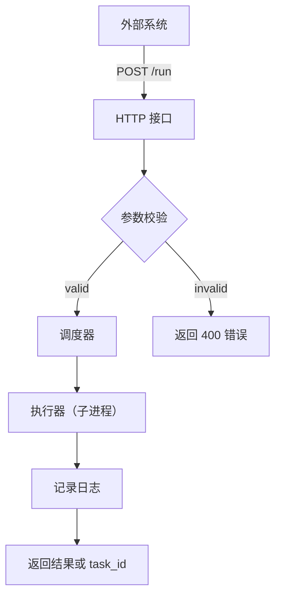

## 快速概览与目标

1. 在外部 Python 环境通过 HTTP 调用大QMT 的桥接服务，获取行情数据（tick、1m、5m、日线、分时等）。
1. 将返回的 JSON 统一转换为 pandas.DataFrame，方便像 akshare 一样直接打印、保存、分析、画图。
1. 可选：把策略放在大QMTserver 中，通过 HTTP 将执行能力服务化，支持远程触发和管理。
## 使用前提

1. 在大QMT 内置 Python 中启动桥接服务（示例）：
```python
大QMTserver.py
```

默认桥接地址：

```vb.net
http://127.0.0.1:1690
```

1. 外部环境安装 pandas：
```bash
pip install pandas
```

## 通用基础代码（桥接侧）

下面的代码是所有示例的基础，建议保存为脚本，例如 qmt_bridge_dataframe_demo.py。

```python
# -*- coding: utf-8 -*-
"""
大QMT 桥接数据获取通用示例

说明：
1. 本脚本运行在外部 Python 环境，不运行在大QMT内置 Python 中。
2. 通过 HTTP 调用大QMT桥接服务。
3. 所有返回结果统一转成 pandas.DataFrame，方便像 akshare 一样直接使用。
"""

import json
import os
from urllib.parse import urlencode
from urllib.request import Request, urlopen

import pandas as pd


# 允许通过环境变量覆盖桥接地址，便于未来切换端口或远程调试。
BRIDGE_BASE_URL = os.getenv("BIG_QMT_BRIDGE_BASE_URL", "http://127.0.0.1:1690")


def request_json(path, params=None):
    """
    通用桥接请求函数。

    参数：
    - path: 接口路径，例如 '/tick'、'/history_data'
    - params: 查询参数字典

    返回：
    - Python 字典（由 JSON 反序列化而来）
    """
    params = params or {}
    query = urlencode(params)
    url = BRIDGE_BASE_URL + path + (("?" + query) if query else "")
    request = Request(url, method="GET")
    with urlopen(request, timeout=8) as response:
        return json.loads(response.read().decode("utf-8"))


def ensure_success(payload):
    """
    校验桥接接口是否成功。

    如果接口返回失败，则直接抛出异常，方便测试时快速定位问题。
    """
    if str(payload.get("status", "")).lower() != "success":
        raise RuntimeError(payload.get("message", "桥接接口返回失败"))
    return payload


def save_table(df, file_path):
    """
    保存 DataFrame。

    说明：
    - .csv 使用 utf-8-sig，便于 Excel 直接打开中文不乱码
    - .xlsx 使用 pandas 默认 Excel 写法
    """
    file_path = os.path.abspath(file_path)
    lower_path = file_path.lower()
    if lower_path.endswith(".xlsx"):
        df.to_excel(file_path, index=False)
    else:
        df.to_csv(file_path, index=False, encoding="utf-8-sig")
    return file_path

```

## 行情字段与周期说明（要点）

1. 大QMT 提供的字段远不止 OHLCV，常见扩展字段包括 amount, preClose, suspendFlag, openInterest, transactionNum, askPrice/askVol/bidPrice/bidVol 等。
1. period 常见值：tick, 1m, 5m, 15m, 30m, 60m, 1d, 1w, 1mon, 1y, 以及 Level2 相关如 l2quote, l2transaction 等。
### 示例：获取单只证券的 tick 五档行情（单行 DataFrame）

```python
def get_tick_df(stock_code):
    """
    获取单只证券 tick 数据，并整理为一行表格。
    """
    payload = ensure_success(request_json("/tick", {"stock_code": stock_code}))
    tick = payload.get("tick", {}) or {}

    row = {
        "stock_code": payload.get("stock_code", ""),
        "stock_name": payload.get("stock_name", ""),
        "latest_price": tick.get("最新", 0),
        "open": tick.get("今开", 0),
        "high": tick.get("最高", 0),
        "low": tick.get("最低", 0),
        "pre_close": tick.get("昨收", 0),
        "up_limit": tick.get("涨停", 0),
        "down_limit": tick.get("跌停", 0),
    }

    ask_price = tick.get("askPrice", []) or []
    ask_vol = tick.get("askVol", []) or []
    bid_price = tick.get("bidPrice", []) or []
    bid_vol = tick.get("bidVol", []) or []

    for i in range(5):
        row["ask_price_{}".format(i + 1)] = ask_price[i] if i < len(ask_price) else None
        row["ask_vol_{}".format(i + 1)] = ask_vol[i] if i < len(ask_vol) else None
        row["bid_price_{}".format(i + 1)] = bid_price[i] if i < len(bid_price) else None
        row["bid_vol_{}".format(i + 1)] = bid_vol[i] if i < len(bid_vol) else None

    return pd.DataFrame([row])


df_tick = get_tick_df("000001")
print(df_tick)
print(df_tick.T)
```

### 保存 tick 表

```python
save_table(df_tick, "tick_000001.csv")
```

### 获取分时图（/market 返回的 chart）

```python
def get_intraday_df(stock_code):
    """
    获取单只证券的分时图表格。
    """
    payload = ensure_success(request_json("/market", {"stock_code": stock_code}))
    chart = payload.get("chart", []) or []
    df = pd.DataFrame(chart)
    if not df.empty and "time" in df.columns:
        df = df.rename(columns={"time": "trade_time", "price": "close"})
    return df


df_intraday = get_intraday_df("000001")
print(df_intraday.head())
print(df_intraday.tail())
```

### 保存分时表

```python
save_table(df_intraday, "intraday_000001.csv")
```

### 获取历史行情（/history_data）

```python
def get_history_df(stock_code, period="1d", count=20,
                   fields="time,open,high,low,close,volume",
                   start_time="", end_time="", dividend_type="none"):
    """
    获取历史行情，并整理成 DataFrame。

    常用 period：
    - tick
    - 1m
    - 5m
    - 15m
    - 30m
    - 1d

    常用 fields 不止 OHLCV，还可以扩展：
    - amount
    - preClose
    - settle
    - openInterest
    - suspendFlag
    """
    payload = ensure_success(
        request_json(
            "/history_data",
            {
                "stock_code": stock_code,
                "period": period,
                "count": count,
                "fields": fields,
                "start_time": start_time,
                "end_time": end_time,
                "dividend_type": dividend_type,
            },
        )
    )

    df = pd.DataFrame(payload.get("data", []) or [])
    if not df.empty and "time" in df.columns:
        df["time"] = df["time"].astype(str)
    return df
```

## 推荐字段组合（可直接复制使用）

* 基础 K 线字段： time,open,high,low,close,volume
* K 线增强字段： time,open,high,low,close,volume,amount,preClose,suspendFlag
* 期货/期权字段： time,open,high,low,close,volume,amount,settle,openInterest
* Tick 扩展字段： time,stime,lastPrice,open,high,low,lastClose,volume,amount,transactionNum
* Tick 五档字段： time,stime,lastPrice,askPrice,askVol,bidPrice,bidVol
### 获取 1 分钟/5 分钟/日线示例

```python
df_1m = get_history_df(
    stock_code="000001",
    period="1m",
    count=60,
    fields="time,open,high,low,close,volume"
)

df_5m = get_history_df(
    stock_code="000001",
    period="5m",
    count=80,
    fields="time,open,high,low,close,volume"
)

df_day = get_history_df(
    stock_code="000001",
    period="1d",
    count=120,
    fields="time,open,high,low,close,volume"
)
```

### 获取更完整的 tick 或五档表

```python
df_tick_more = get_history_df(
    stock_code="000001",
    period="tick",
    count=20,
    fields="time,stime,lastPrice,open,high,low,lastClose,volume,amount,transactionNum,stockStatus"
)

df_tick_level5 = get_history_df(
    stock_code="000001",
    period="tick",
    count=5,
    fields="time,stime,lastPrice,askPrice,askVol,bidPrice,bidVol"
)
```

说明：askPrice/askVol/bidPrice/bidVol 返回的是列表列，pandas 会把它们保存在单元格中；如需展开成多列，可再做二次拆分。

### 批量获取多只证券日线并合并

```python
def get_multi_stock_day_df(stock_codes, count=20):
    """
    批量获取多只证券的日线数据，并合并为一个总表。
    """
    frames = []
    for stock_code in stock_codes:
        df = get_history_df(
            stock_code=stock_code,
            period="1d",
            count=count,
            fields="time,open,high,low,close,volume"
        )
        if df.empty:
            continue
        df["stock_code"] = stock_code
        frames.append(df)

    if not frames:
        return pd.DataFrame()
    return pd.concat(frames, ignore_index=True)


df_batch = get_multi_stock_day_df(["000001", "600000", "159915"], count=10)
save_table(df_batch, "batch_day_data.csv")
```

### 获取买入力（buying_power）

```python
def get_buying_power_df(stock_code):
    """
    获取单只证券的买入力表。
    """
    payload = ensure_success(request_json("/tick", {"stock_code": stock_code}))
    buying_power = payload.get("buying_power", {}) or {}
    row = {
        "stock_code": payload.get("stock_code", ""),
        "stock_name": payload.get("stock_name", ""),
        "latest_price": buying_power.get("latest_price", 0),
        "lot_size": buying_power.get("lot_size", 0),
        "preferred_source": buying_power.get("preferred_source", ""),
        "preferred_max_volume": buying_power.get("preferred_max_volume", 0),
        "normal_available_amount": buying_power.get("normal_available_amount", 0),
        "normal_max_volume": buying_power.get("normal_max_volume", 0),
        "credit_own_amount": buying_power.get("credit_own_amount", 0),
        "credit_own_max_volume": buying_power.get("credit_own_max_volume", 0),
        "credit_margin_amount": buying_power.get("credit_margin_amount", 0),
        "credit_margin_max_volume": buying_power.get("credit_margin_max_volume", 0),
    }
    return pd.DataFrame([row])


df_bp = get_buying_power_df("118025")
print(df_bp.T)
```

### 一次性测试脚本（便于接入验收）

```python
if __name__ == "__main__":
    sample_code = "000001"

    print("桥接健康检查")
    print(ensure_success(request_json("/health")))

    print("\nTick 表")
    print(get_tick_df(sample_code).T)

    print("\n1分钟表")
    print(get_history_df(sample_code, period="1m", count=10))

    print("\n5分钟表")
    print(get_history_df(sample_code, period="5m", count=10))

    print("\n日线表")
    print(get_history_df(sample_code, period="1d", count=10))
```

## 桥接接口一览（用途与适合场景）

* /tick：轻量五档行情、最新价、买入力结构；适合 高频刷新、盘中手动交易、单行 DataFrame。
* /market：完整行情与分时图（chart）；适合 页面刷新、盘中走势分析。
* /history_data：支持 tick/1m/5m/15m/30m/60m/1d 等历史数据，并可通过 fields 扩展更多字段；适合 外部策略研究、DataFrame 批量分析、保存为 CSV/Excel。
## 常见问题与排查要点

1. 桥接返回“未就绪”：请确认大QMT 内置 Python 的 big_data_qmt_app.py 或桥接服务已运行，端口正确。
1. DataFrame 为空：检查证券代码、周期、交易时段、以及是否在 fields 中请求了不支持的字段。
1. 返回慢或超时：检查大QMT 运行负载、网络、以及桥接服务的超时设置。
## 推荐上手顺序（快速验收）

1. 健康检查：/health
1. 获取 tick 表
1. 获取 1 分钟表
1. 获取 5 分钟表
1. 获取日线表
---

### 代码结构概览

* HTTP 接口处理（路由解析、参数校验、鉴权）
* 任务调度与执行（同步/异步执行、任务队列）
* 日志与异常处理
* 配置与环境管理
### 主要模块详解

### HTTP 接口层

该层负责接收外部请求，解析 JSON 参数并进行基本校验，随后将任务发往执行模块。常见端点：

* POST /run — 触发策略执行，返回 task_id（若异步）或执行结果（若同步）
* GET /status?task_id=... — 查询任务执行状态
* GET /history?strategy=... — 查询历史运行结果
实现要点：建议使用 Flask 或 FastAPI；对外 API 应引入 token/签名鉴权并配合 IP 白名单与 TLS。

### 调度与执行适配

接到执行请求后，服务器会根据配置找到对应的策略脚本，并在受控 Python 环境中运行它。执行方式应支持：

* 使用 subprocess 调用独立进程以保证隔离性；
* 使用异步任务队列（如 Celery 或自研队列）处理耗时任务并返回 task_id；
关键细节包括传参映射、最大并发/超时控制、执行隔离与资源限制。

### 日志与错误处理

日志应包含请求元信息、执行输出、异常堆栈与耗时统计；错误以结构化 JSON 返回，便于调用侧解析和自动化处理。

### Mermaid 流程图（服务化执行流程）



### 潜在限制与改进建议

1. 安全性：不要仅依赖简单 token，建议签名机制 + IP 白名单 + TLS；
1. 可扩展性：使用消息队列与工作进程池解耦长任务；
1. 可观测性：增加 Prometheus 指标导出，便于监控请求量、成功率与响应时间；
1. 测试与 CI：为关键流程编写集成测试（模拟请求与子进程），并在 CI 中运行。
