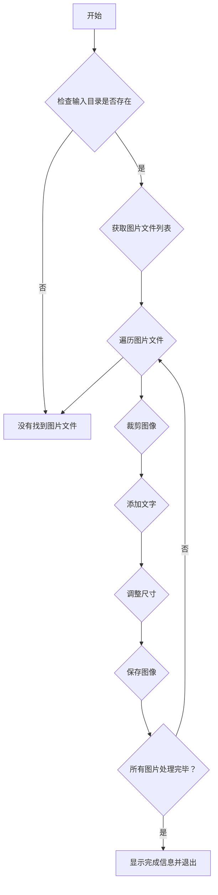

bili 视频：[封面图自动剪切工具：一键加文字并裁剪不同尺寸的四张封面图_哔哩哔哩_bilibili](https://www.bilibili.com/video/BV1WJWPzbEuG/?vd_source=247ac77d4ae7339ea06d0fec09aa8f70)

[程序小店 - 封面图自动剪切工具](https://shop.sanrenjz.com/product/68cfbedb23eb0c32a9053f71)

本文档旨在为具有一定技术背景但非编程专家的读者详细解析封面图自动剪切工具的代码，使其能够理解该工具的目的、功能、结构、算法以及潜在的改进方向。

## 概述

该Python程序是一个基于图形用户界面（GUI）的工具，用于自动裁剪图像并添加文本，生成不同比例的封面图。它利用了 tkinter 库创建GUI界面，PIL（Pillow）库处理图像，并通过多线程技术实现批量处理，提高效率。

该工具支持用户自定义文本内容、字体、颜色和输出比例，适用于自媒体内容创作者快速生成高质量的封面图片。

## 代码结构

整个程序主要由一个类CoverImageProcessor构成，负责GUI的创建、事件处理和图像处理逻辑。以下是代码的主要组成部分：

1. 初始化（__init__）: 初始化GUI界面，设置窗口标题、大小、图标等，并创建各个GUI组件。
1. GUI组件创建:
1. 事件处理函数:
1. 图像处理函数:
1. 配置管理函数:
1. 辅助函数:
## 核心功能详解

### 1. GUI界面创建与布局

代码使用tkinter和ttk模块创建GUI界面。ttk（Themed Tk）提供了更多现代化的控件样式，使界面看起来更美观。主要的GUI组件包括：

* 标签（Label）: 用于显示静态文本。
* 输入框（Entry）: 用于用户输入文本。
* 按钮（Button）: 用于触发事件。
* 复选框（Checkbutton）: 用于选择布尔值选项。
* 下拉框（Combobox）: 用于选择字体。
* 微调框（Spinbox）: 用于选择字体大小。
* 滑动条（Scale）: 用于调整透明度。
* 滚动文本框（ScrolledText）: 用于显示日志信息。
* 标签框架（LabelFrame）: 用于分组显示相关控件。
GUI的布局采用grid布局管理器，灵活地将各个组件放置在窗口中。

### 2. 图像处理

图像处理的核心在于PIL（Pillow）库的使用。PIL是一个强大的图像处理库，可以进行图像的裁剪、缩放、颜色调整、添加文字等操作。

* 裁剪（crop_image）: 根据指定的宽高比裁剪图像，确保输出图像符合要求。
* 添加文字（add_text_to_image）: 在图像上添加用户指定的文字，并可以设置字体、颜色、背景等。
### 3. 批量处理

为了提高处理效率，代码使用了多线程技术。batch_process函数创建一个新的线程来执行批量处理任务，避免阻塞GUI主线程，从而保持界面的响应性。

### 4. 配置文件管理

程序支持将用户设置保存到配置文件config.json中，并在下次启动时加载这些设置。这样用户无需每次都重新设置参数，提高了使用便捷性。配置文件使用json格式，易于读写。

### 5. 拖拽功能

程序支持拖拽图片文件到指定区域进行处理。这个功能依赖于tkinterdnd2库。通过注册拖拽目标和绑定事件，可以方便地将文件路径传递给处理函数。

## 算法和数据结构

* 图像裁剪算法: 代码根据目标宽高比计算需要裁剪的区域，确保裁剪后的图像符合比例要求。
* 文本排版算法: 代码根据字体大小和文本内容计算文本的宽度和高度，并将其居中放置在图像上。
* 数据结构: 程序使用Python的列表和字典来存储GUI组件和配置信息。


## 潜在限制和改进建议

1. 依赖项: 依赖于tkinterdnd2库实现拖拽功能，如果用户未安装该库，则拖拽功能失效。建议在程序启动时检测该库是否安装，并给出明确的提示。
1. 字体兼容性: 在不同操作系统上，字体名称可能不一致。建议提供一个字体选择对话框，让用户选择可用的字体。
1. 错误处理: 代码中的错误处理部分可以进一步完善，例如在文件读取、图像处理等环节增加更详细的错误信息，方便用户排查问题。
1. 性能优化: 对于处理大量高分辨率图片，可以考虑使用更高效的图像处理算法或利用GPU加速，提高处理速度。
1. 多语言支持: 可以考虑增加多语言支持，方便不同国家和地区的用户使用。
1. UI 美观性: 可以考虑使用更现代化的 UI 库，例如 customtkinter，来提升用户体验。
1. 水印功能: 除了添加文字，还可以考虑增加添加水印的功能，例如添加公司 Logo 或个人签名。
1. 预设模板: 增加预设模板功能，用户可以选择不同的排版风格和文字样式，快速生成封面图。
## 编程语言和库

* 编程语言: Python
* GUI库: tkinter和ttk
* 图像处理库: PIL（Pillow）
* 拖拽库: tkinterdnd2
* JSON库: json（Python内置）
* 多线程库: threading（Python内置）
## 无界面代码

```python
import os
from PIL import Image, ImageDraw, ImageFont

# 封面图自动裁剪

# 对"原图"文件夹中的所有图片进行剪切增加文章，生成横竖屏封面图，放到文件夹"处理后"。
def create_covers_with_text(text):
    # 固定的字体设置
    font_path = r'C:\Windows\Fonts\STXINGKA.TTF'
    input_directory = r'D:\wenjian\自媒体\封面图\原图'
    output_directory = r'D:\wenjian\自媒体\封面图\处理后'

    # 定义一个函数来清理文件名
    def sanitize_filename(filename):
        # 定义Windows文件名中不允许的字符
        invalid_chars = '<>:"/\\|?*'
        # 用下划线替换非法字符
        return ''.join('_' if c in invalid_chars else c for c in filename)

    def crop_image(image, aspect_ratio):
        width, height = image.size
        img_aspect_ratio = width / height

        if img_aspect_ratio > aspect_ratio:
            # 图片过宽，裁剪宽度
            new_width = int(aspect_ratio * height)
            left = (width - new_width) / 2
            return image.crop((left, 0, left + new_width, height))
        else:
            # 图片过高，裁剪高度
            new_height = int(width / aspect_ratio)
            top = (height - new_height) / 2
            return image.crop((0, top, width, top + new_height))

    def add_text_to_image(image):
        draw = ImageDraw.Draw(image, "RGBA")  # 确保使用"RGBA"模式以实现半透明填充
        image_width, image_height = image.size
        font_size = int(image_width * 0.08)
        font = ImageFont.truetype(font_path, font_size)

        # 分割文本并计算总高度
        lines = text.split('：')
        text_widths = [draw.textbbox((0, 0), line, font=font)[2] for line in lines]
        text_heights = [draw.textbbox((0, 0), line, font=font)[3] for line in lines]
        total_text_height = sum(text_heights)
        
        # 计算最大文本宽度
        max_text_width = max(text_widths)

        # 文本居中，并留出一点背景边距
        background_margin = 10
        x_rect = (image_width - max_text_width) / 2 - background_margin
        y_rect = (image_height - total_text_height) / 2 - background_margin
        # 使用带Alpha值的白色（例如128）实现半透明效果
        draw.rectangle([x_rect, y_rect, x_rect + max_text_width + 2*background_margin, y_rect + total_text_height +
                        2*background_margin], fill=(255, 255, 255, 128))  # 半透明白色背景
            
        y = (image_height - total_text_height) // 2
        for line in lines:
            text_bbox = draw.textbbox((0, 0), line, font=font)
            text_width = text_bbox[2] - text_bbox[0]
            x_text = (image_width - text_width) / 2
            # 绘制粗体文字 - 使用描边效果实现粗体
            draw.text((x_text, y), line, font=font, fill='red', stroke_width=2, stroke_fill='darkred')  # 红色粗体文字
            y += text_bbox[3] - text_bbox[1]

        return image

    # 确保输出目录存在
    if not os.path.exists(output_directory):
        os.makedirs(output_directory)

    # 预定义输出设置 - 4种比例，分辨率为原来的2倍
    desired_outputs = [
        {"suffix": "_4_3", "aspect_ratio": 4/3, "resize": (2100, 1576)},  # 4:3比例，2倍分辨率
        {"suffix": "_3_4", "aspect_ratio": 3/4, "resize": (1576, 2100)},  # 3:4比例，2倍分辨率
        {"suffix": "_16_9", "aspect_ratio": 16/9, "resize": (2560, 1440)}, # 16:9比例，2倍分辨率
        {"suffix": "_9_16", "aspect_ratio": 9/16, "resize": (1440, 2560)}  # 9:16比例，2倍分辨率
    ]

    # 遍历文件夹中的所有图片
    for filename in os.listdir(input_directory):
        try:
            if filename.lower().endswith(('.png', '.jpg', '.jpeg')):
                input_path = os.path.join(input_directory, filename)
                base_filename, file_extension = os.path.splitext(filename)

                # 打开图片
                with Image.open(input_path) as img:
                    for output in desired_outputs:
                        aspect_ratio = output["aspect_ratio"]
                        resize_dims = output["resize"]
                        suffix = output["suffix"]

                        # 裁剪图片到指定的宽高比
                        cropped_image = crop_image(img, aspect_ratio)

                        # 如有需要，调整图片尺寸
                        if resize_dims is not None:
                            cropped_image = cropped_image.resize(resize_dims, Image.LANCZOS)

                        # 在图片上添加文字
                        output_image = add_text_to_image(cropped_image)

                        # 清理文件名，移除非法字符
                        safe_text = sanitize_filename(text)
                        safe_suffix = sanitize_filename(suffix)
                        safe_extension = sanitize_filename(file_extension)
                        
                        # 添加分辨率信息到文件名
                        resolution_info = f"_{resize_dims[0]}x{resize_dims[1]}" if resize_dims else ""

                        # 保存图片 - 格式：文字_比例_分辨率.扩展名
                        output_filename = f"{safe_text}{safe_suffix}{resolution_info}{safe_extension}"
                        output_path = os.path.join(output_directory, output_filename)
                        output_image.save(output_path)
        except Exception as e:
            print(f"处理图片 {filename} 时发生错误: {e}")

    return "图片处理完成，保存到'D:\\wenjian\\自媒体\\封面图\\处理后'"

if __name__ == "__main__":
    # 提示用户输入文字
    text = input("请输入要添加到图片上的文字: ")
    # 调用处理函数
    result = create_covers_with_text(text)
    print(result)

```

## Mermaid 流程图



