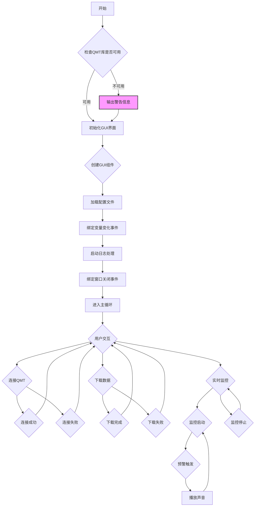

bili 视频：[QMT与通达信结合 5.0：监测交易系统，通达信公式自动交易系统_哔哩哔哩_bilibili](https://www.bilibili.com/video/BV1PwJ2zTEFE/?vd_source=247ac77d4ae7339ea06d0fec09aa8f70)

github 开源地址：[yuhanbo758/qmt_connect_test: mini QMT连接测试，与下载行情数据](https://github.com/yuhanbo758/qmt_connect_test)

程序一键下载： [下载](https://xz.sanrenjz.com/Download/UnPYQxMskS4W.zip)

程序小店：[程序小店 - QMT量化数据通-连接和数据获取](https://shop.sanrenjz.com/product/68d1e8c123eb0c32a9053faa)

本文档旨在为具有一定技术背景但非编程专家的读者，详细解释 qmt_download_and_connect_test.py 文件的功能、结构、算法和潜在问题。该文件是一个集成了 QMT 交易接口连接、行情数据下载、实时数据获取等功能的 GUI 应用程序。

## 1. 代码概述

该 Python 脚本使用 tkinter 库创建图形用户界面，xtquant 库连接 QMT 交易接口，并使用多线程、队列等技术实现异步操作和数据处理。其主要功能包括：

* QMT 连接管理: 连接 QMT 交易接口，查询账户资产和持仓。
* 历史数据下载: 下载股票的历史行情数据，包括 Tick 数据、分钟线、日线等。
* 实时行情监控: 获取股票的实时行情数据，并进行涨跌幅监控和预警。
* 配置文件管理: 使用 JSON 格式的配置文件保存用户设置，并支持自动保存和重置。
## 2. 代码结构与组织方式

该脚本主要由以下几个类和函数组成：

* QMTTraderCallback: QMT 交易回调类，用于处理 QMT 交易接口的事件回调，如连接断开、账户状态更新等。
* QMTDataDownloadGUI: GUI 主类，负责创建和管理 GUI 界面，处理用户交互，并调用 QMT 接口进行数据操作。
* main(): 主函数，用于创建 GUI 应用程序并启动主循环。
QMTDataDownloadGUI 类包含了大量的函数，用于实现 GUI 界面的各个功能，例如：

* GUI 初始化: __init__() 函数初始化 GUI 界面，包括设置窗口标题、大小、图标，创建各种 GUI 组件，以及加载配置文件。
* GUI 组件创建: create_widgets() 函数创建 GUI 组件，包括标签页、按钮、文本框、列表框等。
* QMT 连接管理: connect_qmt(), disconnect_qmt(), query_assets(), query_positions() 函数用于连接和断开 QMT 交易接口，以及查询账户资产和持仓。
* 历史数据下载: download_single_stock(), save_data(), check_existing_data() 函数用于下载和保存股票的历史行情数据。
* 实时行情监控: get_latest_price(), subscribe_realtime(), unsubscribe_realtime(), start_fullpush_monitor(), stop_fullpush_monitor(), process_fullpush_data() 函数用于获取股票的实时行情数据，并进行涨跌幅监控和预警。
* 配置文件管理: load_config(), save_config(), reset_config(), auto_save_config(), open_config_file() 函数用于加载、保存、重置和打开配置文件。
* 日志管理: log(), process_log_queue() 函数用于记录和显示程序运行日志。


## 3. 核心算法与数据结构

### 3.1 多线程与队列

该脚本使用了多线程和队列技术来实现异步操作和数据处理。threading 模块用于创建和管理线程，queue 模块用于创建线程间通信的队列。

* 异步操作: QMT 交易接口的连接、数据下载、实时行情获取等操作都是在单独的线程中进行的，以避免阻塞 GUI 主线程，保证 GUI 界面的响应性。
* 线程间通信: GUI 主线程和数据处理线程之间通过队列进行通信。例如，log() 函数将日志消息放入 log_queue 队列中，process_log_queue() 函数从队列中取出消息并显示在 GUI 界面上。
### 3.2 历史数据增量下载

check_existing_data() 函数用于检查本地是否已存在历史数据，并根据 incremental_var 变量的值，决定是否进行增量下载。

* CSV 文件: 如果保存格式为 CSV 文件，该函数读取 CSV 文件的最后一行，获取最新日期，并计算下一个需要下载的日期。
* SQLite 数据库: 如果保存格式为 SQLite 数据库，该函数查询数据库中的最新日期，并计算下一个需要下载的日期。
### 3.3 全推数据监控

start_fullpush_monitor() 函数用于启动全推数据监控，process_fullpush_data() 函数用于处理全推数据。

* 全推数据: QMT 交易接口可以推送全市场的行情数据，包括股票代码、最新价格、涨跌幅等。
* 涨跌幅监控: process_fullpush_data() 函数根据用户设置的涨跌幅阈值，对全推数据进行监控，并发出预警。
* 声音预警: 如果启用声音预警，当股票的涨跌幅超过阈值时，play_alert_sound() 函数会播放系统提示音或自定义音效。


## 4. 潜在限制与改进建议

### 4.1 错误处理

该脚本的错误处理机制相对简单，主要通过 try...except 块捕获异常，并将错误信息显示在 GUI 界面的日志区域。

* 改进建议: 可以考虑增加更详细的错误处理机制，例如：
### 4.2 性能优化

该脚本在处理大量数据时可能会出现性能问题，例如：

* 全推数据监控: 全推数据量非常大，如果监控的股票数量过多，可能会导致 CPU 占用率过高，GUI 界面卡顿。
* 批量下载: 批量下载股票数据时，如果股票数量过多，可能会导致下载速度过慢。
* 改进建议: 可以考虑以下性能优化措施：
### 4.3 用户体验

该脚本的 GUI 界面相对简单，用户体验还有提升空间。

* 改进建议: 可以考虑以下用户体验改进措施：
## 5. 编程语言与库

该脚本使用 Python 编程语言，主要使用了以下库：

* tkinter: 用于创建 GUI 界面。
* xtquant: 用于连接 QMT 交易接口。
* threading: 用于创建和管理线程。
* queue: 用于创建线程间通信的队列。
* os: 用于进行文件和目录操作。
* json: 用于读写 JSON 格式的配置文件。
* sqlite3: 用于读写 SQLite 数据库。
* pandas: 用于处理数据，例如读取 CSV 文件。
* datetime: 用于处理日期和时间。
* time: 用于进行时间操作，例如睡眠。
* winsound: 用于播放系统提示音。
* markdown: 用于渲染 Markdown 文件。
* html2text: 用于将 HTML 转换为纯文本。
* subprocess: 用于执行系统命令，例如打开配置文件。
## 6. 代码流程图



## 7.测试代码

QMT账号连接代码：

```python
#coding=utf-8
from xtquant.xttrader import XtQuantTrader, XtQuantTraderCallback
from xtquant.xttype import StockAccount
import random
import time


# 定义回调类
class MyXtQuantTraderCallback(XtQuantTraderCallback):
    
    # 连接断开时的回调
    def on_disconnected(self):
        """
        连接断开
        :return:
        """
        print("连接断开，交易接口断开，即将重连")
        
        global xt_trader
        xt_trader = None

    # 账户状态回调
    def on_account_status(self, status):
        """
        :param status: XtAccountStatus 对象
        :return:
        """
        print(f"账户状态: 账号={status.account_id}, 类型={status.account_type}, 状态={status.status}")


if __name__ == '__main__':
    # 全局变量
    xt_trader = None
    
    print("开始连接交易接口...")
    
    while True:
        try:
            # 基本配置
            path = r'D:\jiaoyi\江海证券QMT模拟交易端\userdata_mini'
            acc = StockAccount('18014745')

            # 初始化交易接口
            session_id = int(random.randint(100000, 999999))
            if xt_trader is None:
                xt_trader = XtQuantTrader(path, session_id)
                xt_trader.start()

            # 连接交易接口
            connect_result = xt_trader.connect()
            if connect_result != 0:
                print('连接失败，程序将重试')
                time.sleep(5)  # 等待5秒后重试
                continue
            
            # 连接成功，注册回调并订阅账户
            print('连接成功，正在订阅账户...')
            callback = MyXtQuantTraderCallback()
            xt_trader.register_callback(callback)
            subscribe_result = xt_trader.subscribe(acc)
            
            if subscribe_result != 0:
                print(f'账号订阅失败: {subscribe_result}')
                time.sleep(5)  # 等待5秒后重试
                continue
            
            # 账户订阅成功，查询资产
            print('账户订阅成功!')
            # 查询资产信息
            asset = xt_trader.query_stock_asset(acc)
            if asset:
                print(f"账户资产信息: 现金={asset.cash}, 冻结资金={asset.frozen_cash}, 市值={asset.market_value}, 总资产={asset.total_asset}")
            
            # 查询并打印持仓信息
            positions = xt_trader.query_stock_positions(acc)
            if positions:
                print("\n持仓信息:")
                for position in positions:
                    print(f"证券代码: {position.stock_code}, 持仓数量: {position.volume}, 可用数量: {position.can_use_volume}, 成本价: {position.open_price:.2f}, 市值: {position.market_value:.2f}")
            else:
                print("当前没有持仓")
            
            # 保持连接
            print("连接已建立并保持中...")
            while xt_trader:
                time.sleep(10)  # 每10秒检查一次连接状态
            
        except Exception as e:
            print(f"运行过程中发生错误: {e}")
            # 遇到错误等待5秒后重试
            time.sleep(5)
            
            # 如果交易对象存在，尝试重新连接
            if xt_trader:
                try:
                    xt_trader = None
                except:
                    pass
```

数据获取测试代码：

```python
from xtquant import xtdata
xtdata.enable_hello = False
import pandas as pd
from datetime import datetime, timedelta


# 获取股票历史行情数据，比如日线，分钟线等
def get_stock_history_data(stock_code, period='1d', start_time=None, end_time=None):
    """
    获取股票历史行情数据
    
    Args:
        stock_code: 股票代码，如'000001.SZ'
        period: 周期，'1d'为日线，'1m'为1分钟线
        start_time: 开始时间，格式'20240301'
        end_time: 结束时间，格式'20240314'
        
    Returns:
        DataFrame格式的行情数据
    """
    # 如果没有指定时间，默认获取近10个交易日的数据
    if not start_time or not end_time:
        end_time = datetime.now().strftime('%Y%m%d')
        start_time = (datetime.now() - timedelta(days=7*365)).strftime('%Y%m%d')
    
    # 下载历史数据
    xtdata.download_history_data(stock_code, period=period, start_time=start_time)
    
    # 获取历史行情数据
    fields = ['time', 'open', 'high', 'low', 'close', 'volume', 'amount']
    market_data = xtdata.get_market_data(field_list=fields,
                                       stock_list=[stock_code],
                                       period=period,
                                       start_time=start_time,
                                       end_time=end_time)
    
    if not market_data:
        print(f"未获取到{stock_code}的数据")
        return None
    
    # 转换成DataFrame格式
    df = pd.DataFrame()
    for field in fields:
        if field in market_data:
            df[field] = market_data[field].values[0]  # 使用values[0]获取数据
    
    # 将time列转换为日期时间格式
    if 'time' in df.columns:
        df['time'] = pd.to_datetime(df['time'], unit='ms')
    
    return df


# 获取股票实时行情tick数据和最新价格
def get_stock_data(codes):
    """
    获取股票实时行情数据和最新价格
    
    Args:
        codes: 股票代码列表,如 ['000001.SZ']
        
    Returns:
        market_data: 行情数据字典
        df: 行情数据DataFrame格式
        last_price: 第一个股票代码的最新价格
    """
    market_data = xtdata.get_full_tick(codes)
    print(market_data)
    df = pd.DataFrame.from_dict(market_data, orient='index').reset_index().rename(columns={'index': '证券代码'})
    last_price = market_data[codes[0]]['lastPrice']
    
    print(market_data)
    print(f"{codes[0]}的最新价格是: {last_price}")
    
    return market_data, df, last_price


if __name__ == "__main__":
    stock_code = '000001.SZ'
    
    # 获取日线数据
    # print("获取近10日日线行情:")
    daily_data = get_stock_history_data(stock_code, period='1d')
    if daily_data is not None:
        print(daily_data)
        print("\n")
    
    # 获取1分钟线数据
    start_time = '20241101'  # 指定具体的开始时间
    end_time = '20241108'    # 指定具体的结束时间
    print(f"获取{start_time}至{end_time}的1分钟行情:")
    min_data = get_stock_history_data(stock_code, period='1m', start_time=start_time, end_time=end_time)
    if min_data is not None:
        print(f"获取到的1分钟行情数据条数: {len(min_data)}")
        print(min_data)

    # 示例使用
    codes = ['000001.SZ']
    market_data, df, last_price = get_stock_data(codes)
    print(market_data)
```

