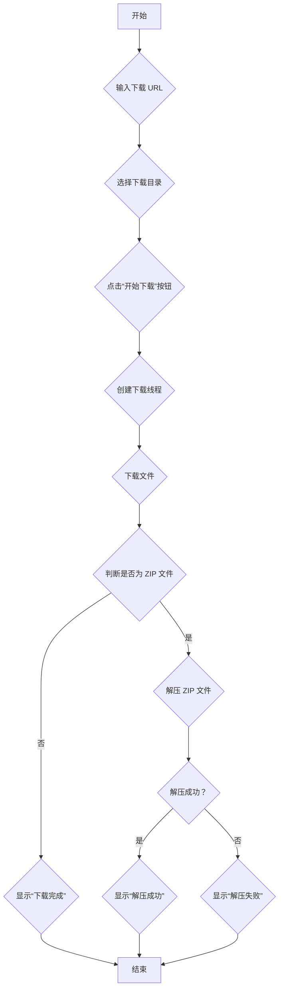

github 开源地址：[yuhanbo758/cos_downloader: 腾讯云对象存储下载工具](https://github.com/yuhanbo758/cos_downloader)
对象存储一键下载：[下载](https://xz.sanrenjz.com/Download/xNP5rI4LJR7x.zip)

程序小店：[程序小店 - 腾讯云对象存储下载器2.0](https://shop.sanrenjz.com/product/68d00a8923eb0c32a9053f7e)

本文档旨在深入解析一个用于腾讯云对象存储（COS）文件下载的 Python 程序。该程序提供了一个图形用户界面（GUI），能够下载文件并自动解压 ZIP 压缩包，

同时解决了中文文件名编码问题。我们将详细解释代码的目的、功能、结构、算法和使用方法，并探讨其潜在限制和改进建议。

## 1. 代码目的与功能

该程序的主要目的是提供一个用户友好的界面，方便用户从腾讯云对象存储或其他 HTTP/HTTPS 地址下载文件。其核心功能包括：

* 下载文件：支持从指定的 URL 下载文件到本地目录。
* 自动解压 ZIP 文件：下载完成后自动解压 ZIP 压缩包。
* 中文文件名处理：能够正确处理包含中文文件名的 ZIP 文件。
* 用户界面：提供直观的 GUI 界面，方便用户操作和查看下载进度。
* 日志记录：记录下载和解压过程中的详细信息，方便问题排查。
## 2. 代码结构与组织方式

整个程序的核心类是 CosDownloader，它负责初始化 GUI 界面、处理用户交互和执行下载任务。代码主要分为以下几个部分：

1. GUI 初始化：__init__ 方法负责创建主窗口、设置标题、图标，并将窗口居中显示。同时，初始化日志队列和软件目录。
1. GUI 组件创建：create_widgets 方法用于创建 GUI 的各个组件，包括 URL 输入框、下载目录选择器、控制按钮、进度条和日志输出区域。
1. 下载功能：download_file 方法负责从指定的 URL 下载文件，并调用 extract_zip_with_encoding 方法解压 ZIP 文件。
1. 解压功能：extract_zip_with_encoding 方法负责解压 ZIP 文件，并处理中文文件名编码问题。
1. 日志功能：log 方法用于将日志消息添加到日志队列，process_log_queue 方法负责从队列中读取消息并显示在日志输出区域。
1. 辅助功能：包括粘贴 URL、浏览目录、打开目录、打开帮助文档等。


## 3. 核心算法与数据结构

### 3.1 中文文件名编码处理算法

在解压 ZIP 文件时，中文文件名的编码问题是一个常见的挑战。为了解决这个问题，extract_zip_with_encoding 方法尝试使用多种编码格式（UTF-8、GBK、GB2312、CP936）进行解码，并对解码后的文件名进行重命名。该算法的核心步骤如下：

1. 尝试不同的编码格式：依次尝试 UTF-8、GBK、GB2312、CP936 等编码格式。
1. 解码文件名：使用当前编码格式解码 ZIP 文件中的文件名。
1. 解压文件：将文件解压到目标目录。
1. 重命名文件：如果解码后的文件名与原始文件名不同，则进行重命名操作，确保文件名正确显示。
以下是该算法的关键代码片段：

```python
def extract_zip_with_encoding(self, zip_path):
    """
    解压ZIP文件并正确处理中文编码
    """
    encodings = ['utf-8', 'gbk', 'gb2312', 'cp936']
    for encoding in encodings:
        try:
            with zipfile.ZipFile(zip_path, 'r') as zip_ref:
                for file_name in zip_ref.namelist():
                    try:
                        # 尝试用当前编码解码文件名
                        if encoding != 'utf-8':
                            try:
                                decoded_name = file_name.encode('cp437').decode(encoding)
                            except:
                                decoded_name = file_name
                        else:
                            decoded_name = file_name
                        
                        zip_ref.extract(file_name, extract_dir)
                        
                        if decoded_name != file_name and encoding != 'utf-8':
                            old_path = os.path.join(extract_dir, file_name)
                            new_path = os.path.join(extract_dir, decoded_name)
                            os.rename(old_path, new_path)
                    except Exception as file_error:
                        self.log(f"解压文件 {file_name} 失败: {file_error}")
                        continue
            return True
        except Exception as encoding_error:
            self.log(f"使用编码 {encoding} 解压失败: {encoding_error}")
            continue
    return False
```

### 3.2 异步日志处理机制

为了避免日志输出阻塞主线程，程序采用了异步日志处理机制。该机制使用 queue.Queue 作为日志消息的缓冲区，并通过 threading.Thread 创建一个独立的线程来处理日志消息。

1. 日志队列：log_queue 用于存储待处理的日志消息。
1. log 方法：将日志消息添加到 log_queue 中。
1. process_log_queue 方法：在一个循环中不断从 log_queue 中读取消息，并将消息显示在日志输出区域。
1. 定时检查：process_log_queue 方法使用 root.after 定时检查 log_queue，确保日志消息能够及时处理。
以下是该机制的关键代码片段：

```python
def log(self, message):
    """
    添加日志消息到队列
    """
    self.log_queue.put(f"[{self.get_timestamp()}] {message}")

def process_log_queue(self):
    """处理日志队列中的消息"""
    try:
        while True:
            message = self.log_queue.get_nowait()
            self.log_text.config(state=tk.NORMAL)
            self.log_text.insert(tk.END, message + "\n")
            self.log_text.config(state=tk.DISABLED)
            self.log_text.see(tk.END)
    except queue.Empty:
        pass
    
    # 每100ms检查一次队列
    self.root.after(100, self.process_log_queue)
```

## 4. 编程语言和库

该程序主要使用 Python 编程语言，并依赖以下标准库：

* tkinter：用于创建 GUI 界面。
* urllib.request：用于下载文件。
* zipfile：用于解压 ZIP 文件。
* threading：用于创建和管理线程。
* queue：用于实现异步日志处理。
* os：用于文件和目录操作。
## 5. 代码流程图



## 6. 使用方法

1. 运行程序：直接运行 cos_downloader.py 脚本。
1. 输入下载 URL：在 “下载地址” 输入框中输入或粘贴文件下载链接。
1. 选择下载目录：点击 “浏览” 按钮选择文件保存目录，或使用默认目录。
1. 开始下载：点击 “开始下载” 按钮开始下载文件。
1. 查看进度：通过进度条和状态标签查看下载进度。
1. 查看日志：通过日志输出区域查看下载和解压过程的详细信息。
## 7. 潜在限制与改进建议

1. 断点续传：目前不支持断点续传功能，如果下载过程中断，需要重新下载。可以考虑添加断点续传功能，提高下载效率。
1. 多线程下载：目前只使用单线程下载文件，可以考虑使用多线程下载，提高下载速度。
1. 错误处理：目前的错误处理机制相对简单，可以考虑添加更详细的错误信息和重试机制，提高程序的健壮性。
1. 编码格式：尝试编码格式可以配置化，使得使用者可以自定义，避免总是需要修改代码。
1. 界面美化：GUI 界面可以进一步美化，提供更好的用户体验。
1. 配置保存：可以将下载目录、日志级别等配置保存到文件中，方便用户自定义。
1. 文件校验：增加文件完整性校验，例如使用 MD5 或 SHA256 算法，确保下载的文件没有损坏。
## 8. 总结

本文详细解析了腾讯云对象存储下载器的代码，包括其目的、功能、结构、算法和使用方法。通过对代码的深入分析，我们可以更好地理解该程序的设计思想和实现细节，并为其未来的改进提供参考。

该程序通过异步日志处理和编码自动识别等方式，较好地解决了GUI程序卡顿和中文支持的问题，具有较高的实用价值。

